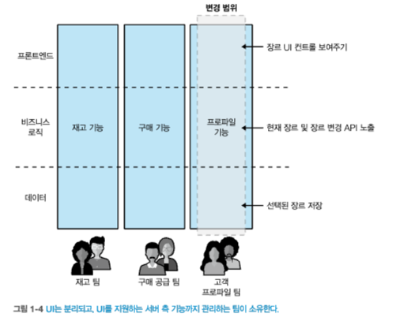
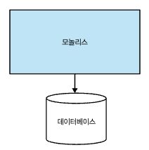
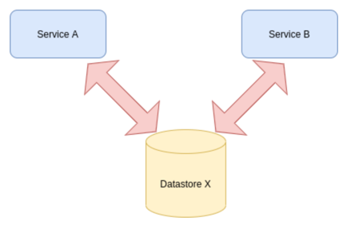
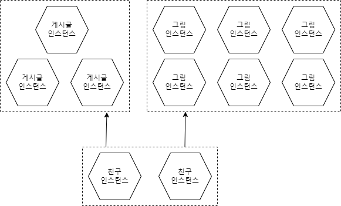

# 1. 마이크로 서비스란?
## 1.1 마이크로서비스 살펴보기
- 비지니스 도메인에 따라 모델링된, 독립적으로 릴리스 가능한 서비스
- 1개 이상의 네트워크 엔드포인트를 통해 비지니스 기능을 제공
- 상세 구현 정보는 외부 세계에서 완전히 은폐
- 마이크로서비스는 자체 데이터베이스를 갖는다.
- 마이크로서비스 경계 내부의 변경은 소비자에게 영향을 미치지 않는다.
- 서비스 지향 아키텍처 vs MSA
  - SOA는 비즈니스 측면에서의 서비스 공유 최대화
  - MSA는 한 가지 작은 서비스에 집중, 서비스 공유 최소화  

## 1.2 마이크로서비스의 핵심 개념
### 1.2.1 독립적 배포성
- 마이크로서비스는 서비스별로 독립적으로 변경, 배포, 릴리즈가 가능하다.
  - 서비스별로 **느슨하게 결합** 시켜야만 독립적 배포가 가능하다.
### 1.2.2 비즈니스 도메인 중심의 모델링
- 도메인 주도 개발(DDD)과 같은 기술을 사용하여, 서비스 경계를 정의하자.
  - 서비스 간 변경을 최소화 시키는것이 목표
  - 기술적 기능의 응집력보다 비지니스 기능의 높은 응집력을 우선시
### 1.2.3 자기 상태 소유
- 각 마이크로서비스가 자체적으로 상태를 소유하고 유지하는 원칙
  - 마이크로서비스 별 데이터베이스를 소유
  - 마이크로서비스 별 자체 비즈니스 로직 소유
    - 각 서비스가 자신의 업무 영역에 대한 책임을 가지며, 다른 서비스와는 독립적으로 비즈니스 로직을 수행
  - 하위 호환성 유지(독립적 배포)
    - 새로운 기능이나 변경이 있을 때는 이 변경이 기존 버전과 호환되도록 설계
### 1.2.4 크기
- 쉽게 이해할 수 있는 크기로 유지되어야 한다.
- 가능한 작은 인터페이스를 갖는 것
- 크기 보다는 두가지 핵심 사항에 집중
  - 얼마나 많은 마이크로서비스를 처리할 수 있는가?(마이크로 서비스를 위한 기술 습득 등등)
  - 어떻게 경계를 정의해야 하는가?
### 1.2.5 유연성
- 마이크로서비스를 사용하면 유연성이 높아진다.
  - 서비스별 기술스택 의사결정, 느슨한 결합 등
### 1.2.6 아키텍처와 조직의 정렬
- 관련 기술의 응집력이 높은형태(도메인이 기준X)  
  
- 비지니스 기능의 응집력이 높은형태(도메인 기준)
- **팀을 구성하는 방식에 따라 소프트웨어 아키텍처가 달라 진다.**
> 콘웨이의 법칙
> - 시스템을 설계하는 조직은 ... 이러한 조직의 커뮤니케이션 구조를 본떠 설계하도록 **제한된다**.
  
## 1.3 모놀로스
- 소프트웨어 아키텍처의 한 형태 : 전체 어플리케이션을 하나의 큰 코드베이스로 구성
### 1.3.1 단일 프로세스형 모놀리스
- 모든 코드가 단일 프로세스로 배포되는 시스템  
  
### 1.3.2 모듈식 모놀리스
- 단일 프로세스가 모듈별로 구성된 형태이다.
- 모듈별로 독립적으로 작업할 수는 있지만, 배포하려면 모두 다 합쳐져야 한다.  
  
  
### 1.3.3 분산형 모놀리스
- 서비스들이 여전히 특정 기능을 수행하는 데 필요한 코드와 데이터를 공유  
  
### 1.3.4 모놀리스와 전달 경합
- 서로 같은 코드베이스에서 작업함으로, 애로사항이 있을 수 있다.(같은 파일 수정 등등)
  - 마이크로서비스 아키텍처에서는 더 구체적인 경계를 제공하므로, 코드 소유권에 대한 혼란을 줄일 수 있다.
### 1.3.5 모놀리스의 장점
- 분산 시스템의 함정들을 피할 수 있다.(분산 트랜잭션 관리...)
- 모니터링이 용이하다.
- 문제해결이 용이하다.
## 1.4 활성화 기술
- 아키텍처를 구현하고 유지하는 데에는 여러 기술적인 도구와 접근 방식이 필요하다.
- 분산되는 시스템으로 인해 발생하는 문제를 지속적으로 찾고, 도움이 될 만한 기술을 찾아야 한다.
### 1.4.1 로그 집계와 분산 추적
- 마이크로서비스 아키텍처를 채택하기 위해서는 **로그 집계 시스템을 꼭 구축하자**.
- Honeycomb
  - 분산 추적 (Distributed Tracing): Honeycomb은 각각의 트랜잭션을 개별적으로 추적하여 시스템에서 어떻게 동작하는지 이해할 수 있도록 도와줍니다
- Jaeger, Zipkin, LGTM(Loki, Grafana, Tempo, Mimir)스택

### 1.4.2 컨테이너와 쿠버네티스
- 각 마이크로서비스 인스턴스를 격리해 실행하는 것이 이상적이다.
  - 컨테이너 서비스를 활용하자.
  - 마이크로 서비스 배포관리가 오버헤드가 된다면, 서비스의 컨테이너화와 쿠버네티스를 사용을 고려하라.(클라우드 관리형)
### 1.4.3 스트리밍
- 마이크로 서비스 데이터 공유 방법을 찾아야 한다.
  - 카프카를 많이 사용
### 1.4.4 공용 클라우드 및 서버리스
- 마이크로 서비스가 증가 할 수록, 더 많은 인프라 관리 인적 비용이 들 것 이다.
- 클라우드에서 제공하는 Faas 등을 활용하자.
## 1.5 마이크로서비스의 장점
### 1.5.1 기술 이질성
- 마이크로서비스 별 다른 기술 사용 가능
- 한 시스템의 성능을 개선하기 위해서 더 나은 기술 스택을 사용할 수 있다.  
  
- 위험이 가장 낮을 것 같은 마이크로서비스를 골라 기술을 적용 할 수 있다.
  > 다양한 기술적용을 할 수 있다고 생각이든다.
- 기술 업그레이드를 쉽게 만든다.
  > 서비스별로 jvm 버전 or 프레임워크 버전을 업그레이드 시킬 수 있다.

### 1.5.2 견고성
- 장애 전파 격리 - *벌크헤드(침수 전파를 막는용도)
  > 하나의 마이크로서비스의 장애가 생겨도, 다른 서비스들은 장애가 전파되지 않는다.
- 마이크로서비스를 구성했을때, 하나의 서비스에서 장애가 발생 했을시 **사용자**에게 미칠 영향을 반드시 생각해야 한다.
  > 마이크로 서비스별로 장애가 생겼을때 최대한 사용자에게 영향도가 없게끔 failover 처리해야함!
### 1.5.3 확장성
- 확장이 필요한 서비스만 확장할 수 있다.  
  
### 1.5.4 배포 용이성
- 하나의 서비스만 독립적으로 배포할 수 있다.
### 1.5.5 조직적 정렬
- 서비스단위로 팀이 분산되므로, 팀별 목표가 뚜렷해진다.
- 팀별로 다양한 기술 시도를 해볼 수 있다.
* 조직적 정렬 - 조직이 하나의 목표, 비전, 철학을 가지는 절차
### 1.5.6 조합성
- 다양한 마이크로서비스들을 자유롭게 조합하여 새로운 기능을 구성할 수 있는 능력을 의미
 > 예를들어, 알림 서비스를 배송서비스에 추가할 수 있다.

## 1.6 마이크로서비스의 고충
### 1.6.1 개발자 경험
- 로컬 개발 환경 설정
  - 서비스가 점점 많아질수록, 모든 마이크로 서비스 실행하기 까다로움.(마이크로 서비스별로 jvm)

### 1.6.2 기술 과다
- 마이크로 서비스별 다양한 프로그래밍 언어/런타임/DB 등으로 다양한 기술셋이 쓰일 수 있다.
- 다양한 기술이 가져올 비용 및 사용하는 기술의 범위 및 복잡성에 대해 고려

### 1.6.3 비용
- 컴퓨팅, 네트워크, 스토리지, 소프트웨어가 활용되므로 비용이 증가한다.
- 팀 변경시, 해당 서비스에 대한 새로운 개념/사용법을 익히는데에 대한 비용도 추가된다.
- 마이크로서비스는 비용 절감에 관심을 둔 조직에는 적합하지 않다.

### 1.6.4 리포팅
- 데이터가 여러 스키마에 분산되어 있기 때문에 리포팅을 위한 서비스가 더 어려워 진다.
  - 실시간 리포팅 형태나 중앙의 리포팅 데이터베이스 생성해 리포팅 문제를 해결 할 수도 있다.
### 1.6.5 모니터링과 문제 해결
- 기존 모놀리식 어플리케이션 모니터링은 이분법 적이지만 단일 인스턴스가 다운될 때 미치는 영향은 파악하기가 어렵다.
### 1.6.6 보안
- 마이크로 서비스별 네트워크를 교류가 많아진다.
  - 서비스 인증 처리에 주의를 기울여야한다.
### 1.6.7 테스팅
- 마이크로서비스에서는 엔드투엔드 테스트 범위가 상당히 늘어납니다.
- 계약 주도 테스팅(Contract-Driven Testing)을 활용
  - 서비스간 요청과 응답을 명시적으로 정의

### 1.6.8 지연 시간
- 많은 마이크로서비스들이 네트워크를 통해 서비스를 제공하거나 제공 받기 때문에 시스템 지연시간이 있다.
  - 직렬화/역직렬화, OS레벨 네트워크 부하
### 1.6.9 데이터 일관성
- 마이크로서비스별 DB를 관리하기 때문에, 데이터 일관성 문제가 발생할 수 있다.
  - 사가(saga) 또는 궁극적 일관성(eventual consistency) 개념을 사용해야 할수 있다.
    - 사가(saga) : 분산 트랜잭션을 관리하기 위한 디자인 패턴
      - 전체 비즈니스 트랜잭션을 여러 트랜잭션 단계로 분해하고, 각 단계에 대한 성공 또는 실패를 처리
      - 각 서비스는 성공적으로 완료된 트랜잭션에 대한 이벤트를 발행하여 다음 단계를 알림
    - 궁극적 일관성(eventual consistency) : 모든 노드 간의 상태 동기화를 즉시 보장하지 않고, 언젠가는 일관성을 달성하겠다는 원칙

## 1.7 마이크로서비스를 사용해야 하는가?
- 처한 상황에 따라 마이크로 서비스를 적용 시킬지 여부를 판단해야 한다.
### 1.7.1 마이크로서비스가 적합하지 않은 곳
- 도메인 모델이 충분히 안정화되지 않은 상태
  - 새로운 제품, 스타트업
- 소규모 개발팀
  - 마이크로서비스 세금(모놀리식 보다 관리해야할 대상이 많아짐)
- 고객이 배포하고 관리하는 소프트웨어를 만드는 조직

### 1.7.2 마이크로서비스가 적합한 곳
- SaaS(Software as a Service) 소프트웨어
  - ex) slack, discord 등
- 아키텍처 & 조직의 (서비스)경계가 명확한 조직
  - 마이크로서비스의 기술 중립적 특성(*기술스택에 구애받지않는 특성)으로 클라우드 플랫폼을 최대한 활용할 수 있다.
- 다양한 새로운 채널을 통해 고객 서비스를 제공하려는 조직
  - 디지털 트랜스포메이션(digital transformation, 새로운 가치를 창출하기 위해 디지털 기술을 통합하는 것)

## 요약
- 마이크로서비스 아키텍처는 엄청난 유연성을 제공한다.
  - 기술 선정, 견고성, 확장성, 팀 구성 등 
- 마이크로서비스는 복잡성을 수반하므로, 현재 해결하려는 문제에 합당한지 먼저 따져봐야 한다.
- 마이크로서비스를 제대로 이해하고 구현한다면 생산적인 아키텍처를 만들 수 있다.

사진 출처 : Building Microservices, 2nd Edition

