# 2. 마이크로서비스 모델링 방법
## 2.1 뮤직코프 소개
## 2.2 올바른 마이크로서비스 경계를 만드는 것은 무엇인가?
- 본질적으로 마이크로서비스는 모듈식 아키텍처의 한 형태이다.
  - 모듈식 소프트웨어 & 구조적 프로그래밍 영역에 존재하는 많은 선행기술에 의지하여 경계를 나누는데 도움을 받을 수 있다.
  - 올바른 경계를 나누기위한 핵심 3가지(정보 은닉, 응집력, 결합)
### 2.2.1 정보은닉
- 모듈(또는 마이크로서비스) 경계 뒤에 가능한 한 세부정보 노출을 최소화
- 장점
  - 향상된 개발시간 : 모듈별 개발하므로 병렬적으로 개발 가능
  - 이해도 : 모듈별로 살펴볼 수 있으므로, 쉽게 이해할 수 있음
  - 유연성 : 모듈별로 독립적이므로, 기능을 변경하기 용이 / 모듈을 합쳐 새로운 기능 제공 가능
### 2.2.2 응집력
- **함께 바뀌고 함께 머무는 코드**
- **마이크로 서비스**는 강한 응집력을 목표로 한다.
  - 비지니스 기능을 추가하기위해 여러 서비스를 배포할 경우, 독립적 배포 불가 
### 2.2.3 결합
- 마이크로서비스간 느슨한 결합해야 한다.
- 마이크로서비스의 핵심은 다른 서비스를 변경하지 않고도 **하나의 독립적 서비스를 배포**할 수 있다는것.
### 2.2.4 결합과 응집력의 연관성
- 마이크로서비스별 결합도는 낮추고, 응집력은 높이자.
  - 응집력 : 개별 마이크로서비스
  - 결합 : 마이크로서비스간의 결합
- 서비스별 경계에 안전성 필요
  - 마이크로서비스가 제공하는 계약이 하위 호환성을 유지시켜야 한다.

## 2.3 결합유형
- 결합을 평가하는 모델 중 상당수는 **코드 수준**에서 주로 이야기 된다.
- 마이크로서비스는 모듈식 아키텍처의 한 형태이며, 이전부터 모듈식 아키텍처를 해결하기 위해 다양한 연구가 있었다.
  - 구조적 프로그래밍의 같은 개념을 활용하여, 마이크로서비스 기반 시스템 관점에서 적용 시킬 수 있다.
- 결합유형 4가지(오른쪽으로 갈수록 결합도가 높음, 응집도 낮음)     
  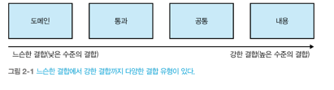
### 2.3.1 도메인 결합
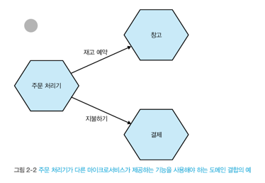  
- 하나의 마이크로서비스가 다른 마이크로서비스의 **기능을 사용**하기 위해 상호작용해야 하는 상황
- 마이크로서비스 아키텍처에서 이 유형의 상호작용은 대개 불가피하다.
  - 최소한으로 유지해야 한다.
  - 꼭 필요한 것만 공유하고, 최소한의 데이터만 전송해야 한다.
- 시간적 결합  
 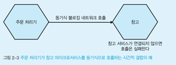
  - 하나의 마이크로서비스가 작업을 완료하기 위해, 동시간에 다른 마이크로서비스의 서비스를 필요로 하는 상황
    - 다른 마이크로서비스에 이상이 있을경우, 호출부 마이크로서비스에도 영향을 끼침
  - 메시지 브로커를 통해 이를 해결할 수 있다.

### 2.3.2 통과 결합
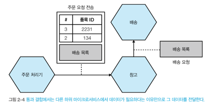  
- 하위 마이크로서비스가 데이터가 필요로 한다는 이유만으로 하나의 마이크로서비스가 다른 마이크로서비스의 데이터를 전달하는 형태
  - 호출 마이크로서비스에서 또다른 마이크로 서비스를 알아야 하는 단점
  - 하위에서 데이터를 변경하면 상위에서 더 큰 변경을 초래할 수 있다.
- 예시의 통과 결합을 줄이기 위한 해결책  
  1. 통과 결합 -> 도메인 결합으로 변경(주문 처리기가 복잡해짐)   
    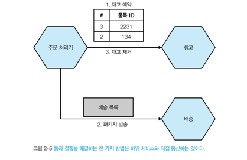
  2. 주문서비스와 창고서비스의 계약을 통해 데이터를 받는형태로 변경(창고 서비스가 배송목록 전달)
    - 배송서비스 계약이 변경되도 주문서비스에는 변경할 필요 없다.  
  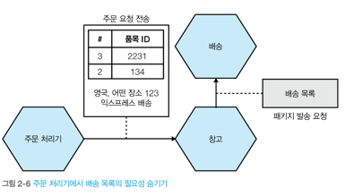
  3. 주문 처리기에서 주문 요청의 일부로 배송목록을 보내고, 창고 서비스는 단지 전달만 한다면 창고 서비스는 변경이 불필요하다.
### 2.3.3 공통 결합
- 둘 이상의 마이크로서비스가 공통 데이터 집합을 사용하는 형태  
  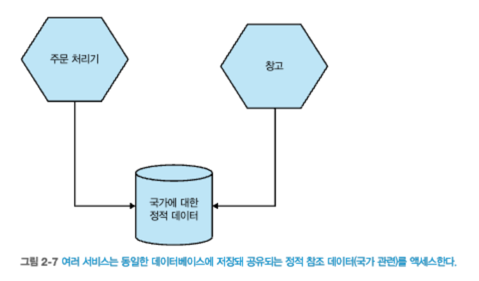
  - 동일한 공유데이터베이스, 공유 메모리, 공유 파일 시스템
  - 데이터 구조를 변경하면 여러 마이크로서비스에 영향을 미친다.
- 둘 이상의 마이크로 서비스가 동일 주문레코드를 업데이트 하는 형태  
  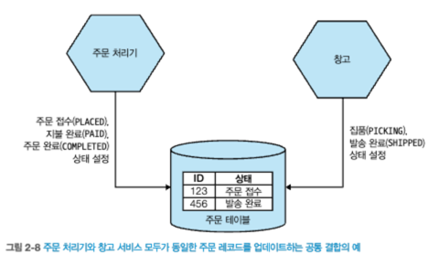 
  1. 상태 기계를 만들어 해결(하지만, 상태 기계를 관리하는 책임을 공유)  
    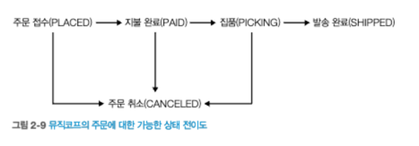
  2. 하나의 마이크로서비스가 주문 상태를 관리하게 만듬  
    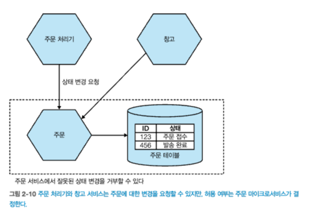 
  - 여러 서비스가 공유 데이터베이스에 접근하여 고비용SQL을 처리하므로, 문제가 될 가능성이 크다.
### 2.3.4 내용 결합
- 상위 서비스가 하위 서비스의 내부까지 도달해 서비스의 내부 상태를 변경하는 형태  
  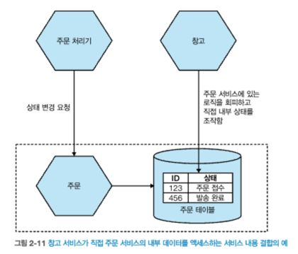
  - 다른 마이크로서비스의 DB에 직접 변경하는 외부 서비스
  - 주문 테이블의 내부 데이터 구조가 외부에 노출되는 문제가 있다.
  - 외부에서 직접 DB를 액세스하도록 허용하면 외부 계약의 일부가 되어 변경 가능한 부분과 불가능한 부분을 쉽게 추론 할 수 없다.
  - 내용 결합은 피하라.

## 2.4 딱 도메인 주도 설계만큼
- 마이크로서비스 경계를 찾는 데 도메인 주도 설계(DDD)를 사용한다. 
### 2.4.1 보편언어( 유비쿼터스 언어)
- 의사소통을 돕기 위해 코드와 도메인 설명에 사용할 **공통 언어를 정의하고 채택**한다.
  - 프로젝트에 참여하는 모든 사람간에 공유되는 용어
  - 사용자가 쓰는 용어를 코드에서 동일하게 사용하려고 노력해야한다.
  - 사용자 또는 프로덕트 오너가 직접 사용한 용어를 코드에 반영하면, 더 쉽게 모델링 할 수 있으며 의사소통도 향상된다.
    ````java
    - 해석 어려움
    public enum OrderState {
        step1, step2, step3....
    }
    - 해석하기 편해짐
    public enum OrderState {
        PAYMENT_WAITING, PREPARING, SHIPPED, DELIVERING, DELIVERY_COMPLETED, CANCELLED;
    }
    ````
### 2.4.2 애그리거트
- 애그리거트 (ENTITY 와 VALUE 를 개념적으로 하나로 묶은 것이다)
  - 엔티티 : 식별자를 가지고 있는 도메인 모델
  - 밸류 : 속성값, 불변(Immutable) 해야한다.
- 애그리거트는 수명주기가 있어 상태 기계로 구현할 수 있다.
- 하나의 마이크로서비스는 여러 애그리거트를 관리할 수 있지만, **하나의 애그리거트는 하나의 마이크로 서비스에서 관리**되어야 한다.
- **애그리거트 루트**
  - Aggregate는 일반적으로 Aggregate로 구성될 수 있으며, 그 중에서 **하나는 Aggregate Root로 지정**된다.
  - **도메인 규칙 제공**
  - 트랜잭션 경계, 트랜잭션 무결성을 보장하고 데이터 일관성을 유지
  - **외부에서 Aggregate에 접근하거나 수정할 때는 반드시 Aggregate Root를 통해야 한다.**

    ````java
     // 주문 상품(Line Item) Aggregate
    public class OrderItem {
        private Long orderItemId;
        private String product;
        private int quantity;
        // 비즈니스 로직.. 
    }
    
    // 배송 정보(Shipping Address) Aggregate
    public class ShippingAddress {
        private Long shippingAddressId;
        private String recipientName;
        private String address;
        // 비즈니스 로직.. 
    }

    // 주문 상태 열거형
    public enum OrderStatus {
        CREATED,   // 주문 생성
        PROCESSING, // 주문 처리 중
        SHIPPED,    // 주문 배송 완료
        CANCELLED   // 주문 취소
    }

    # Aggregate Root를 통해 외부에서의 접근 및 수정을 진행
    // 주문(Order) Aggregate (Aggregate Root)
    public class Order {
        private Long orderId;
        private List<OrderItem> orderItems;
        private ShippingAddress shippingAddress;
        private OrderStatus orderStatus;
        // 다른 속성들...

        // 주문 상품 추가
        public void addOrderItem(OrderItem orderItem) {
            this.orderItems.add(orderItem);
        }
    
        // 배송 정보 업데이트
        public void updateShippingAddress(ShippingAddress shippingAddress) {
            this.shippingAddress = shippingAddress;
        }

        // 주문 배송 완료
        public void markAsShipped() {
            if (this.orderStatus == OrderStatus.PROCESSING) {
                transitionTo(OrderStatus.SHIPPED);
            } else {
                throw new IllegalStateException("배송 완료 처리할 수 없는 상태입니다.");
            }
        }
    }
    ````
  

- 서로 다른 마이크로서비스 어그리거트간 관계 구현
  - REST 기반 URI를 저장  
  

- URI 스킴(pseudo-URI scheme)을 활용하여, **구조화된 식별자**를 만들어 마이크로서비스간 훨씬 명확한 의사소통을 할 수 있다.
    - soundcloud:tracks:123  
      soundcloud:users:123  
      soundcloud:comments:123  
      soundcloud:artwork:123  
      soundcloud:playlists:123  

### 2.4.3 경계 콘텍스트
  
**경계 컨텍스트는 구현 세부 사항을 숨긴다.**   
**내부 고려 사항은 외부 세계에서는 완전히 감쳐줘야 한다.**
- 은닉 모델
  - 은닉 모델은 해당 바운디드 컨텍스트 안에서만 유효하며, 외부에서는 직접적으로 접근할 수 없다.
    - 모델의 일관성을 유지하기 위해 사용  
  
    

- 공유 모델
  - 바운디드 컨텍스트 간에 정보를 공유할 필요가 있을 때 사용되는 모델이다.
    - 다른 바운디드 컨텍스트와의 상호 작용을 위해 필요한 최소한의 공통 언어와 모델을 제공한다.
    - 공유 모델은 여러 바운디드 컨텍스트에서 공통으로 사용되므로, 변경에 대한 협의와 관리가 필요하다.

- 컨텍스트 맵(컨텍스트 경계를 식별해 내고 이들간의 관계를 표현한 그림)  
  

- 주요 컨텍스트 매핑 관계
  - 공유커널(Shared Kernel) - 컨텍스트 경계 사이에 공통적인 모델을 공유하는 관계  
    - 
  - 수요자와 공급자(Customer-Supplier) - 공급하는 컨텍스트는 상류(Upstream)로 수요자 되는 컨텍스트는 하류(Downstream)  
    - 
  - 충돌방지계층(Anti-Corruption Layer) - 하류 팀이 상류 팀의 모델에 영향을 받을 때 하류 팀의 고유 모델을 지키기 위한 번역 계층을 만드는 것
    - 
  - 공개 호스트 서비스(Open Host Service) - 컨텍스트 경계에 대한 접근을 제공하는 프로토콜이나 인터페이스를 정의. 보통 다른 컨텍스트에서 사용할 수 있는 공유된 API
    - 
  - 발행된 언어(Published Language)
    - 필요한 도메인 정보를 표현할 수 있는 적절히 문서화된 공유 언어를 공통의 의사소통

### 2.4.4 애그리거트와 경계 콘텍스트를 마이크로서비스에 매핑
- 애그리거트 루트를 기반으로 서비스 분리:
  - 마이크로서비스는 주로 특정 도메인 모델의 일부를 나타내는 서비스입니다.
  - 애그리거트 루트를 기준으로 해당 애그리거트와 관련된 비즈니스 로직을 갖는 마이크로서비스를 생성합니다.
### 2.4.5 이벤트 스토밍
- 기술 전문가와 비전문가가 다 같이 참여하는 공동 작업을 의미한다.
  - 도메인 모델 개발을 함게 만들어, 공유된 통합 세계관을 갖을 수 있다.
- 물류
  - 도메인 이해관계자가 먼저 한 방에 모인다.(사용자, 도메인전문가, 프로덕트 오너)
  - 포스트잇을 활용하여 다양한 색상으로, 다른 개념을 나타낸다.
- 프로세스
  1. 도메인 이벤트를 식별한다.(ex: 주문접수됨, 상품등록됨)
  2. 이벤트를 식별하는 커맨드를 식별한다.(ex: 주문접수, 상품등록)
  3. 외부 시스템 도출(ex: sns 및 email발송, 결제시스템 , 배송시스템)
  4. 액터 도출 - 커맨드를 발생시키는 주체(사람, 시스템, 등)
     - **관리자**가 상품등록을 하여 상품이 등록됨이벤트가 발생된다.
     - **주문자**가 주문을를 하여 주문접수됨 이벤트가 발생된다.
  5. 애그리거트를 도출 - 커맨드와 이벤트가 영향을 주는 **데이터 요소**
     - '**명사**'로 도출한다.
       - '주문 접수' 라는 도메인 이벤트는 잠재적으로 '주문' 이라는 애그리거트를 도출 해낼 수 있다.
  6. 컨텍스트 경계 정의한다.
     - **마이크로서비스 후보**가 되는 컨텍스트 경계를 그린다.
     - 도출된 요소들 애그리거트,액터,커맨드,이벤트를 고려하여 경계를 식별한다
  7. 정책 도출
     - 이벤트 뒤에 따라오는 반응 적인 비지니스 로직
     - 다른 컨텍스트 경계와의 관계를 식별한다.

  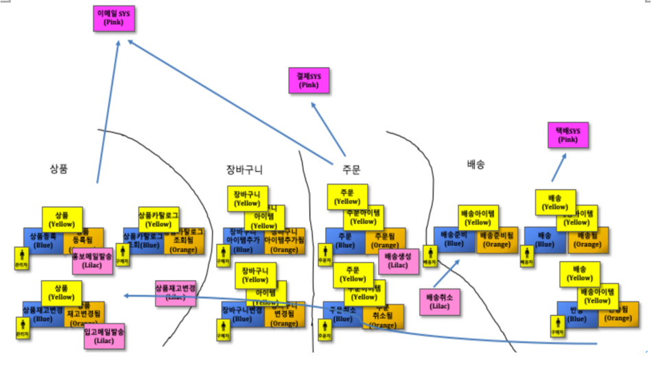
## 2.5 마이크로서비스를 위한 도메인 주도 설계 사례
- 마이크로서비스에서 DDD가 유용한 이유
1. DDD에서 경계 콘텍스트가 정보 은닉에 사용된다. 
2. 보편언어 사용
   - 비지니스 언어를 통해 코드와 도메인을 설계함으로써 도메인 전문성이 향상된다.
   - 소프트웨어 사용자에 대한 이해와 공감대를 형성하며 의사소통도 증대된다.
## 2.6 비지니스 도메인 경계에 대한 방안
- DDD는 마이크로서비스 아키텍처를 구축할 때 유용하다.
- DDD가 마이크로서비스 경계를 찾을 때 고려해야 할 유일한 기술은 아니다.
- 경계를 찾을 때 고려할 수 있는 다른 요소도 존재한다.
### 2.6.1 변동성
- 변동성을 기반으로 경계를 나눈다.
  -  시장 출시 기간을 단축시키는데 유용하다.
### 2.6.2 데이터
- 보유하고 관리할 데이터의 특성에 따라 경계가 나뉠 수 있다.  
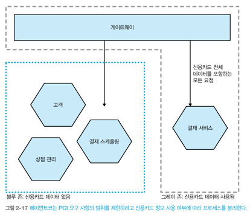
### 2.6.3 기술
- 다른 기술을 사용해야 할 경우, 경계가 나뉠 수 있다.
  - 다른 런타임 모델 혼합  
  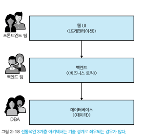
### 2.6.4 조직  
- 조직 구조에 따라 경계가 나뉠 수 있다.  
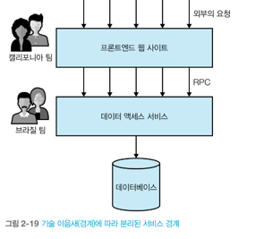
## 2.7 혼잡 모델과 예외
- 경계를 찾는 방법에 대해서는 여러가지가 있다.
- **정보 은닉**의 지침을 따르고, **결합과 응집력의 상호작용**을 애하하면 최악은 피할 수 있다.
