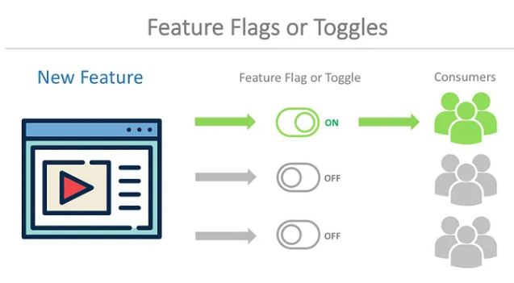

# 3. 모놀리스 분해
- 해당 장은 마이크로서비스 아키텍처로 전환을 하는데 도움이 되는 몇가지 우선 사항, 패턴,팁을 설명한다.
## 3.1 목표를 가져라
- 마이크로서비스는 목표가 아니다.
  - 성취하고자 하는 것을 명확하게 이해하지 못하면, 마이크로서비스 자체를 만드는데에 집착 할 수 있다.
- 달성하려는 변화가 무엇인지 명확히 하고, 마이크로서비스를 고려하기 전에 목표를 달성할 수 있는 더 쉬운 방법을 고려하라.
- 마이크로서비스 아키텍처가 장기적으로 가장 좋은 방법이라면, 목표에 대한 진행 상황을 추적하고, 필요에 따라 진행 방향을 변경하라.
## 3.2 점진적 마이그레이션
- 모놀리식 시스템을 분해하는 것이 옳은 일이라고 판단되면, 조금씩 떼어내는 것이 좋다.
  - 수행과정에서 마이크로서비스를 배우는 데 도움이 될 것이다.
  - 마이크로서비스가 좋은 아이디어라고 생각한다면 작은 곳에서 시작하라.
  - 빅뱅배포를 하지 않고도, 마이크로서비스가 제공하는 가치를 점진적으로 얻을 수 있다.
  * 빅뱅 배포 : Big Bang 배포는 어플리케이션의 전체 혹은 대부분을 한번에 업데이트
## 3.3 모놀리스가 적인 경우는 드물다
- 모놀리식 아키텍처는 본질적으로 나쁘지 않다.(간단한 애플리케이션, 단일 코드베이스, 작은팀)
- 모놀리스가 없는 것에 집중하지 말고 **아키텍처 변경이 가져올 혜택에 집중**하라.
### 3.3.1 조급한 분해의 위험성
- 도메인에 대한 이해가 명확하지 않을 때는 마이크로서비스를 생성하는 데 위험이 따른다.
  - 마이크로서비스로 분해하려는 기존 코드베이스를 보유하는 것이 처음부터 마이크로 서비스로 진행하는 것보다 훨씬 쉽다.
## 3.4 무엇을 먼저 나눌까?
- 마이크로서비스로 `추출하는 작업의 용이성`, `추출의 이점` 사이의 균형에 따라 결정될 것이다.
- 비교적 `쉬운`쪽에 가까운 것을 마이크로서비스로 전환해, 경험을 쌓는것이 필요하다. 
## 3.5 계층별 분해
  
출처 : 한빛미디어, 마이크로서비스 아키텍처 구축 
### 3.5.1 코드 우선

출처 : 한빛미디어, 마이크로서비스 아키텍처 구축
### 3.5.2 데이터 우선
  
출처 : 한빛미디어, 마이크로서비스 아키텍처 구축
## 3.6 유용한 분해 패턴
### 3.6.1 교살자 무화과 패턴(Strangler Fig Pattern)
- 기존에 구축된 레거시 시스템을 한 번에 완전히 대체하는 대신, 시스템의 일부를 점진적으로 대체하면서 새로운 시스템으로 전환하는 방식이다.
- Strangler Fig 패턴은 과도한 `비용`과 `리스크`를 줄이고, 새로운 시스템을 안정적으로 도입하는 데 도움이 됩니다.  

### 3.6.2 병렬 실행(Parallel Run pattern)
- 모놀리식 기능과 새로운 마이크로서비스 기능을 나란히 실행해, 같은 요청을 제공하고 결과를 비교한다.  

* 출처 : https://engineering.zalando.com/posts/2021/11/parallel-run.html
### 3.6.3 기능 토글(Feature toggle)
- 애플리케이션의 특정 기능을 활성화 또는 비활성화할 수 있게 하는 기능을 말한다.  

## 3.7 데이터 분해에 대한 우려
- 데이터베이스를 분리하면 여러 문제가 발생한다. (몇가지 팁이다.)
### 3.7.1 성능
- 데이터베이스가 분리되면, 데이터들을 join(쿼리질의) 하기 어렵다.
- 기존 모놀리식 보다, 조인 작업이 효율적이지 않다.
  - 모놀리식 데이터베이스 조인
  
  - 조인 작업이 데이터베이스 계층 -> 어플리케이션 계층으로 이동
  

tip : 데이터 베이스가 분리되므로, 먼저 재무 서비스에서 원장데이터를 select 한다음 카탈로그 서비스의 엘범을 select하는 형태가 되므로 , 기존 모놀리식보다 훨씬 비효율적인 방법으로 조인이 되는 것을 확인할 수 있습니다.
### 3.7.2 데이터 무결성
- `앨범`과 `원장` 테이블이 같은 데이터베이스에 있다면 외래 키 관계를 정의할 수 있다.
  - 데이터 무결성이 보장된다.
- 서로 다른 데이터베이스에 테이블이 존재하면, 데이터 무결성을 강제할 수 없다.
  - `앨범`테이블을 소프트 삭제(실제 레코드 삭제가 아닌, 삭제 표시)
  - 앨범 판매시, `앨범`명을 원장 테이블에 복사한다.(이름 동기화 처리 방향 찾아야함)
### 3.7.3 트랜잭션
- 모든 테이블이 하나의 데이터베이스에 포함되어 있을 때, 트랜잭션을 사용하여 데이터의 일관성을 보장할 수 있다.
- 데이터베이스가 여러개로 나눠지면, 트랜잭션의 안정성을 잃게 된다. 
  - 분산 트랜잭션은 구현하기 어렵다.
- ACID
````java
데이터베이스 트랜잭션은 ACID라는 특성을 가지고 있다.
Atomicity(원자성) : 한 트랜잭션의 연산들이 모두 성공하거나, 반대로 전부 실패되는 성질
Consistency(일관성) : 트랜잭션이 일어난 이후의 데이터베이스는 데이터베이스의 제약이나 규칙을 만족(not null 조건, timestamp 칼럼이면 시간 관련 데이터가 들어가야하는 등등)
Isolation(격리성, 고립성) : 트랜잭션 수행시 다른 트랜잭션의 작업이 끼어들지 못하도록 보장하는 것을 말한다.
Durability(지속성) : 성공적으로 수행된 트랜잭션은 영원히 반영이 되는 것을 말한다.

````
### 3.7.4 도구
### 3.7.5 리포팅 데이터베이스

