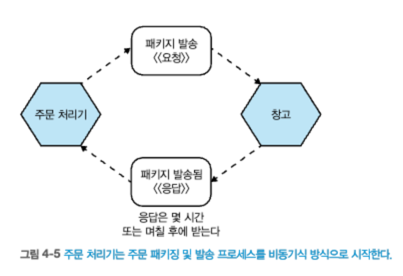

# 4 마이크로서비스 통신 방식
- 다양한 통신 유형을 고려하지 못하여, 마이크로서비스 간의 통신을 제대로 구현하는 데 어려움이 따른다.
- 이번장에서는 문제 영역에 가장 적합한 통신 방식을 소개하고, 다양한 통신 방식을 분석해본다.
## 4.1 프로세스 내부에서 프로세스 사이로
### 4.1.1 성능
### 4.1.2 인터페이스 변경
### 4.1.3 에러 처리
- 프로세스 간 통신에 나타나는 다섯 가지 유형의 실패 모드
  - 충돌 실패 
  - 누락 실패
  - 타이밍 실패
  - 응답 실패
  - 임의 실패 
## 4.2 프로세스 간 통신을 위한 기술:다양한 선택
- 프로세스 간 통신에 사용하는 기술의 범위는 방대하다.
  - 기술에 대한 사고방식이 실제로 해결하려는 문제와 일치하지 않을 수 있다.
- 문제에 실제로 적합한지 고려하지 않고 신기술을 선택한다.
  - ex) 요청과 응답을 위해 카프카를 사용하는 것은 좋은 선택이 아니다.
- 따라서, 먼저 원하는 통신 방식을 이야기하고 나서 해당 방식을 구현하는 데 적합한 기술을 찾는 것이 중요하다.
## 4.3 마이크로서비스 통신 방식
- 동기식 블로킹(synchronous blocking)
  > 마이크로서비스는 다른 마이크로서비스를 호출하고 응답을 기다리는 작업을 차단한다.(다른 마이크로서비스 응답을 기다림)
- 비동기식 논블로킹(asynchronous nonblocking)
  > 호출을 보낸 마이크로서비스는 호출 수신 여부에 관계없이 처리를 계속할 수 있다.
- 요청 및 응답(request-response)
  > 마이크로서비스는 작업을 수행하도록 다른 마이크로서비스에 요청을 보낸다. 결과를 알려주는 응답을 받을 것을 기대한다.
- 이벤트 기반(event-driven)
  > 마이크로서비스는 다른 마이크로서비스가 소비하고 반응하는 이벤트를 발산한다. 이벤트를 발행하는 마이크로서비스는 자신이 발행하는 이벤트를 소비사흔 마이크로서비스가 어떤 마이크로서비스인지 알지 못한다.
- 공통 데이터(common data)
  > 통신 방식으로 자주 볼 수 없는 마이크로서비스인 경우 일부 공유 데이터 소스를 통해 협업한다.

필자는??
- 주어진 상황에 더 적합한 방식이 `요청 및 응답` 인지 아니면 `이벤트 기반` 협업 방식인지 살펴본다.
- `요청 및 응답 방식`에서 동기 및 비동기 구현 모두가 가능하다면, `비동기 구현을 선택`해야한다.
- 하지만 `이벤트 기반 협업 방식을 선택`한다면, `비동기식 논블로킹 방식`으로 제한한다.
> 올바른 기술을 선택할 때는 통신 방식 외에도 지연시간 & 보안 관련 & 확장 기능 등 다양한 고려사항이 있다.

### 4.3.1 짜맞추기
- 단일 마이크로서비스가 `하나 이상의 협업 형태를 구현하는 것은 일반적`이다.
  - ex) 주문하거나 변경하고 나서 이벤트를 발생시키는 주문(Order) 마이크로서비스가 있다. 
## 4.4 동기식 블로킹-패턴
- 마이크로서비스가 다운스트림 프로세스에 보내고 호출이 완료돼 응답이 수신될 때 까지 대기하는 형태

* 출처 : 한빛미디어 - 마이크로서비스 아키텍처 구축 
### 4.4.1 장점
- 간단하고 친숙하다.
### 4.4.2 단점
- 시간적 결합
  - 다운스트림 마이크로서비스의 응답을 기다리고 있을 때, 응답이 늦거나 네트워크 지연 이슈가 있다면 오랜 시간 동안 블로킹 된다.
  - 멤버십 마이크로서비스가 부하를 받고 있고, 요청에 늦게 응답하면 주문 처리기도 느리게 응답하게 된다.
  - 업스트림 인스턴스가 종료되면, 멤버신 마이크로서비스의 응답은 손실된다.?
- 양방향 결합
  - 업스트림 인스턴스가 종료되면, 멤버신 마이크로서비스의 응답은 손실된다.
  - 
- 동기식 호출을 사용하면 비동기식 호출을 사용할 때보다 연쇄적인 문제에 더욱 취약해진다.
### 4.4.3 적용 대상
- 간단한 마이크로서비스 아키텍처라면 큰 문제가 없다.
- 호출 체인이 더 많아질 때 동기식 블로킹은 문제가 된다.
  - 긴 체인이 상당한 리소스 경합을 일으킬 수 있다.
  - 하나 또는 이들 간의 네트워크 호출에 문제가 발생하면 전체 작업이 실패 할 수 있다.
  - 업스트림 마이크로서비스의 네트워크 컨넥션을 응답이 올때까지 열린 상태로 유지해야하므로, 실행 중인 시스템에 영향을 줄 수 있다.

- 이와 같은 상황을 개선하기 위해 마이크로서비스 간의 상호작용을 재검토 할 수 있다.
- 주문 처리기 마이크로서비스에서 이상거래 고객으로 지정하여 초기에 발견할 수 있다.
- 호출 체인의 길이를 줄여 전반적인 지연시간이 개선되는 것을 확인할 수 있다.
  - 구매 흐름의 이상거래 탐지 서비스를 제거해 의존성을 줄인다.

## 4.5 비동기식 논블로킹-패턴
- 비동기식 통신을 사용하면, 호출하는 마이크로서비스를 블로킹하지 않는다.
- 여러가지 비동기식 논블로킹 통신방식이 있지만, 책에서는 일반적인 3가지 비동기식 논블로킹 3가지방식을 소개한다.
#### 논블로킹 3가지 방식
1. 공통 데이터를 통한 통신
   - 업스트림 마이크로서비스는 공통 데이터를 변경하고, 이 데이터는 나중에 하나 이상의 마이크로서비스에서 사용된다.
2. 요청 및 응답
   - 마이크로서비스는 다른 마이크로서비스에 작업 요청을 보낸다. 요청된 작업이 완료되면 성공 여부와 관계없이 업스트림 마이크로서비스는 응답을 수신한다.
   - 특히, 업스트림 마이크로서비스의 어떤 인스턴스도 응답을 처리할 수 있어야 한다.
3. 이벤트 기반 상호작용
   - 마이크로서비스는 발행한 일에 대한 사실적 진술로 생각될 수 있는 이벤트를 브로드캐스트 한다.
   - 다른 마이크로서비스는 관심 있는 이벤트를 수신하고 적절히 대응한다.
### 4.5.1 장점
- 비동기식 논블로킹 통신을 사용하면 초기 호출을 수행하는 마이크로서비스와 호출을 수신하는 마이크로서비스는 일시적으로 분리된다.
  - 호출을 수신하는 마이크로서비스가 호출과 동시에 연결될 필요는 없으며, `시간적 비결합에 대한 우려를 피한다`.
  - 호출에 의해 트리거되는 기능을 처리하는 데 오랜 시간이 걸리는 경우에도 유용하다.  

### 4.5.2 단점
- 구현 복잡도와 비동기식 통신 방식의 선택 범위이다.
  - 선택 가능한 비동기 통신 방식은 다양하고, 구현 방식을 자세히 살펴보면 난감할지도 모를 기술들을 만날 수 있다.  
### 4.5.3 적용 대상
- 장기 수행 프로세스는 명백한 비동기 통신 후보다.(ex, 그림4-5)
- 긴 호출 체인이 있는 상황.

## 4.6 공통 데이터를 통한 통신 - 패턴(비동기식 논블로킹)
## 4.7 요청 및 응답 통신 - 패턴(비동기식 논블로킹)
## 4.8 이벤트 기반 통신 - 패턴(비동기식 논블로킹)
## 4,9 조심해서 진행해라