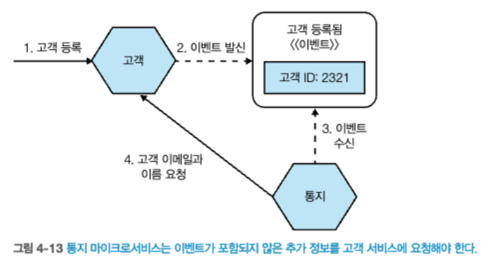

# 4 마이크로서비스 통신 방식
- 다양한 통신 유형을 고려하지 못하여, 마이크로서비스 간의 통신을 제대로 구현하는 데 어려움이 따른다.
- 이번장에서는 문제 영역에 가장 적합한 통신 방식을 소개하고, 다양한 통신 방식을 분석해본다.
## 4.1 프로세스 내부에서 프로세스 사이로
- 네트워크를 통한 두 프로세스 사이의 호출은 한 프로세스 내부의 호출과 매우 다르다.
### 4.1.1 성능
- 프로세스 내 호출
  - 기본 컴파일러와 런타임은 호출의 영향을 줄이려고 마치 처음에 호출이 없었던것처럼 전체 호스트 최적화를 수행할 수 있다.
    - Just-In-Time 컴파일러(jvm), 인라이닝 - 실제 메소드를 호출하지 않고 바로 결과값을 돌려줌 (jvm)
- 프로세스 간 호출
  - 패킷을 전송해야한다.
  - 네트워크를 통해 마이크로서비스 간 호출을 할때 데이터는 직렬화/역직렬화를 하므로 페이로드의 크기에 대해 주의를 기울여야 한다.
### 4.1.2 인터페이스 변경
- 프로세스 내부 인터페이스 변경
  - `같은 프로세스에 함께 패키징`되어, 롤아웃이 간단하다.
- 마이크로서비스간 통신에서 인터페이스 변경
  - 하위 호환성을 깨뜨리는 변경을 할 때는 둘 다 새 인터페이스를 사용하도록 업데이트하기 위해 소비자와 함께 락스텝 배포를 한다.
### 4.1.3 에러 처리
- 프로세스 내부에서 에러의 특성은 매우 직관적인 편이다.
  - 호출 스택의 위 방향으로 에러를 전파한다.
- `분산 시스템에서 에러의 특성은 다양`하다.
  - 프로세스 간 통신에 나타나는 다섯 가지 유형의 실패 모드
    - `충돌 실패` : 프로세스나 시스템이 갑자기 중단되는 경우
    - `누락 실패` : 전송 후 응답을 받지 못하는 경우
    - `타이밍 실패` : 어떤 일이 너무 늦게 발생하거나 너무 일찍 발생한 경우
    - `응답 실패` : 응답이 예상한 것과 다른 경우
    - `임의 실패` : 비잔티움 실패, 비정상적인 동작으로 인해 발생하는 실패
## 4.2 프로세스 간 통신을 위한 기술:다양한 선택
- `프로세스 간 통신`에 사용하는 `기술의 범위는 방대`하다.
  - 기술에 대한 사고방식이 실제로 해결하려는 문제와 일치하지 않을 수 있다.
- 문제에 실제로 적합한지 고려하지 않고 신기술을 선택한다.
  - ex) 요청과 응답을 위해 카프카를 사용하는 것은 좋은 선택이 아니다.
- 따라서, 먼저 원하는 통신 방식을 이야기하고 나서 해당 방식을 구현하는 데 `적합한 기술`을 찾는 것이 중요하다.
## 4.3 마이크로서비스 통신 방식  
  
출처 : 한빛미디어 - 마이크로서비스 아키텍처 구축 

- 동기식 블로킹(synchronous blocking)
  > 마이크로서비스는 다른 마이크로서비스를 호출하고 응답을 기다리는 작업을 차단한다.(다른 마이크로서비스 응답을 기다림)
- 비동기식 논블로킹(asynchronous nonblocking)
  > 호출을 보낸 마이크로서비스는 호출 수신 여부에 관계없이 처리를 계속할 수 있다.
- 요청 및 응답(request-response)
  > 마이크로서비스는 작업을 수행하도록 다른 마이크로서비스에 요청을 보낸다. 결과를 알려주는 응답을 받을 것을 기대한다.
- 이벤트 기반(event-driven)
  > 마이크로서비스는 다른 마이크로서비스가 소비하고 반응하는 `이벤트를 발산`한다. 이벤트를 발행하는 마이크로서비스는 자신이 발행하는 이벤트를 소비하는 마이크로서비스가 어떤 마이크로서비스인지 알지 못한다.
- 공통 데이터(common data)
  > 통신 방식으로 자주 볼 수 없는 마이크로서비스인 경우 `일부 공유 데이터 소스를 통해 협업`한다.


`신뢰할 수 있는 통신`, `허용 가능한 지연 시간`, `통신량`에 대한 요구 사항은 기술을 선택하는 데 중요한 역할을 한다.
- 주어진 상황에 더 적합한 방식이 `요청 및 응답` 인지 아니면 `이벤트 기반` 협업 방식인지 살펴본다.
- `요청 및 응답 방식`에서 동기 및 비동기 구현 모두가 가능하다면, `비동기 구현을 선택`해야한다.
- 하지만 `이벤트 기반 협업 방식을 선택`한다면, `비동기식 논블로킹 방식`으로 제한한다.
> 올바른 기술을 선택할 때는 통신 방식 외에도 지연시간 & 보안 관련 & 확장 기능 등 다양한 고려사항이 있다.

### 4.3.1 짜맞추기
- 마이크로서비스 아키텍처 전체에 다양한 협업 스타일이 혼재될 수 있으며, 이것은 지극히 일반적이다.
- 단일 마이크로서비스가 `하나 이상의 협업 형태를 구현하는 것은 일반적`이다.
  - ex) 주문하거나 변경하고 나서 이벤트를 발생시키는 주문(Order) 마이크로서비스가 있다. 
## 4.4 동기식 블로킹-패턴
- 마이크로서비스가 호출을 다운스트림 프로세스에 보내고 호출이 완료돼 `응답이 수신될 때 까지 대기`하는 형태  
  
출처 : 한빛미디어 - 마이크로서비스 아키텍처 구축 
### 4.4.1 장점
- 간단하고 친숙하다.
### 4.4.2 단점
- 시간적 결합
  - 주문 처리기가 멤버십을 호출할때 멤버십 마이크로서비스에 연결할 수 있어야 한다.
  - 다운스트림 마이크로서비스의 응답을 기다리고 있을 때, 응답이 늦거나 네트워크 지연 이슈가 있다면 오랜 시간 동안 블로킹 된다.
  - 멤버십 마이크로서비스가 부하를 받고 있고, 요청에 늦게 응답하면 주문 처리기도 느리게 응답하게 된다.
- 양방향 결합
  - 업스트림 인스턴스가 종료되면, 멤버신 마이크로서비스의 응답은 손실된다.
- 동기식 호출을 사용하면 비동기식 호출을 사용할 때보다 연쇄적인 문제에 더욱 취약해진다.
### 4.4.3 적용 대상
- 간단한 마이크로서비스 아키텍처라면 큰 문제가 없다.
- 호출 체인이 더 많아질 때 동기식 블로킹은 문제가 된다.
  - 긴 체인이 상당한 리소스 경합을 일으킬 수 있다.
  - 하나 또는 이들 간의 네트워크 호출에 문제가 발생하면 전체 작업이 실패 할 수 있다.
  - 업스트림 마이크로서비스의 네트워크 컨넥션을 응답이 올때까지 열린 상태로 유지해야하므로, 실행 중인 시스템에 영향을 줄 수 있다.  
  
출처 : 한빛미디어 - 마이크로서비스 아키텍처 구축 
- 이와 같은 상황을 개선하기 위해 마이크로서비스 간의 상호작용을 재검토 할 수 있다.
- 주문 처리기 마이크로서비스에서 이상거래 고객으로 지정하여 초기에 발견할 수 있다.
- 호출 체인의 길이를 줄여 전반적인 지연시간이 개선되는 것을 확인할 수 있다.
  - 구매 흐름의 이상거래 탐지 서비스를 제거해 의존성을 줄인다.  
  
출처 : 한빛미디어 - 마이크로서비스 아키텍처 구축 
## 4.5 비동기식 논블로킹-패턴
- 비동기식 통신을 사용하면, 호출하는 마이크로서비스를 블로킹하지 않는다.
- 여러가지 비동기식 논블로킹 통신방식이 있지만, 책에서는 일반적인 3가지 비동기식 논블로킹 3가지방식을 소개한다.
#### 논블로킹 3가지 방식
1. 공통 데이터를 통한 통신
   - 업스트림 마이크로서비스는 공통 데이터를 변경하고, 이 데이터는 나중에 하나 이상의 마이크로서비스에서 사용된다.
2. 요청 및 응답
   - 마이크로서비스는 다른 마이크로서비스에 작업 요청을 보낸다. 요청된 작업이 완료되면 성공 여부와 관계없이 업스트림 마이크로서비스는 응답을 수신한다.
   - 특히, 업스트림 마이크로서비스의 어떤 인스턴스도 응답을 처리할 수 있어야 한다.
3. 이벤트 기반 상호작용
   - 마이크로서비스는 발행한 일에 대한 사실적 진술로 생각될 수 있는 이벤트를 브로드캐스트 한다.
   - 다른 마이크로서비스는 관심 있는 이벤트를 수신하고 적절히 대응한다.
### 4.5.1 장점
- 비동기식 논블로킹 통신을 사용하면 초기 호출을 수행하는 마이크로서비스와 호출을 수신하는 마이크로서비스는 일시적으로 분리된다.
  - 호출을 수신하는 마이크로서비스가 호출과 동시에 연결될 필요는 없으며, `시간적 비결합(2.3.1)에 대한 우려를 피한다`.
  - 호출에 의해 트리거되는 기능을 처리하는 데 오랜 시간이 걸리는 경우에도 유용하다.  
  
출처 : 한빛미디어 - 마이크로서비스 아키텍처 구축 
### 4.5.2 단점
- 구현 복잡도와 비동기식 통신 방식의 선택 범위이다.
  - 선택 가능한 비동기 통신 방식은 다양하고, 구현 방식을 자세히 살펴보면 난감할지도 모를 기술들을 만날 수 있다.  
### 4.5.3 적용 대상
- 장기 수행 프로세스는 명백한 비동기 통신 후보다.(ex, 그림4-5)
- 긴 호출 체인이 있는 상황.

## 4.6 공통 데이터를 통한 통신 - 패턴
- 하나의 마이크로서비스가 **데이터를 정의한 위치에 넣고**(DB,fs system ..) **다른 마이크로서비스가 그 데이터를 이용**할 때 사용된다.
  - 기본적으로 **비동기식**이다.   
  
출처 : 한빛미디어 - 마이크로서비스 아키텍처 구축 
### 4.6.1 구현
- 데이터를 저장할 `영구 저장소가 필요`하다.
- 모든 다운스트림 마이크로서비스는 `새 데이터가 가용하다`는 사실을 인식하는 `매커니즘이 필요`
  - `**폴링**(polling)`방식이 가장 일반적인 해결책이다.

- `이 패턴의 두 가지 일반적인 예`는 **데이터 레이크**(data lake)와 **데이터 웨어하우스**(data warehouse)이다.
  - 정보의 흐름은 한 방향이라고 가정한다.(하나의 마이크로서비스가 데이터를 게시, 다운스트림 소비자는 데이터를 읽는다.)
  - 데이터 레이크
    > 원시 데이터를 업로드하고, 이 원시 데이터의 다운스트림 소비자는 이 정보를 처리하는 방법을 알고 있어야 한다.
  - 데이터 웨어하우스
    > 데이터 웨어하하우스 자체는 구조화된 데이터 저장소이다.
    > 구조가 하위 호환이 불가능한 방식으로 변경되면 생산자가 업데이트 되어야 한다.
- `더욱이 문제가 되는 구현방식`은 여러 마이크로서비스가 `동일한 데이터 저장소를 읽고 쓰는` **공유 데이터베이스를 사용**하는 것이다.
  - 공통결합의 문제
     
  출처 : 한빛미디어 - 마이크로서비스 아키텍처 구축 
### 4.6.2 장점
- 일반적으로 알려진 기술을 사용해 매우 **간단하게 구현**할 수 있다.
- 구형 메인프레임 애플리케이션이나 맞춤형 상용 소프트웨어 제품(COTS)과 같은 **다양한 유형의 시스템들과 함께 운용**가능하다.
- 이방법은 데이터양에서도 큰 문제가 되지 않으므로, 한 번에 **많은 데이터를 전송한다면 효과적**이다.
### 4.6.3 단점
- **실시간 데이터 처리가 필요한 경우**에는 유용하지 않을 수 있다.
  - 대기 시간이 짧은 폴링 매커니즘
- `공통 데이터 저장소`가 잠재적으로 `결합의 원천`이 된다.
  - 데이터 저장소의 구조가 변경되면 마이크로서비스 간 통신이 중단될 수 있다.
  
### 4.6.4 적용대상
- `기술적 제약이 있는 프로세스`
  - 구형 시스템이라도 파일을 읽는것은 가능하다.
  - 소비자 입장에서는 변경 비용도 많이 든다.
- `대용량 데이터를 공유해야 할 때`
  - 수 기가바이트 파일을 파일시스템으로 보낼때
  - 수백만 개의 행을 로드해야 할 때


## 4.7 요청 및 응답 통신 - 패턴
- 요청 및 응답을 사용하면 마이크로서비스는 다운스트림 서비스에 `작업 요청`을 보내고 요청에 대한 `결과를 받길 기대`한다.
  - `동기식 블로킹`, `비동기식 논블로킹` 방식 방식으로 구현 가능

- 요청 및 응답 통신의 통신 사례    
  1. **[일반적인 사용 사례]**  
    
  출처 : 한빛미디어 - 마이크로서비스 아키텍처 구축

  2. **[특정 순서로 호출을 완료]**  
    
  출처 : 한빛미디어 - 마이크로서비스 아키텍처 구축 

````java
- 명령 대 요청(용어 정리) - 필자는 요청이라는 용어를 선호
  > 명령 : 반드시 지켜야 하는 지시를 의미한다.
  > 요청 : 거부될 수 있따는 것을 암시한다.
````

### 4.7.1 구현:동기 대 비동기
- **요청 및 응답 호출**은 `동기식 블로킹 방식`이나 `비동기식 논블로킹 방식`으로 구현할 수 있다.  


- **[동기식 호출]**
  - 업스트림 & 다운스트림 마이크로서비스는 네트워크 커넥션 생성, 커넥션을 따라 전송
  - 응답하는 마이크로서비스는 요청하는 마이크로서비스에 대해 전혀 알 필요가 없다.
  - 업스트림 또는 다운스트림 마이크로서비스 인스턴스가 종료돼 커넥션이 끊어지면 문제가 발생할 수 있다.  


- **[비동기식 요청 및 응답 방식]**
      
  출처 : 한빛미디어 - 마이크로서비스 아키텍처 구축   
  ````java
  1. 주문 처리기 서비스가 재고 예약 메시지를 큐로 전송한다.
  2. 창고 서비스는 가용한 상황에서 메시지(재고 예약)를 사용한다.
  3. 창고 서비스는 재고 예약 작업을 수행한 다음, 주문 처리기가 읽고 있는 큐(재고 예약됨)로 응답을 보낸다.
    > 응답을 어디로 라우팅할지 알아야한다.
  ````
  - 비동기식 논블로킹으로 상호작용시, 요청을 수신하는 마이크로서비스는 응답을 어디로 라우팅 해야 할지 알고 있어야 한다.  
  - 큐를 사용할 때 처리 `요청을 버퍼링`할 수 있다는 `이점`이 있다.
    - 준비가 되면 다음 요청을 소비할 수 있다.
  - 원래 요청과 응답을 연결 지어야 할 때가 있다.
    - ex) 재고 예약됨 응답을 ㅎ해당 주문과 연결지어야할 때가 있음
      - `원래 요청의 상태를 데이터베이스에 저장`하고, 응답이 올 때 수신한 인스턴스가 관련된 상태를 다시 로드해서 적절히 동작할 수 있게 한다.
  
- `요청 및 응답 통신` 에서는 `타임아웃 처리`가 필요 하다.

````
# 병렬 호출 대 순차호출
 - 요청 및 응답 통신 방식으로 작업시, 일부 처리를 계속하기 전에 여러 번 호출해야 하는 상황이 발생한다. 
  > 작업 의전체 대기 시간은 각 API호출 지연시간에 총합이된다.
 - 요청을 병렬로 실행하는 것을 고려하자. 
  > 작업의 전체 대기시간은 가장 느린API 호출에 좌우된다.
````

### 4.7.2 적용대상
- `요청 결과를 확인` 후, 처리 해야 하는 모든 상황
- 재시도(retry)와 같은 `일종의 보상 조치를 수행` 가능한 마이크로서비스 환경에도 적합
- 남은 문제는 장 단점이 있을 때 동기식 구현과 비동기식 구현 중 어떤 것을 선택 할지 선택 하는 것이다.

## 4.8 이벤트 기반 통신 - 패턴
- 마이크로서비스가 다른 마이크로서비스에 `수신 여부가 보장되지 않는 이벤트를 발행`한다.
  - 이벤트 리스너가 자체 실행 스레드에서 실행되기 때문에 비동기식 상호작용이다.
- `이벤트를 발행하는 마이크로서비스`는 이벤트를 사용하는 `다른 마이크로서비스의 존재를 알지 못한다`.
  - 필요할 때 이벤트를 발행하면 그 책임을 다한것이다.

**[이벤트 기반 통신]**
  
출처 : 한빛미디어 - 마이크로서비스 아키텍처 구축  
````java
1. 창고서비스는 주문포장 프레스세와 관련된 이벤트를 발행한다.
2. 이벤트를 재고 및 통지 마이크로서비스가 수신하여 반응한다.
 > 통지 마이크로서비스 : 고객에게 주문 상태 변경 이메일 보냄
 > 재고 마이크로서비스 : 재고 수준을 업데이트 한다.
```` 
- `창고 서비스`는 `이벤트를 브로드캐스트` 할 뿐이다.
- `이벤트 수신자를 모르기 때문에`, `느슨하게 결합`된다.
- 요청 및 응답 통신 방식과 비교 할때, 책임을 통지 마이크로서비스에 
- `이벤트 발행자`는 무엇을 할지 결정 하는 것을 `수신자에게 떠넘길 수 있다`.
  - 요청 및 응답 통신 방식을 사용시, 창고 서비스는 고객 알림이 필요한 이벤트를 알고 있어야 한다.
  - 요청 및 응답 방식을 사용 하면 다운스트림 수신자가 수행할 수 있는 작업에 대한 지식이 있어야 함을 의미하며, `더 높은 수준의 도메인 결합`을 나타낸다.
- `이벤트 기반 협업 방식`에서 `이벤트 발행자`는 `다운스트림 마이크로서비스가` **무엇을 할 것인지 알필요가 없으며, 존재조차 알 필요 없다.**
  - 결합이 크게 줄어든다.


  - 이벤트 : 사실(fact), 즉 정확히 무슨 일이 발생했다는 진술을 의미한다.
  - 메시지 : 메시지 브로커와 같은 비동기 통신 매커니즘을 통해 전송되는 것이다.
````
# 이벤트와 메시지
- 이벤트 : 사실(fact), 즉 정확히 무슨 일이 발생했다는 진술을 의미한다.
- 메시지 : 메시지 브로커와 같은 비동기 통신 매커니즘을 통해 전송되는 것을 말한다.
- 이벤트 기반 협업 방식에서 이벤트를 브로드캐스트하며, 일반적으로 이벤트를 메시지에 넣는 것이다.
 > 메시지는 전달 매체고, 이벤트는 페이로드다.
````
### 4.8.1 구현
- `고려해야 할 두 가지` 주요한 측면
  - 마이크로서비스가 `이벤트를 발행하는 방법`
  - 소비자가 해당 `이벤트 발생을 알아내는 방법`

- **[이벤트를 발행하는 방법]**
  - `래빗엠큐(RabbitMQ)`
    - 생상자는 API를 사용해 이벤트를 브로커에 발행
    - 브로커는 이벤트가 도착하면 소비자가 알림을 받을 수 있도록 처리
    - 이러한 브로커는 이전 메시지를 추적하도록 도와서 소비자의 상태도 처리할 수 있다.
  - `HTTP를 통해 이벤트 전파`
    - 아톰(Atom) 피드
    - 이러한 HTTP를 사용하면 지연 지연 시간 측면에서 나쁘며, 소비자가 자신이 받은 메시지를 추적하고 폴링 일정도 관리해야 한다

### 4.8.2 이벤트에 포함되는 것
  
````java
1. 고객 마이크로서비스에서 새 고객이 등록했음을 이벤트 브로드캐스트 한다.
2. 멤버 서비스는 포인트 적립을 위한 계정 설정, 통지 서비스는 이메일 발송한다. 
````
#### 이벤트 안에는 정확히 무엇이 포함되어야 할까?  
  
 
#### [딱 ID만]
 
- `이벤트에` 새로 등록된 고객의 `식별자만 포함하여 브로드캐스트` 
  - 멤버십 마이크로서비스는 식별자만 있으면 멤버십 계정 생성 가능
  - 통지 마이크로서비스는 필요한 정보가 없으므로, 고객 마이크로서비스에서 정보를 가져 와야 한다.
- 단점 
  - 통지 마이크로서비스는 고객 마이크로서비스에 대해 알아야 하는 `도메인 결합`
  - 필요한 정보를 얻으려면 고객 마이크로서비스에 요청을 보내야 한다.
  - **특정 이벤트에 관심이 있는 마이크로서비스의 수가 증가함에 따라 이러한 호출의 영향은 커질 것이다.**
#### [매우 자세한 이벤트]
  
- `API를 통해 공유하는 모든 것을 이벤트에 삽입`한다.(필자 선호 방식)
  - 고객 마이크로서비스가 존재하는지 알 필요가 없다.
  - 더 많은 정보가 포함된 이벤트는 감사 시스템에 도움을 줄 수 있으며, 특정 시점에 엔티티를 재구성하는 기능을 제공한다.
- **단점**
  - 이벤트 크기 우려
    - 최신 메시지 브로커는 메시지 크기에 제한을 두고 있다.(카프카, 최대 1MB / 래빗엠큐, 최대 512MB)
 
- **`민감한 데이터`를 볼 수 있는 `마이크로서비스 범위를 제한하는 방법`**
  - 두가지 유형의 이벤트를 보낸다.
    - 하나의 이벤트는 민감한 데이터를 제외하고 더 `광범위한 메시지 전달`
    - 하나의 이벤트는 민감한 데이터를 포함하며, 일부 마이크로서비스에서 사용
  - 복잡성이 증가하는 단점이 있다.
    - ex) 첫번째 메시지만 보내고, 두번째 메시지는 보낼시 서버 down

- **고려사항**
  - 데이터를 이벤트에 포함 한다는 것은 `외부 세계와 계약의 한 부분`이다.
  - 이벤트에서 필드를 제거하면 외부 당사자가 중단될 수 있음을 알아야 한다.
  - 이벤트에 `더 많은 데이터를 추가`할수록 외부 당사자는 `이벤트에 대한 더 많은 가정`을 해야 한다.
 
### 4.8.3 적용 대상
- `느슨한 결합에 더 중점을 두는 상황`
````
- 주의할 점은 이러한 협업 방식에 대한 노출이 제한적일 때는 새로운 복잡성의 원인이 되는 경우가 많다.
 > 이와 같은 통신에 확신이 서지 않는다면 다양한 상호작용 방식이 혼합될 수 잇다는 사실을 상기 하라.
 > 전체를 이벤트 기반 협업 방식으로 할 필요는 없다.
 > 하나의 이벤트에서 시작해 점차 확장해 나갈 수도 있다.
````
## 4.9 조심해서 진행해라
- `이벤트 기반 아키텍처`는 `복장성을 증가시킨다`.
  - 메시지 게시 및 구독 관리의 복잡성
  - 또 다른 문제의 복잡성
    - ex) 장기 수행되는 비동기식 응답 및 요청 방식
- `이벤트 기반 아키텍처`와 `비동기식 프로그래밍`의 복잡성으로 인해, 신중해야 한다.
  - `적절한 모니터링`이 존재하는지 확인해야 한다.
  - 프로세스 경계를 거쳐 `요청을 추적`하게 해주는 `상관관계 ID의 사용을 고려`해야 한다.

