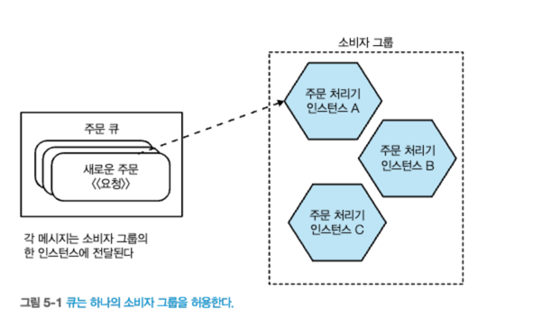

# 5. 마이크로서비스 통신 구현
- 이 장에서는 마이크로서비스 통신에 일반적으로 사용되는 `몇 가지 기술`을 살펴 본다.
## 5.1 이상적인 기술을 찾아서
- 마이크로서비스 간 통신하는 방법에는 `다양한 선택지`가 있다.
  - SOAP, XML-PRC, REST, gPRC 등
- 특정 기술을 논의하기 전에, 우리가 선택한 기술에서 `무엇을 원하는지 생각`해 봐야 한다.
### 5.1.1 하위 호환성을 쉽게 하라
- `마이크로서비스를 변경`할 때는 소비자 서비스와 `호환성이 깨지지 않도록` 해야 한다.
- 기술 선택시, 하위 호환이 쉬운 기술을 선택
### 5.1.2 인터페이스를 명시적으로 만들라
- `마이크로 서비스 인터페이스 명시적이여야 한다.`
  - 마이크로서비스 소비자가 `노출된 기능을 명확하게 이해`할 수 있어야 한다.
  - `명시적 스키마` 사용하여 인터페이스를 정의하자.
    - ex) json 응답 형태의 문서 등등, JSON Schema
### 5.1.3 API를 기술 중립적으로 유지하라
- 새로운 기술이나 도구가 항상 등장하며, 미래에는 현재 사용 중인 기술과 다를 수 있음
- 따라서, `API를 기술 중립적으로 설계`하는 것은 중요하다.
  - 기술 스택을 강요하는 통합 기술은 피해야 한다. 

### 5.1.4 소비자를 위해 서비스를 단순하게 만들라
- 소비자의 편의성 고려하여 `마이크로서비스의 사용을 단순하게` 만들어야한다.
- 소비자가 `자유롭게 기술 선택`할 수 있도록 해야 한다.
- 클라이언트 라이브러리를 제공하여, 편의성을 제공할 수 있으나 결합이 증가된다.

### 5.1.5 내부 구현 세부 사항을 숨겨라
- `상세 정보를 노출하도록 강요하는 기술`은 피해야 한다.
  - 소비자가 내부 구현에 종속되는 것을 피하기 위함
    - 기술 부채 및 변경 비용 증가 가능성

## 5.2 기술 선택
대중적이고 흥미로운 몇가지 기술

#### 1. 원격 프로시저 호출(remote procedure call)
- 원격 프로세스에서 타 서버의 메서드를 호출할 수 있는 프레임 워크.
  - `SOAP`, `gRPC` 
#### 2. REST
- GET,POST 등을 사용해 리소를 노출하는 아키텍처 방식이다.
#### 3. 그래프QL(GraphQL)
- `클라이언트가 필요한 데이터의 구조를 요청`하는 방식
#### 4. 메시지 브로커(message broker)
- `큐`나 `토픽`을 통해 비동기 통신을 하는 미들웨어

### 5.2.1 원격 프로시저 호출
- `로컬에서 원격 서비스를 실행` 하는 기술
  - 원격서비스는 동일 로컬내 프로세스 또는 물리적으로 떨어진 서버가 될 수 있다.
- 이 분야 기술의 대부분은 SOAP, gPRC와 같은 명시적 스키마를 필요로 한다.
  - ````
    //gPRC 예시
    syntax = "proto3";
    message User {
      int32 id = 1;
      string username = 2;
      string email = 3;
    }
    
    // 사용자 서비스 정의
    service UserService {
      // 사용자를 가져오는 메소드
      rpc GetUserById (GetUserRequest) returns (User) {}
    }
    ````
#### [문제점]
1. `기술 결합`(technology coupling)이 발생한다.
   - 특정 프로그래밍 언어나 기술 스택에 의존(Java RMI)
   - 최근에는 gRPC, Apache 스리프트 언어 호환이 잘되긴 한다.

2. 로컬 호출은 원격 호출과 같지 않다.
   - 로컬 호출 : 같은 프로세스 내에서 메서드를 호출
   - 원격 호출 : 물리적으로 다른 위치에 있는 메서드를 호출
     - 네트워크를 통해 데이터를 전송, 마샬링과 역마샬링 과정필요(`네트워크 비용 고려`)
     - 네트워크는 신뢰할 수 없다.(패킷변조, 통신 실패 등)
3. 깨지기 쉽다.
   - `인터페이스 변경에 대한 취약성`
     - 인터페이스에 변경(메서드 이름 or 매개변수..)이 발생하면 클라이언트 및 서버 모두가 반영 필요
   - `데이터 구조 변경에 대한 취약성`
     - 데이터 구조에 새로운 필드를 추가하거나 기존 필드를 제거하는 경우, 클라이언트 및 서버 모두가 반영 필요

#### [적용대상]
- `동기식 요청 및 응답` 모델
  - gRPC 추천
    - 비동기식 API지원
    - 플랫폼 호환성, 다양한 통신방식 등

### 5.2.2 REST
- REST(Representational State Transfer)
  - 리소스를 표현하고 상호 작용하는 아키텍처
    - 웹에서 영감을 받은 아키텍처 형식


#### [리차드슨 성숙도 모델] -  RESTful 서비스의 수준을 나타내는 모델
- 레벨 0: POX(Plain Old XML)
  - `HTTP를 단순히 전송 수단으로 사용`
- 레벨 1: 리소스 식별(URI)
  - `리소스에 대해 유일한 식별자(URI)를 사용`하여 리소스를 표현
  - ex) /post/{id}
- 레벨 2: HTTP 메서드 활용
  - `URI Resources + HTTP Method`
    - 세 번째 단계에서는 HTTP 메서드(GET, POST, PUT, DELETE 등)를 활용하여 CRUD(Create, Read, Update, Delete) 작업을 수행
  - ex) GET /post/1 (조회), DELETE /post/1 (삭제)
- 레벨 3: `하이퍼미디어 컨트롤(HATEOAS)`
  - 하이퍼미디어 컨트롤(Hypermedia as the Engine of Application State, HATEOAS)을 적극적으로 활용
  - 클라이언트가 서버로부터 받은 리소스를 통해, `다음 가능한 동작을 결정`할 수 있게 해준다.

#### [REST와 HTTP]
- HTTP 프로토콜은 REST 아키텍처와 잘 어울리는다.
  - `HTTP 동사의 활용` (REST 아키텍처에서 동사가 모든 리소스에서 동일한 방식으로 작동하도록 지정)
    - 동사를 정의하여 서버에서 리소스에 대한 작업을 수행(get, post, put)
      - get : 멱등적 리소스 검색(결과가 항상 같음)
        - ex) /customer : 고객 조회
      - post : 새로운 리소스 생성
        - ex) /customer : 고객 생성
    - `개념적으로 하나의 엔드포인트가 존재`

#### [애플리케이션 상태 엔진으로서의 하이퍼 미디어(HATEOAS)]
- HATEOAS
  - `클라이언트와 서버 간의 결합을 최소화 하고자 도입된 원칙`
  - 해당 자원에 대한 호출 가능한 링크를 전달
  - ````json
    // GET /post/{id} 의 응답값
    
    {
      "contents" : { "id" :  1},
      "links" : {
        "next_post" : "{domain}/post/2",
        "previous_post" : "{domain}/post/0"
      }
    }
    ````
#### [문제점]
- HATEOAS의 성능 문제
  - 클라이언트는 작업에 대한 엔드포인트를 찾기위해 여러 컨트롤을 탐색
    - ````
      1) 클라이언트는 상품을 구매하기 위해 서버에게 상품 목록을 요청
      2) 특정 상품에 대한 정보를 요청
      3) 해당 상품을 주문할 수 있도록 요청 
      ```` 
#### [적용대상]
- HATEOAS의 목표를 이해하지만, 장기적으로 좋다는 증거는 많이 보이지 않는다.

### 5.2.3 그래프QL
- `단일 쿼리`를 실행하여 필요한 정보를 모두 가져올 수 있다.
  - 기존에는 다운스트림 마이크로서비스에 여러 번의 호출
#### [문제점]
- 언어 지원 부족(지원 확장 중...)
- 동적 쿼리 실행으로 인한 서버 부하
- 캐싱의 복잡성
- 쓰기 작업에 대한 부적합성
- 마이크로서비스가 단순히 데이터베이스의 래퍼로 간주되는 경향
#### [적용대상]
- 외부 클라이언트와 시스템의 경계에서 사용
  - 모바일 앱과 같은 클라이언트 환경

>그래프QL은 일반적인 마이크로서비스 간 통신을 대체하는 것이 아니라 보완하는 역할  
 그래프QL사용 대안 으로 BFF(Backend For Frontend) 패턴


### 5.2.4 메시지 브로커
- 프로세스 사이에 위치해 `프로세스 간의 통신을 관리`한다.
  - `비동기 통신`을 위해 사용
#### [토픽과 큐]
- 큐
  - 두 지점 간(point to point)
  - 발신자 <- 큐 -> 소비자
    - 발신자가 소비자를 인지하고 있어야 한다.
  - `하나의 소비자 그룹 허용`
  - 발신자는 소비자에 대한 정보를 알아야함  

  
출처 : 한빛미디어 - 마이크로서비스 아키텍처 구축  

- 토픽 : 
  - 발신자 -> 토픽, 토픽 -> 여러 소비자
  - `여러 소비자 그룹 허용`
  - 발신자 어떤 소비자가 메시지를 받을지 알지 못한다.  

  
출처 : 한빛미디어 - 마이크로서비스 아키텍처 구축  
#### [전달 보장]
- **브로커의 사용 이유**
  - 비동기 통신에 유용한 여러 기능을 제공함.
  - `전달 보장 기능`(guaranteed delivery) 
    - 메시지를 배달할 때까지 메시지를 보관(`메시지 신뢰성 제공`)
    - 다운스트림 대상이 가용하지 않더라도 문제가 되지 않음
  - `고가용성`(클러스터 기반 시스템으로 실행되어 고장 날 경우에도 메시지가 손실되지 않도록 보장)
#### [신뢰]
- 브로커 선택에 대한 신중한 고려가 필요
#### [다른 특성]
- `메시지 전달 순서 보장`
  - 대부분의 브로커는 메시지가 전달되는 순서를 보장
  - 카프카는 개별 파티션 내에서만 순서 보장
- `트랜잭션 지원`
  - 쓰기 트랜잭션 제공(ex, 카프카)
  - 읽기 트랜잭션 제공(ex, 카프카) 
- `정확히 한 번 전달 보장`
  - 몇몇 브로커는 소비자에게 '정확히 한 번' 메시지 전달을 보장
#### [선택]
- `다양한 메시지 브로커`
  - 래빗엠큐(RabbitMQ)
  - 액티브엠큐(ActiveMQ)
  - 카프카(Kafka)
- `클라우드 완전관리형 브로커`
  - SCS, SNS, Kinesis
#### [카프카]
- 대용량 데이터를 처리하도록 설계
- 여러 생산자 및 소비자를 허용(확장성)
- 메시지 영속성
- 스트림 처리
  - KSOL(SQL문과 유사)
    - 데이터를 실시간으로 처리하고 분석 가능
    - 분석 결과를 다시 다른 토픽에 쓰거나 카프카 스트림 처리 어플리케이션에 전달
## 5.3 직렬화 포맷
### 5.3.1 텍스트 포맷
- 텍스트 포맷 사용 시 클라이언트 유연성 증가
  - 사람이 읽고 이해하기 쉽다.
    - JSON, XML, 아브로(Avro)
  - 유연한 구조
    - 새로운 필드 추가
### 5.3.2 바이너리 포맷
- 텍스트 포맷에 비해 `페이로드 전송 효율적`
  - 극도로 낮은 지연 시간을 필요로 하는 분산 시스템을 구축할 때 고려
## 5.4 스키마
- 마이크로서비스 엔드포인트(외부에 노출하는 API)에 `명시적 스키마 사용 이점`
  - 데이터 구조를 명확히 정의하여 통신의 이해를 돕는다.
  - 시스템에서 발생하는 오류를 보다 쉽게 확인(ex, response 값을 통해)
### 5.4.1 구조적 계약 위반 대 의미적 계약 위반
마이크로서비스에서의 계약 위반은 보통 구조적 계약 위반과 의미적 계약 위반으로 구분
  - `구조적 계약 위반`
    - 엔드포인트의 구조가 변경되어 더 이상 호환되지 않는 상황
    - 변경된 구조로 인해 서비스 사용자가 더 이상 요청을 보낼 수 없는 상황
  - `의미적 계약 위반`
    - 엔드포인트의 구조는 유지되지만, 서비스의 동작 방식이 변경
    - 서비스가 기대와 다른 결과를 반환하거나, 다른 동작을 수행
### 5.4.2 스키마를 사용해야 할까?
- `구조적 계약 위반 감지`(엔드포인트의 구조가 변경되었을 때 호환성 문제를 사전에 파악)
- `호환성 보장 및 문서화`(클라이언트와 서버 간의 구조 계약을 명확하게 정의)

## 5.5 마이크로서비스 간의 변경 처리
- `마이크로서비스 간의 변경 처리`에 대한 접근은 `크게 두 가지`로 구분
  - `중단 변경 피하기(회피)`
  - `중단 변경 관리하기(대응)`
## 5.6 중단 변경 피하기
- `확장 변경`
  - 기존 기능 유지, 새로운 필드 추가
- `관대한 독자`
  - 클라이언트 코드를 외부 계약에 유연하게 설계
- `올바른 기술 선택`
  - 변경 사항을 쉽게 적용할 수 있는 기술을 선택
- `명시적 인터페이스`
  - 마이크로서비스가 노출하는 내용을 명확히 정의, 유지 보수와 이해를 용이
- `우발적 중단 변경을 일찍 발견하기`
  - 변경 사항이 실제 운영 환경에 배포되기 전에 중단 변경 가능성을 사전에 파악
### 5.6.1 확장 변경
- 마이크로서비스 계약에 새로운 내용 추가, 기존 요소 유지
  - ex) 새로운 필드인 생년월일을 기존의 고객 정보에 추가
### 5.6.2 관대한 독자
- 클라이언트 코드를 서비스 변경에 유연하도록 설계
  - `견고함의 원칙`
    - "당신이 하는 일에는 엄격하고, 남에게서 받아들일 때는 너그럽게 하라"
### 5.6.3 올바른 기술
- 클라이언트 중단 없이 변경을 용이하게 하는 기술 사용
  - ex) gRPC, 아브로
### 5.6.4 명시적 인터페이스
- `명시적 스키마 사용`(유지 보수와 이해를 용이)
  - RPC에서는 명시적 스키마가 흔함.
  - REST에서도 명시적 스키마의 사용이 증가중
  - 비동기 메시지 프로토콜에서도 명시적 스키마 사용 시도중(AsyncAPI, CloudEvents)
### 5.6.5 우발적 중단 변경을 일찍 발견하기
- `구조적 위반 일찍 발견`
  - 스키마 비교 도구 사용(프로토락, openapi-diff, 컨플루언트 스키마 레지스트리)
- `의미적 위반 일찍 발견`
  - 소비자 주도 계약 테스트 진행
    - 서비스 제공자는 소비자가 작성한 테스트를 실행하여 계약을 준수하는지 확인


## 5.7 중단 변경 관리하기
- 중단 변경이 필요한 경우 3가지 방법

- `락스텝 배포`
  - 마이크로서비스 & 소비자 동시배포
- `호환되지 않은 마이크로서비스 버전의 공존`
  - 이전 버전 & 새버전 동시 실행
- `기존 인터페이스 에뮬레이션`
  - 새 인터페이스 노출, 기존 인터페이스 에뮬레이트

### 5.7.1 락스텝 배포
- 인터페이스 변경이 있는 마이크로서비스와, 소비자 마이크로서비스 `동시 배포`
### 5.7.2 호환되지 않은 마이크로서비스 버전의 공존
- 버전이 다른 마이크로서비스를 동시 실행  
  
출처 : 한빛미디어 - 마이크로서비스 아키텍처 구축

[단점]
- 서비스 버그 수정시, 2개의 다른 서비스를 수정&배포 + 코드베이스 분리
- 선수지식 필요
  - 특정 클라이언트가 어떤 서비스로 가야하는지
  - ex) 미들웨어 or nginx 수정
- 공통 데이터베이스 사용
  - 서로 다른 서비스에서 고객정보를 insert(공통결합)
 
[사용처]
- 몇분 or 몇시간 동안만 서비스를 공존
  - ex) 카나리아 배포시
### 5.7.3 기존 인터페이스 에뮬레이션
- 동일 서비스 에서 신&구 버전의 엔드포인트 제공
  - 중단 변경을 `단계적으로 진행`
  - ex) URI로 구분하여 라우팅( /v1/customer/ , /v2/customer/ )
  
출처 : 한빛미디어 - 마이크로서비스 아키텍처 구축  

### 5.7.4 어떤 방식을 선호하는가?
[사용예]
- 락스템 배포
  - 영향도가 단일팀으로 제한될 경우
- 버전 공존
  - 짧은 시간 동안 마이크로서비스 버전 동시 실행시
    - ex) 블루-그린 배포, 카나리아 배포
- 구 엔드포인트 에뮬레이션
  - 버전 공존 보다 훨씬 쉽게 처리 가능
  - ex) 단일 코드베이스, 미들웨어 or nginx 수정 불필요
### 5.7.5 사회적 계약
- 마이크로서비스간 계약 변경시, `소비자 우선 방식`을 수용
  - 마이크로서비스는 소비자가 호출하기 위해 존재
### 5.7.6 사용성 추적
- 소비자와 구 인터페이스 사용 중단 협의 했지만, 실제 사용 중단여부 확인 필요
  - ex) 소비자가 HTTP user-agent 식별자를 심도록 하여 확인
### 5.7.7 극단적 조치
- 소비자에게 새버전으로 업그레이드 하도록 권고
- 일방적으로 구 인터페이스 서비스 제거
- 의도적인 구 인터페이스 서비스 지연처리

## 5.8 마이크로서비스 세계에서 DRY와 코드 재사용의 위험
- DRY(Don't Repeat Yourself) 코드의 중복 
### 5.8.1 라이브러리를 통한 코드 공유
- 공유 코드가 서비스 경계 외부로 새어나가 사용되면 잠재적인 결합이 생긴다.
  - ex) 공통 도메인 객체 `클라이언트 라이브러리`

[클라이언트 라이브러리]
- 클라이언트 라이브러리에 더 많은 로직이 들어갈수록 `응집력은 약해짐`
- 클라이언트 측 기술 선택 제한
  - ex) js 라이브러리라면, 클라이언트는 js 를 사용해야한다.
- `클라이언트가 라이브러리 업그레이드를 담당`
- 클라이언트 라이브러리 사용시, `서비스 디스커버리` 및 `라이브러리 실패` 등을 탐지할 수 있어야 한다.


## 5.9 서비스 디스커버리
- 마이크로서비스가 모니터링 & 탐지
### 5.9.1 도메인 네임 시스템(DNS)
- 관례 기반의 도메인 템플릿이 효율적
  - <서비스이름>-<환경>.musiccorp.net
- TTL(Time to Live)
  - TTL에 명시된 기간동안 이전 IP를 유지(DNS 캐싱)
 > 해결방안 : 도메인 네임 엔트리가 로드밸런서를, 로드밸런스는 서비스를 가리키도록 처리
  
출처 : 한빛미디어 - 마이크로서비스 아키텍처 구축  
### 5.9.2 동적 서비스 레지스트리
- 주키퍼
  - 서비스별 구성정보 저장
  - 서비스 상태 확인
- 콘술
  - 콘술 템플릿 사용하여, 동적 구성파일 변경 제공
  - 서비스별 상태확인
  - 서비스별 구성정보 저장
  - 콘술+볼트(시크릿정보저장) 함께 많이 사용
- etcd와 쿠버네티스
  - etcd : 키-값 저장소, 쿠버네티스와 함께 사용 
- 내 색대로 만들기
### 5.9.3 사람이 사용한다는 것을 잊지 말자!

## 5.10 서비스 메시와 API 게이트웨이
- `서비스 메시`와 `API 게이트웨이`는 마이크로 서비스 사이의 프록시로 동작
  - 개별 마이크로서비스의 특정 동작과 무관하게 동작해야한다.  


- API 게이트웨이
  - `외부 트래픽 처리`
- 서비스 메시
  - `내부 트래픽 처리`  

  
출처 : 한빛미디어 - 마이크로서비스 아키텍처 구축

## 5.10.1 API 게이트웨이
- API 게이트웨이 관심사는 `외부의 요청을 내부로 매핑` 하는 것이다.
  - API 키, 로깅, 속도 제한 등
- API 게이트웨이에서 `너무 많은일은 하는 것은 피해야 한다`.

- 적용 대상
  - 복잡한 마이크로서비스 기반 애플리케이션(엔드포인트를 단일화)
      
    출처 : https://www.msaschool.io/operation/architecture/architecture-one/  
- 회피 대상
  - 호출 집계
  - 프로토콜 재작성
  - 마이크로 서비스 간 호출의 중개자로 사용
    - 네트워크 홉 추가되어, 호출 지연 -> `서비스 메시`가 더 적합
## 5.10.2 서비스 메시
서비스 메시는 서비스 `내부의 통신에 대한 제어`를 담당
- 작동 방식  
 

- `적절한 범위 내에서 공통 동작을 삽입`하는 것은 `시스템의 유연성과 확장성을 향상`
  - ex) Istio, 타임아웃 정의
- `모든 조직에게 서비스 메시가 적합한 것은 아니다.`
  - 쿠버네티스를 사용하지 않는 경우
  - 마이크로서비스가 적은 경우
## 5.10.3 다른 프로토콜은 어떨까?
- API 게이트웨이와 서비스 메시는 주로 HTTP 관련 호출을 처리하는 데 사용
- 카프카와 같은 메시지 브로커는 브로커와 직접 통신
## 5.11 서비스 문서화
- 마이크로서비스 API를 사용해 문서 최신화
- 서비스 엔드포인트 위치를 통해 문서를 쉽게 볼수있도록 해야한다.
### 5.11.1 명시적 스키마
- 명시적 스키마 엔드포인트의 사용 방법을 설명하는 데에는 제한적 -> `좋은 문서가 여전히 필요`
  - AsynAPI, OpenAPI, CloudEvents 툴 활용
### 5.11.2 자기 기술 시스템
- 자기 기술 시스템 : 시스템 자체가 자신의 구성, 동작, 상태 등에 대한 정보를 스스로 설명할 수 있는 능력을 갖춘 시스템
  - 휴먼 레지스트리(Human Registry)
    - 조직 내의 서비스에 대한 정보를 위키나 문서와 같은 가벼운 방식으로 기록하고 공유
  - 실제 데이터와 병합해 풍부한 자기 기술 시스템을 완성해나갈 수 있음
    - ex) 파이낸셜 타임즈의 비즈 옵스


#### 요약
- 해결하려는 문제가 기술 선택의 기준이 되는지 확인하라.
- 상황과 선호도에 따라 적합한 기술을 선택하되, 기술을 먼저 선택하는 함정에 빠지지 말아야 한다.
- 어떤 선택을 하든 스키마 사용을 고려하라.
  - 계약을 명시적으로 만드는 데 유용, 우발적인 중단 변경 찾는데 도움이 된다.
- 가능하면 하위 호환되는 변경을 적용하여, 독립적인 배포를 유지하도록 노력
- 하위 호환되지 않는 변경 수행시, 소비자가 업그레이드할 시간을 제공하여 락스텝 배포를 피하라.
- 엔드포인트에 대한 정보를 사람들에게 노출하라.


