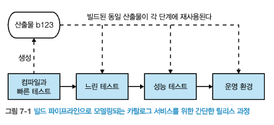
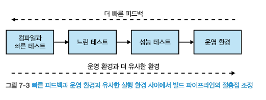
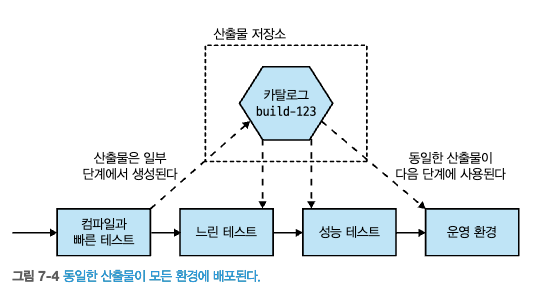

# 7. 빌드
- 이번장에서는 `빌드 파이프라인`과 `코드 관리`의 방법을 살펴본다.

## 7.1 지속적 통합에 대한 간략한 소개
- `지속적 통합`(CI, continous integration)
  - CI의 목표 : 소스코드 `동기화` & 새로 체크인한 코드가 `기존 코드와 적절하게 통합`하는것
    - 코드커밋 감지, 체크아웃, 컴파일 테스트
- **CI의 장점**
  - 정적 분석 & 테스트를 사용해 `코드 품질에 대한 피드백`
    - SonarQube & junit
  - 바이너리 `산출물 생성 자동화`
    - Jenkins
  - 배포된 산출물로부터 `역으로 코드 추적 가능`(history)
  - IAC를 수용하면, `마이크로서비스 코드` 및 `인프라를 구성`하는데 필요한 코드 버전을 제어(빌드 & 복제)
    - Terraform
### 7.1.1 실제로 CI를 하고 있는가?
- 많은 팀들이 CI 도구를 사용하는 것과 `CI를 수용하는 것을 혼동`
- **정말로 CI를 수용 하고 있는지 3가지 질문(제즈 험블)**
  - `메인라인에 하루에 한번 체크인 하는가?`
    - 가능한 한 자주 단일 메인브랜치에 통합하라
  - `변경 사항을 검증하는 일련의 테스트가 있는가?`
    - 코드가 예상대로 동작하는지 확일할 수 없는 CI는 CI가 아니다.
  - `빌드가 깨졌을 때 이를 수정하는 것이 팀의 최우선 일인가?`
    - 빌드가 안된다면 추가 체크인을 모두 중지하며, 먼저 해결한다.
### 7.1.2 브랜치 모델
- 기능 브랜치(feature branch)
  - 변경 사항을 정기적으로 통합하지 않아, `통합을 지연`시킨다.
  - 통합시 `복잡한 머지`를 해야한다.
  - 대안으로 트렁크 기반 개발
- `트렁크 기반 개발`(trunk-based development)
  - 모든 사람이 `동일한 트렁크에서 작업`
  - 기능 플래그(feature flag)와 같을 기술을 사용해 미완 작업을 숨긴다.

- 오픈 소스 개발에는 브랜치 중심 방식이 일반적
- 사유소스(private)는 브랜치 중심 방식이 적합하지 않을 수 있다.
  - ````
    [2019년 데브옵스 현황 보고서]
    코드 커밋은 더 빨리 할수록 좋다.
    작은 배치로 작업하는 것이 더 좋다.
    -> 수명이 짧은 브랜치, 작은 패치, 변경사항은 모든 사람의 생산성을 높일 수 있다.
    ````
````
tip : 브랜치 주의 사항
1. 일찍 통합하고 자주 통합하라.
2. 기능 개발을 위해 장기 브랜치를 사용하지 말라.(브랜치를 꼭 사용해야 한다면 짧게 유지)
3. 트렁크 기반 개발을 고려하라.
````

## 7.2 빌드 파이프라인과 지속적 제공(CD)
- `빌드 파이프라인`(build pipeline)의 필요성
  - 빠르게 실패하는 테스트를 먼저 실행, 느린 테스트는 그 다음에 실행
  - 소프트웨어 진행 상황 추적 & 품질에 대한 통찰력을 제공
    - 파이프라인 단계별 문제 식별
  - `배포 가능한 산출물 생성`(테스트, 성능 테스트 등 완료 )
 
  
- 지속적 제공(CD, continuous delivery)
  - 모든 체크인을 릴리스 후보로 취급
  - 운영 환경 준비 상태에 대한 지속적인 피드백
    - 컴파일이 성공했는지, 테스트가 통과 됐는지 등..  
  
출처 : 한빛미디어 - 마이크로서비스 아키텍처 구축  
  
출처 : 한빛미디어 - 마이크로서비스 아키텍처 구축  


#### 지속적 제공 vs 지속적 배포
- **지속적 제공(continuous delivery)**
  - 체크인을 릴리스 후보로 취급, 후보의 품질을 평가해 `배포할 준비가 됐는지 결정하는 단계`
- **지속적 배포(continuous deployment)**
  - 자동화된 매커니즘(ex, 테스트)를 사용해 체크인을 검증하며, 자동으로 배포되는 것이다.
- 따라서, 지속적 배포는 지속적 제공의 확장
  - 지속적 배포 없이도 `지속적 제공은 가능`

### 7.2.1 도구
- CD(continuous delivery)를 지원하는 도구를 사용
  - 파이프라인 정의 & 시각화 
  - 운영 단계까지 `전체 경로를 모델링` 가능
    - 일부 단계는 수동일 수 있다.(UAT, User Acceptance Test)

### 7.2.2 절충점과 환경
`빠른 피드백`과 `운영 환경과 유사한 환경`의 필요성 사이에서 `절충점을 검토하는 것이 중요`
- 개발용 노트북에서는 가장 빠른 피드백
- 제 운영 환경과 유사한 환경(구축 시간 & 비용이 든다)
  - `스모크 테스트`와 `병렬 실행` 기술을 운영 환경에서 수행  

  
출처 : 한빛미디어 - 마이크로서비스 아키텍처 구축  

### 7.2.3 산출물 생성
- 산출물 생성을 어떻게 CI/CD 빌드 프로세스에 적용해야 할까
  - 첫째, 산출물은 `한 번만 빌드` 한다.
  - 둘째, 배포할 산출물을 `검증` 한다.

  
출처 : 한빛미디어 - 마이크로서비스 아키텍처 구축

````
tip
산출물 생성 팁
- 배포 산출물을 한 번만 빌드하라. 
- 한 번만 빌드한 서비스를 배포하려는 모든 곳에서 재사용하라.
- 환경별 구성 정보를 다른 곳에 저장해, 산출물이 배포 환경에 구애받지 않게 하라. 
````

## 7.3 소스 코드와 빌드를 마이크로서비스에 매핑하기
- 마이크로서비스 코드를 구성하는 방법
### 7.3.1 거대한 리포지터리 하나와 거대한 빌드
- 가장 간단한 방법
- 하나의 레포지터리, 하나의 빌드(모노레포의 한 형태)
- 단점
  - 변경점이 없는 소스도 함께 테스트 진행
  - 배포시간 증가
  - 불필요하게 모든 서비스를 배포
  - 특정 서비스 빌드 실패시, 모든 서비스의 빌드가 실패  
  
출처 : 한빛미디어 - 마이크로서비스 아키텍처 구축  

### 7.3.2 마이크로서비스당 하나의 리포지터리(멀티레포-패턴)
- 서비스별 리포지터리 분리
  - 리포지터리별 단위로 소유권을 갖을 수 있다.
- 단점
  - 변경되는 서비스의 **원자적 배포 불가능**(모든 서비스를 한 번에 전체적으로 배포 불가능)
  
출처 : 한빛미디어 - 마이크로서비스 아키텍처 구축  

[리포지터리 간 코드 재사용]
- 멀티레포, 클라이언트 라이브러리 배포시 다른 서비스에 의존성 불가피하다.
- 라이브러리 배포 -> 의존되는 서비스들 재배포
  - 수동 배포 or 동적 배포  
  
출처 : 한빛미디어 - 마이크로서비스 아키텍처 구축


[여러 리포지터리에서 작업]
- 2개 이상의 리포지터리를 변경해야 할 경우
- 호환성을 위해, 순서를 정하여 배포 진행  
  
출처 : 한빛미디어 - 마이크로서비스 아키텍처 구축  

> 여러 마이크로서비스가 변경해야 한다면, 서비스 간 결합을 의미한다.

[적용 대상]
- 서비스별 단일 리포지터리 방식은 대규모 & 소규모 모두 잘 어울린다.

### 7.3.3 모노레포(패턴)
- 여러 마이크로서비스가 동일 리포지터리 사용
  - 코드를 **원자적 방식**으로 변경 가능
  - 코드를 재사용(다른 개발자나 팀이 작성한 코드를 여러 프로젝트나 모듈에서 활용)
  - 다른 사람의 코드 가시성 확보

  
출처 : 한빛미디어 - 마이크로서비스 아키텍처 구축  

> **원자적 커밋 vs 원자적 배포**
> 원자적 커밋이, 원자적 롤아웃을 제공하는 것은 아니다.  
> 여러서비스를 원자적으로 배포하는 것은 독립적 배포 원칙에 위배된다.

[빌드 매핑]
- 모노레포 내 `폴더`를 빌드에 매핑
- `폴더`
  - 둘 이상의 빌드를 트리거하는 폴더
  - 모든 마이크로서비스에서 사용되는 공통 폴더
- 이론적으로 모노레포에서는 다른 프로젝트에 의존성을 가질 수 있다.

※의존성을 효과적으로 관리하는 도구 **베이즐(bazel)** (그래프 기반 빌드 도구)

  
출처 : 한빛미디어 - 마이크로서비스 아키텍처 구축  

[소유권 정의]
- 마틴파울러 `소스 제어에 대한 소유권 모델`
  - `강력한 소유권`
    - 특정 그룹의 사람들이 소유
    - 소스 변경을 원하면 `소유자에게 변경 요청`
  - `약한 소유권`
    - 특정 그룹의 사람들이 소유
    - 그룹 외부의 사람이 소스 변경을 원할때 `소유권 그룹 사람이 검토 및 허용`
  - `공동 소유권`
    - 모든 개발자가 모든 코드를 변경

- 개발자가 많아질수록 소스 분명한 책임 경계를 만들어야 한다.
  - 도구예시 
    - 구글 퍼포스
    - 깃허브, CODEOWNERS 파일 생성해 소유자 매핑
      - pr 요청 발생시, 소유자들에게 검토 요청하게 된다.
      ````
      # 프로젝트 파일 권한 범위 + @유저아이디
      /build/logs/ @doctocat
      apps/ @doctocat
      apps/ @doctocat
      ````
[도구]
- 소스 제어 도구
  - 바이퍼
  - 깃

[모노의 범위는?]
- 조직의 다양한 부분에 소수의 모노레포를 사용할 수 있다.
  - 공동 소유권을 실천하는 팀에게 일부 문제를 피하면서 모노레포의 이점을 제공한다.
  - 기존 조직의 소유권 경계 안에서 동작하므로 의미가 있다.  
  
출처 : 한빛미디어 - 마이크로서비스 아키텍처 구축  

[적용대상]
- 자원을 투입할 수 있는 기술중심의 대기업
- 소수의 개발자팀

### 7.3.4 어떤 방식을 사용해야 할까?
- 모노레포의 장점인 세분화된 재사용 & 원자적 커밋은 규모에 따라 발생하는 문제보다 중요하지 않다.
  - 조직이 커짐에 따라 모노레포의 고충은 증가(복잡성, 유지보수, 빌드, 도구 관리 리소스 등)
  - 세밀한 소유권 제어 & 도구를 통해 모노레포에 대한 우려를 줄일 수 있지만 아직 그래프 기반 빌드 도구의 사용률은 현재 매우 낮다.
- `멀티레포 방식`을 필자는 선호한다.
#### [요약]
- 트렁크 기반 개발
- 모노레포
- 멀티레포


