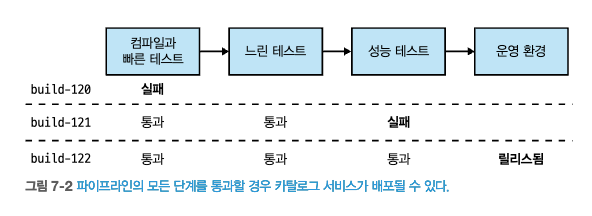

# 7. 빌드
- 지금까지 마이크로서비스의 설계 측면을 살펴봤다.
- 개발 프로세스는 어떻게 변경해야 할까?
- 이번장에서는 `파이프라인`과 `코드 관리`의 방법을 살펴본다.

## 7.1 지속적 통합에 대한 간략한 소개
- `지속적 통합`(CI, continous integration)
  - CI의 목표 : 기존 코드와 적절하게 통합되는지 확인
  - 코드커밋 감지, 체크아웃, 컴파일 테스트
- **CI의 장점**
  - 정적 분석 & 테스트를 사용해 코드 품질에 대한 피드백
    - SonarQube & junit
  - 바이너리 산출물 생성 자동화
    - Jenkins
  - 배포된 산출물로부터 역으로 코드 추적 가능(history)
  - IAC를 수용하면, `마이크로서비스 코드` 및 `인프라를 구성`하는데 필요한 코드 버전을 제어(빌드 & 복제)
    - Terraform
### 7.1.1 실제로 CI를 하고 있는가?
- 많은 팀들이 CI 도구를 사용하는 것과 `CI를 수용하는 것을 혼동`
- 정말로 CI를 수용 하고 있는지 3가지 질문(제즈 험블)
  - `메인라인에 하루에 한번 체크인 하는가?`
    - 가능한 한 자주 단일 메인브랜치에 통합하라
  - `변경 사항을 검증하는 일련의 테스트가 있는가?`
    - 코드가 예상대로 동작하는지 확일할 수 없는 CI는 CI가 아니다.
  - `빌드가 깨졌을 때 이를 수정하는 것이 팀의 최우선 일인가?`
    - 빌드가 안된다면 추가 체크인을 모두 중지하며, 먼저 해결한다.
### 7.1.2 브랜치 모델
- 기능 브랜치(feature branch)
  - 변경 사항을 정기적으로 통합하지 않아, 통합을 지연시킨다.
  - 통합시 복잡한 머지를 해야한다.
- `트렁크 기반 개발`(trunk-based development)
  - 모든 사람이 동일한 트렁크(메인브랜치)에서 작업
  - 기능 플래그(feature flag)와 같을 기술을 사용해 미완 작업을 숨긴다.

- 오픈 소스 개발에는 브랜치 중심 방식이 일반적
- 사유소스(private)는 브랜치 중심 방식이 적합하지 않을 수 있다.
  - ````
    [2019년 데브옵스 현황 보고서]
    코드 커밋은 더 빨리 할수록 좋다.
    작은 배치로 작업하는 것이 더 좋다.
    -> 수명이 짧은 브랜치, 작은 패치, 변경사항은 모든 사람의 생산성을 높일 수 있다.
    ````
````
tip : 브랜치 주의 사항
1. 일찍 통합하고 자주 통합하라.
2. 기능 개발을 위해 장기 브랜치를 사용하지 말라.(브랜치를 꼭 사용해야 한다면 짧게 유지)
3. 트렁크 기반 개발을 고려하라.
````

## 7.2 빌드 파이프라인과 지속적 제공(CD)
- `빌드 파이프라인`(build pipeline)의 필요성
  - 빠르게 실패하는 테스트를 먼저 실행, 느린 테스트는 그 다음에 실행
  - 소프트웨어 진행 상황 추적 & 품질에 대한 통찰력을 제공
    - 파이프라인 단계별 문제 식별
  - `배포 가능한 산출물 생성`(테스트, 성능 테스트 등 완료 )
 
  
- 지속적 제공(CD, continuous delivery)
  - 모든 체크인을 릴리스 후보로 취급
  - 운영 환경 준비 상태에 대한 지속적인 피드백
    - 컴파일이 성공했는지, 테스트가 통과 됐는지 등..
  
출처 : 한빛미디어 - 마이크로서비스 아키텍처 구축  
  
출처 : 한빛미디어 - 마이크로서비스 아키텍처 구축  


#### 지속적 제공 vs 지속적 배포
- **지속적 제공(continuous delivery)**
  - 체크인을 릴리스 후보로 취급, 후보의 품질을 평가해 `배포할 준비가 됐는지 결정하는 단계`
- **지속적 배포(continuous deployment)**
  - 자동화된 매커니즘(ex, 테스트)를 사용해 체크인을 검증하며, 자동으로 배포되는 것이다.
- 따라서, 지속적 배포는 지속적 제공의 확장
  - 지속적 배포 없이도 `지속적 제공은 가능`

### 7.2.1 도구
- CD(continuous delivery)를 지원하는 도구를 사용
  - 파이프라인 정의 & 시각화 
  - 운영 단계까지 `전체 경로를 모델링` 가능
    - 일부 단계는 수동일 수 있다.(UAT, User Acceptance Test)

### 7.2.2 절충점과 환경
`빠른 피드백`과 `운영 환경과 유사한 환경`의 필요성 사이에서 `절충점을 검토하는 것이 중요`
- 개발용 노트북에서는 가장 빠른 피드백
- 제 운영 환경과 유사한 환경(구축 시간 & 비용이 든다)
  - `스모크 테스트`와 `병렬 실행` 기술을 운영 환경에서 수행  

  
출처 : 한빛미디어 - 마이크로서비스 아키텍처 구축  

### 7.2.3 산출물 생성
- 산출물 생성을 어떻게 CI/CD 빌드 프로세스에 적용해야 할까
  - 첫째, 산출물은 `한 번만 빌드` 한다.
  - 둘째, 배포할 산출물을 `검증` 한다.

  
출처 : 한빛미디어 - 마이크로서비스 아키텍처 구축

````
tip
산출물 생성 팁
- 배포 산출물을 한 번만 빌드하라. 
- 한 번만 빌드한 서비스를 배포하려는 모든 곳에서 재사용하라.
- 환경별 구성 정보를 다른 곳에 저장해, 산출물이 배포 환경에 구애받지 않게 하라. 
````

## 7.3 소스 코드와 빌드를 마이크로서비스에 매핑하기
- 마이크로서비스 코드를 구성하는 방법
### 7.3.1 거대한 리포지터리 하나와 거대한 빌드
- 가장 간단한 방법
  - 하나의 레포지터리, 하나의 빌드(모노레포의 한 형태)
  - 단점
    - 변경점이 없는 소스도 함께 테스트 진행
    - 배포시간 증가
    - 불필요하게 모든 서비스를 배포
    - 특정 서비스 빌드 실패시, 모든 서비스의 빌드가 실패  
  
출처 : 한빛미디어 - 마이크로서비스 아키텍처 구축  

### 7.3.2 마이크로서비스당 하나의 리포지터리(멀티레포-패턴)
[리포지터리 간 코드 재사용]
[여러 리포지터리에서 작업]
[적용 대상]

### 7.3.3 모노레포(패턴)
### 7.3.4 어떤 방식을 사용해야 할까?

#### [요약]


