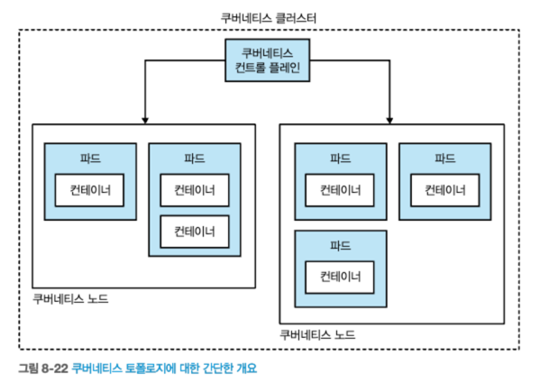
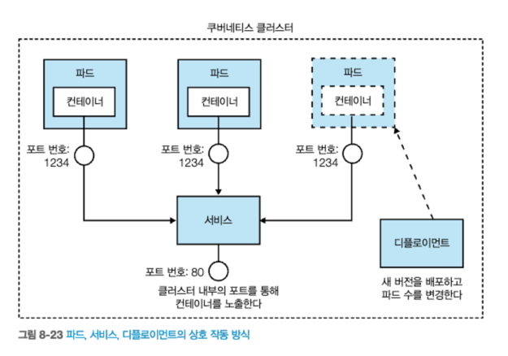
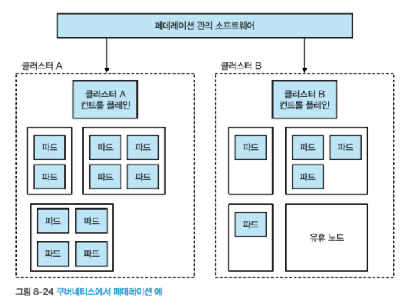
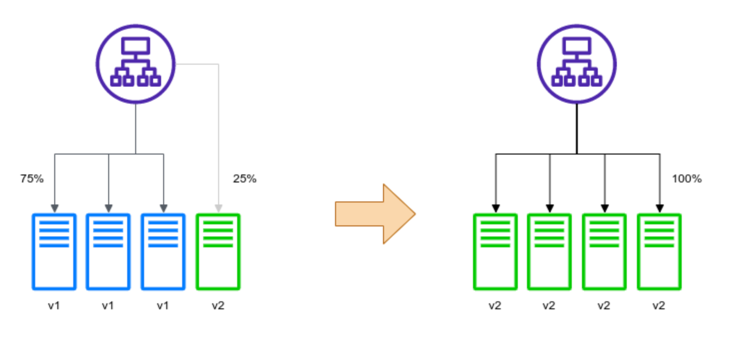

# 8. 배포

## 8.1 논리적에서 물리적으로
- 논리적 관점은 많은 복잡성을 숨겨준다.
- 물리적으로 어떤 종류의 정보가 숨어 있는지 살펴보자.  
    
출처 : 한빛미디어 - 마이크로서비스 아키텍처 구축  

### 8.1.1 다수 인스턴스

#### [로드 밸러서 라우팅 형태]  
    
출처 : 한빛미디어 - 마이크로서비스 아키텍처 구축  

#### [여러 데이터 센터 분산 형태]  
    
출처 : 한빛미디어 - 마이크로서비스 아키텍처 구축  

### 8.1.2 데이터베이스
- 마이크로서비스 **인스턴스마다** 자신의 데이터베이스를 가져야 할까? -> **아니다**
  - 상태 조회, 조작하는 로직은 **논리적으로 하나의 마이크로서비스** 이다.
- 데이터베이스를 공유하지 말라는 규칙을 위반하지 않을까?
  - 아니다, 데이터베이스 액세스 및 조작하는 로직이 **다양한 마이크로서비스에 분산되는 것을 우려**하는 것이다.  
    
출처 : 한빛미디어 - 마이크로서비스 아키텍처 구축

#### [데이터 배포 및 확장]
- 읽기, 쓰기 에 대한 **부하 분산**  
  
출처 : 한빛미디어 - 마이크로서비스 아키텍처 구축  

#### [논리적으로 분리된 데이터 베이스] (자체구축, 온프라미스에서 많이 사용)
  - 라이센스 비용절감
  - 동일한 데이터베이스 엔진 및 하드웨어
  - 공유 데이터베이스 인프라가 고장 나면, 여러 마이크로서비스에 영향을 끼칠 수 있다.  
    
출처 : 한빛미디어 - 마이크로서비스 아키텍처 구축  

#### [물리적으로 분리된 데이터 베이스, 클라우드 기반] 
  - 마이크로서비스별 전용 데이터베이스
  - 관리 비용 절감(백업, 업그레이드, 페일오버)
  - 마이크로서비스 소유자는 공유 서비스에 의존하지 않을 수 있다.  
    
출처 : 한빛미디어 - 마이크로서비스 아키텍처 구축  

### 8.1.3 환경
- 각 환경은 소프트웨어를 개발하고 **운영 준비 상태를 테스트**할 수 있도록 **특정 목적을 수행**한다.
  - 개발자 노트북, CI 서버, 통합 테스트 환경 ...
- **모든 환경이 운영 환경의 정확한 복사본**이 된다면 **가장 이상적**이다.

#### [파이프 라인 예시]
- 운영 환경에 도달하기 전에 여러 환경을 거친다.
- 신속하게 문제를 해결할 수 있도록 소프트웨어 작동여부를 빨리 파악하는 것이 중요하다.  
  
출처 : 한빛미디어 - 마이크로서비스 아키텍처 구축  

#### [다양한 환경별 마이크로서비스 배포 예시]
- 마이크로서비스의 토폴로지는 환경마다 변경된다.
- 환경별 정보(인스턴수 갯수 등..)는 배포된 **서비스 산출물과 분리**돼야 한다.  
    
출처 : 한빛미디어 - 마이크로서비스 아키텍처 구축  


## 8.2 마이크로서비스 배포의 원칙
- 몇 가지 핵심원칙
### 8.2.1 격리 실행
- `마이크로서비스 인스턴스가 자체 컴퓨팅 자원을 가진 방식으로 실행하라.`

#### [호스트당 다수의 마이크로 서비스]
- 모니터링이 어려워 진다.(모호함)
- 여러 서비스가 **컴퓨팅 자원을 공유**
  - 한 서비스 부하가 걸리면, 다른 서비스에 사용할 자원이 줄어든다.
- 여러서비스가 하나의 호스트의 있으므로 장애의 영향 분석이 복잡해진다.
- 서비스 배포 복잡성 증대
  - 의존성 충돌 가능성 등
- 팀의 자율성 저해
- **독립적 배포 가능성 약화**  
  
출처 : 한빛미디어 - 마이크로서비스 아키텍처 구축  


#### [호스트당 하나의 마이크로서비스]
- **서비스별 전용 자원**
- **서비스별 의존성 설치**  
  
출처 : 한빛미디어 - 마이크로서비스 아키텍처 구축  

#### [머신별 격리도]
- 과거에는 머신의 격리를 위해 새로운 물리 서버를 구입하거나 임대
  - 비용과 시간이 많이 소요
- 주문형 컴퓨팅 플랫폼과 가상화 기술의 발전으로 컴퓨팅 자원에 대한 비용이 대폭 감소
- 과거에 비해 컨테이너 기술은 많이 개선되었고, 다른 머신모델과의 격차를 많이 줄였다.
- 컨테이너의 격리 정도는 약하지만, **비용 효율 & 프로비저닝**이 빠르다.
- **컨테이너** 격리 기술은 **마이크로서비스 에서 중요한 선택지로 간주된다.**
  - 효율적인 리소스 관리, 스케일링 용이성, 독립성과 격리 ...   
  
출처 : 한빛미디어 - 마이크로서비스 아키텍처 구축  


### 8.2.2 자동화 집중
- 마이크로서비스의 수가 증가함에 따라 **자동화가 중요**해진다.(서비스가 작게 쪼개지므로, 해야할일이 많아 진다)
- 고수준의 **자동화를 가능하게 할 기술을 선택**하고 자동화를 **문화의 핵심 부분으로 채택**해야 한다.
---
- 마이크로서비스로 이전하면 운영 영역에서 **복잡성이 크게 증가**한다.
  - **자동화에 끊임없이 주력**해야 한다. -> 개발 생산성 증가
  - 자동화 작업을 수행할 **도구**와 **기술**을 선택해야 한다.
  - 마이크로서비스의 복잡성을 억제하려면 **자동화 문화를 수용**해야 한다.

#### 자동화의 능력에 대한 두 가지 사례 연구
- REA & 길트 라는 회사는 **자동화 도구를 채택하는데 많은 시간을 할애** 하였고, 장기적으로 **마이크로서비스의 사용을 견인하는 원동력**이 되었다.


### 8.2.3 코드형 인프라스트럭처
- 자동화를 용이하게 하고 정보 공유를 촉진하는 **인프라스트럭처 코드를 구성을 기술하라**
  - **terraform**, chef, puppet, ansible, pulumi, AWS CloudFormation 등
- 인프라스트럭처의 **코드 버전을 제어**하면 **이력 관리**를 할 수 있고, **결함 추적**에도 유용하다.

### 8.2.4 무중단 배포
- **독립적인 배포 가능성을 강화**해 서비스 **사용자에게 다운타임 없이 새 버전의 마이크로서비스를 배포할 수 있어야 한다.**
---
- **사용자 다운타임 없이** 새 버전의 마이크로서비스를 배포할 수 있도록 **독립적인 배포를 강화**하라
- 무중단 배포를 구현할 수 있는 능력은 **릴리스 빈도 향상**을 이끈다.(파이낸셜 타임즈, 사라웰스)
- 릴리스 수행시, **업스트림 소비자가 알아채지 못하게 하는 것이 목표**이다.
  - 마이크로서비스 특성에 크게 좌우된다.
    - 동기식 : 문제가 생길 여지가 있다.
    - 비동기식 : 메시지를 다시 읽어 실행 하면 되기 때문에 쉽게 구현 가능 

### 8.2.5 기대 상태 관리
- 마이크로서비스를 지정된 상태로 유지할 수 있는 플랫폼을 사용해 **장애가 발생하거나 트래픽 증가**시 **새로운 인스턴스를 시작**할 수 있도록 하라.
---
- **기대 상태 관리**(desired state management)는 **어플리케이션 인프라를 자동으로 유지 관리하는 기능**이다.
  - 인스턴스 수 지정, 메모리 및 CPU 할당 
- **플랫폼 스스로 원하는 상태를 유지하는 방법을 관리**한다.
  - 인스턴스가 죽거나 하부 하드웨어가 고장나더라도 **플랫폼이 문제를 처리**할 수 있다.
    - 플랫폼 : AWS 오토스케일링 그룹, 쿠버네티스, 노마드  

    
출처 : 한빛미디어 - 마이크로서비스 아키텍처 구축  

#### 전제조건
- **자동화된 배포**는 올바른 상태 관리를 위한 전제조건이다.
#### 깃옵스
- **기대 상태 관리 & 코드형 인프라스트럭처 통합**한다.
- 깃옵스와 비슷한 플럭스(Flux)와 같은 도구도 있다.

## 8.3 배포 방법
- 몇 가지 배포 방식 소개
### 8.3.1 물리 머신
- 마이크로서비스는 가상화 없이 `물리 머신에 직접 배포`된다.
--- 
- 마이크로서비스를 `직접 물리 머신에 배포`하는 방식
  - 직접 = **가상화X, 컨테이너X**
- 물리 하드웨어에 직접 배포하면 **자산 전체의 활용도가 낮아질 수 있다.**
  - 자원낭비 가능성(하드웨어에서 제공하는 CPU,메모리,I/O를 절반만 사용) 
- 동일 머신에 여러 마이크로서비스를 패키징하고 싶은 유혹을 받을 수 있다.
  - **격리된 실행 환경 원칙을 위반**
- **퍼펫**이나 **셰프**와 같은 도구를 사용해 `기대 상태 관리`,`무중단 배포`를 구현할 수 있지만, **물리 머신 배포와는 어울리지 않는다**.
  - `가상머신 or 컨테이너 기술 조합`이 더 적합하다.

### 8.3.2 가상 머신
- 마이크로서비스 인스턴스는 **가상 머신에 배포**된다.
--- 
- 가상화는 기존 물리머신을 **더 작은 가상 머신으로 분할**하게 함으로써 데이터 센터를 변화 시켰다.
- VMware, 가상 머신 인프라(Ec2)는 컴퓨팅 인프라의 사용도를 높이고 `호스트 관리 부담을 줄이는데 이점`을 제공한다.
  - CPU, 메모리, I/O, 스토리지를 **가상 머신에 할당**
  - 환경 분리 및 격리(서로 간의 영향을 최소화)
  - 스케일링 및 유연성
- 각 인스턴스가, 개별 VM에 배포될 때 인스턴스간 훌륭한 `격리 수준 보장` 된다.
- 하지만 하부 하드웨어가 고장나면 **서비스 인스턴스가 손실되는 문제가 여전히 존재**한다.
#### [가상화 비용]
- `수확 체감 현상`
  - 많은 가상 머신을 같은 하부 하드웨어에 넣을수록 효용이 떨어지는 현상
- 하이퍼바이저 역할 2가지
  - CPU, 메모리 자원, I/O를 물리 호스트로 매핑
  - 제어 계층 역할, 가상 머신 자체를 조작
- **하이퍼바이저가 작업**을 수행하기 위해 `자원을 별도로 확보`해야한다.
  - 관리 호스트가 많을수록 하이퍼바이저에 더 많은 자원을 확보해야한다.  
  
출처 : 한빛미디어 - 마이크로서비스 아키텍처 구축  

#### [마이크로서비스에 적합한가?]
- `격리 측면에서는 우수`하지만, `비용이 발생`한다.
- 자동화 용이성은 **사용 중인 기술에 따라 달라**진다.
- 클라우드에서 제공하는 **관리형 VM**(Ec2..등)을 통해 쉽게 자동화 할 수 있다.
  - 자동 확장 그룹, 무중단 배포
  - 전통적 가상화 플랫폼에서 제공하는 관리형VM은 중앙 통제를 받는 경향이 있어, 자동화 기능이 제한될 수 있다.
- 가상 머신이 제공하는 `엄격한 격리 수준이 필요`하거나 컨테이너화 능력이 없다면 VM이 훌륭한 선택이다.

### 8.3.3 컨테이너
- 마이크로서비스 인스턴스는 가상 또는 물리머신에서 `격리된 컨테이너로 실행`된다.
- 컨테이너 런타임은 쿠버네티스와 같은 `컨테이너 오케스트레이션 도구로 관리`할 수 있다.
--- 
- `마이크로서비스 아키텍처를 실행하기 위한 실질적인 선택지`가 됐다.
  - 도커 대중화 + 컨테이너 관리도구(쿠버네티스)
- 컨테이너가 정확히 무엇인지 이해, `가상 머신과의 차이점`을 살펴봐야한다.
#### [다른 방식의 격리]
**가상머신 vs 컨테이너**
- 하이퍼바이저가 필요 없다.-> `자원절약`
- `프로비저닝`이 가상머신에 비해 `빠르다`.
- 세밀한 리소스 할당 가능 -> `하드웨어 활용 최적화`
- 컨테이너는 **공유 커널의 일부를 사용**한다.
  - 각 컨테이너의 프로세스 트리는 커널 안에 있다.  
  
출처 : 한빛미디어 - 마이크로서비스 아키텍처 구축
- 일정 격리 수준 보장
- `비용 효과적`
  - `VM보다 격리비용이 작다.`  
  
출처 : 한빛미디어 - 마이크로서비스 아키텍처 구축  

#### [완전하지는 않다]
- 컨테이너들이 외부 세계와 소통할수 있는 방법이 필요하다.
  - `도커의 도입`이 해당 문제에 큰 도움을 주었다.
- 리소스 관점
  - 가상 머신 격리 수준처럼 `완전하게 동일하게 리소스가 할당 되지 않는다.`

#### [윈도 컨테이너]
- 리눅스와 비교할때 윈도 운영체제가 상당히 크다.
#### [도커]
- 컨테이너 프로비저닝을 관리
- 네트워킹 문제 처리
- 자체 레지스트리
- `이미지 개념 도입`
  - 산출물로 도커 이미지 생성, 레지스트리에 저장
- 도커 이미지를 빌드하거나, 이미지를 가져와 로컬에서 쉽게 실행할 수 있다.
- 여러 머신에서 컨테이너를 관리하기위해 `도커 스웜`, `도커 스웜 모드`를 출시
  - 하지만, **수많은 컨테이너를 관리할 경우 쿠버네티스가 최고**이다.

#### [마이크로서비스에 대한 적합성]
- 컨테이너는 **마이크로서비스에 매우 적합**하다.
- 하부 기술을 숨겨 **다양한 기술 스택을 혼합**할 수 있다.
- **기대 상태 관리와 같은 개념을 구현하려면 쿠버네티스와 같은 플랫폼이 필요**하다.

### 8.3.4 애플리케이션 컨테이너
- 마이크로서비스 인스턴스들이 하나의 컨테이너에서 실행되는 구조
---
- 런타임 오버헤드를 줄이는 이점이 있다.
  - 하나의 JVM 오버헤드만 발생
- 단점이 훨씬 많다.
  - 기술 선택의 제한
  - 자동화 및 관리측면 제한(선별 오토스케일링 불가)
  - 어플리케이션 컨테이너가 제공하는 기능의 가치 의문
    - 세션 클러스터링 -> 서비스 확장시 피하고 싶은 대상
  - 리소스 사용 및 스레드 분석이 훨씬 더 복잡하다.
  - **부족한 격리 수준**은 해당 아키텍처를 사용하지 않는 주된 이유가 됐다.  
  
출처 : 한빛미디어 - 마이크로서비스 아키텍처 구축  

### 8.3.5 PaaS
- Paas(Platform as a Service) 더 고수준의 추상화에서 작업하게 된다.
- 제대로 동작하지 않을때는 문제를 해결하기 위해 내부에 접근할 수 있는 **권한이 많지 않다**.
  - Paas가 더 똑똑해지려고 할 수록, 더 많은 문제가 발생하는 경우가 많다.
### 8.3.6 FaaS
- 쿠버네티스에 근접한 유일한 기술은 `서버리스` 이다.
- `머신 관리`와 `구성`에 대한 상세 내용은 사용자에게 **가려진다**.
- FaaS(Function as a Service) = `서버리스`
- AWS 람다
  - 실행되지 않는 코드는 비용이 들지 않는다.
  - 사용한 만큼만 비용 지불(on-demand)
  - 트래픽을 예측할 수 없는 상황에서 훌륭한 선택지(오토스케일링)
- FaaS 플랫폼을 사용하면 **운영 부담을 크게 줄일 수 있다.**

#### [제한 사항]
- 일종의 컨테이너 기술을 사용한다.
  - 함수의 실행 환경을 자세하게 설정하거나 제어하는 것이 어려울 수 있다.
- FaaS 제공자에 따라 언어 제약이 있다.
- 함수 호출 시간에 제약이 있다.
  - GCP 9분, AWS 15분, Azure 무제한
- **함수 호출은 무상태**(stateless)로 간주되며, **이전 호출에 남겨진 상태에 액세스할 수 없다.**
  - Azure 영속 함수로 함수를 일시 중지하고, 다시 시작할 수 있다.(AWS 스텝함수 보다 개발 친화적)

````
켄 프롬, '소프트웨어와 앱의 미래는 왜 서버리스인가?
- 개발자가 더 이상 서버에 대해 생각할 필요가 없다.
- 컴퓨팅 자원 & 용량을 관리할 필요가 없다.
 > 공급자가 관리
````
````
웹 어셈블리(Wasm)
- 다양한 프로그래밍 언어로 작성된 프로그램을 클라이언트 브라우저에서 실행하는 방법을 제공하고자 정의된 공식 표준
- 이베이 C++ 바코드 스캐너, Wasm를 사용하여 웹으로도 제공 
````

#### [문제점]
- 시작 시간(spin-up time)
  - 새로운 런타임을 가동하는 데 드는 `콜드 스타트(cole start)`
    - jvm, .NET
- 함수의 동적 확장
  - 함수 동시 호출에 대한 제한이 있다.
  - 시스템의 한 부분은 동적으로 확장 가능하나, 호출대상이 그렇지 않다면 문제가 생긴다.
#### [마이크로서비스와 매핑]

#### 마이크로서비스당 함수 매핑
  - `단일 함수`로 배포
  - 자원에 대한 요청이 **동일한 진입점**을 통해 들어오며, 요청 **경로를 기반**으로 단일 함수 내에서 분기 실행한다.  
  
출처 : 한빛미디어 - 마이크로서비스 아키텍처 구축  

#### 애그리거트당 함수 매핑
  - `애그리거트별 함수 분리`
  - `독립적`으로 배포 가능
- 주의사항
  - 첫째 : 더 크게 분류된 외부 인터페이스를 유지 해야한다.
    - 크게 분류하여야 재결합하거나, 애그리거트 모델을 재구성하려는 경우, 소비자에게 영향을 주지 않는다.
  - 두번째 : 데이터
    - 같은 팀이 모든 기능을 관리하고 개념적으로 단일한 서비스라면 **동일한 DB** 사용하는 것이 좋다.
    - 각 애그리거트 함수의 요구 사항이 달라지면 DB 사용을 **분리** 하는 것 이 좋다.
    - 업스트림 소비자에게는 여전히 단일 마이크로서비스로 표시할 가치가 있다.

[case1] 단일 함수  
  
출처 : 한빛미디어 - 마이크로서비스 아키텍처 구축  

[case2] 함수별 애그리거트, DB 1개   
  
출처 : 한빛미디어 - 마이크로서비스 아키텍처 구축  

[case3]  DB 분리  
  
출처 : 한빛미디어 - 마이크로서비스 아키텍처 구축  

#### 심지어 더욱 세분화한다.
- 애그리거트당 기능을 더 작은 조각으로 나눈다면?
- 애그리거트 핵심 원칙을 위반한다.
  - **애그리거트를 단일한 단위**로 취급해야 한다.
- 함수로 처리될 수 있는 하나의 애그리거트를 관리하는데, 이러한 복잡성을 추가할 가치가 있는지 의문

#### [향후 전망]
- 향후 대부분의 개발자가 하부 상세 내용을 숨기는 플랫폼을 사용하게 될 것이다.
- 쿠버네티스를 지원하는 FaaS 제품에 점점 더 많은 작업이 진행되고 있다.
- 더 많은 조직이 일부분 FaaS를 채택하고 있다.
  - ex) BBC 
## 8.4 어떤 배포가 적합할까?
> **tip**  
> 더 진행하기 전에 현재 하고 있는 일이 효과가 있다면 계속하라!   
> 유행에 따라 기술적인 결정을 내리지 말라.
- 마이크로서비스 배포 원칙을 검토하며 집중했던 가장 중요한 측면 중 하나는 `마이크로서비스의 격리를 보장`하는 것이다.
- 샘의 정말 기본적인 경험 규칙
  1. 고장 나지 않았다면 고치지 말라
  2. 훌륭한 PasS에 맡길 수 있다면 그렇게 하고 만족하라.
  3. 마이크로서비스 컨테이너화는 격리 비용에 대한 우수한 절충안이다.  
     **작업에 대한 어느 정도의 제어권을 여전히 제공**하며, 로컬 개발에 이점을 가져온다. **이후에는 쿠버네티스를 기대하라**.
- 클라우드 에서 배포 모델로 Faas에 적합하다면 Faas를 사용해라.
- 히로쿠나 자이트와 같은 Pass가 애플리케이션과 맞다면 모든 작업을 플랫폼에 맡겨라.

````
퍼핏, 셰프와 기타 도구의 역할
- 컨테이너가 부상하면서 역할이 비교적 크게 축소되었다.
- 코드형 인프라스트럭처의 개념은 여전히 매우 중요하다.
  - 테라폼과 같은 것은 클라우드 인프라스트럭처를 프로비저닝하는 데 매우 유용하다.
- 도메인 특화 언어(DSL)가 아닌 일반 프로그래밍 언어를 사용하는 풀루미(Pulumi)를 매우 좋아하게 됐다.
````

## 8.5 쿠버네티스와 컨테이너 오케스트레이션
- 컨테이너가 관심을 끌기 시작하며, **여러 머신에서 컨테이너를 관리하는 솔루션이 필요**해 졌다.
  - 도커스웜, 도커스웜모드, **쿠버네티스**
  - 다른 제품에 대한 많은 노력에도 **쿠버네티스**가 이 분야를 지배하게 됐다.
### 8.5.1 컨테이너 오케스트레이션에 대한 사례
- 쿠버네티스는 `컨테이너 오케스트레이션 플랫폼` 또는 `컨테이너 스케줄러`로 표현 된다.
- 컨테이너 오케스트레이션 플랫폼은 무엇이며 왜 필요할까?
  - 컨테이너 워크로드가 실행되는 **방법**과 **위치**를 다룬다.
    - 실행 방법(CPU 및 메모리 할당량, 네트워크 설정, 볼륨 마운트)
    - 위치(실행할 서버를 결정)
  - **기대 상태를 관리**해 **컨테이너들이 예상된 상태가 유지**되도록 한다.
  - **컨테이너 배포 관리 용이**

### 8.5.2 쿠버네티스의 개념 엿보기

#### [쿠버네티스 클러스터]
- **두 부분으로 구성** 된다.
  1. **노드**(실행될 머신집합)
     - 노드 안에서 물리 머신 또는 가상 머신을 실행
     - 컨테이너를 스케줄링하는 대신에 **파드(pod) 를 스케줄링** 한다.
     - `파드`는 함께 배포될 `하나 이상의 컨테이너로 구성`된다.
       - 보통 파드당 1개의 컨테이너
       - 엔보이(Envoy)와 같은 사이드카 프록시 사용시 에는 파드당 1개 이상의 컨테이너도 합리적
  2. 노드를 관리하는 **컨트롤 플레인**(control plane)  

  
출처 : 한빛미디어 - 마이크로서비스 아키텍처 구축  

#### [서비스] 
- **쿠버네티스 클러스터 내에서 라우팅을 처리**
  - 서비스는 **실행 중인 파드**들을 **클러스터 내에서 접근**할 수 있는 **네트워크 인터페이스로 매핑하는 역할**을 한다.  
- **서비스**는 호출과 파드를 상호 라우팅하려고 존재하며 **파드를 종료하거나 시작하는 새로운 파드를 처리**할 수 있다.
  - **쿠버네티스**에서는 서비스를 배포하지 않고 **서비스에 매핑되는 파드를 배포**한다.
    
출처 : 한빛미디어 - 마이크로서비스 아키텍처 구축    
#### [레플리카셋]
- 레플리카셋을 통해 **파드들의 기대 상태를 정의**한다.
  - **디플로이먼트를 통해** 처리한다.
#### [디플로이먼트]
- `파드`와 `레플리카셋`에 대한 **변경 사항을 적용하는 방법**이다.
  - 디플로이먼트를 통해 **롤링 업그레이드**, **롤백**, **노드 수 확장** 등의 작업을 수행한다.

> **마이크로서비스 배포시**  
> 1. **파드를 정의**한다.
> 2. **서비스를 정의**해 **쿠버네티스가 마이크로서비스에 액세스 하는 방법**을 알린다.
> 3. **디플로이먼트**를 사용하여 **실행 중인 포드에 변경 사항을 적용**한다.

### 8.5.3 멀티테넨시와 페데레이션
쿠버네티스는 **사용자나 그룹이 필요한 수준의 제어를 가지는데 제약**이 있다.

- **멀티테넨시(Multitenancy)**
  - 정의 : 하나의 소프트웨어 시스템이 **사용자나 그룹**이 **자신만의 독립된 환경을 가지고 있는 것**을 의미한다.
  - 쿠버네티스 위에 플랫폼을 추가하여 멀티테넌시를 지원하도록 할 수 있다.
    - 레드햇의 오픈시프트
    - 하지만, 플랫폼 사용 비용 및 특정 **벤더에 종속적** 이다.
- **페데레이션(Federation)**
  - 정의 : **여러 독립된 클러스터를 하나로 관리** 하는 것을 의미한다.
  - 쿠버네티스 클러스터를 **논리적 단일 클러스터로 관리**한다.
    - 이기종 클라우드가 될 수도 있음.
  - 모든 클러스터 위에 일부 소프트웨어 계층이 있어 **모든 클러스터에 변경을 가할 수 있다**.
  - **클러스터 간에 리소스를 공유하고 할당 할 수 있다**.  

    
출처 : 한빛미디어 - 마이크로서비스 아키텍처 구축  

> **쿠버네티스의 배경**  
> 컨테이너 관리 시스템인 오메가와 보그에서 영감을 얻은 구글 오픈 소스 프로젝트
### 8.5.4 클라우드 네이티브 컴퓨팅 재단
- CNCF(Cloud Native Computing Foundation) 비영리 리눅스 재단에서 파생
- 클라우드 네이티브 개발을 촉진하는 프로젝트의 생태계를 관리하고 지원한다.
  - 클라우드 네이티브 개발은 애플리케이션을 클라우드 환경에서 구축, 배포, 운영하는 것을 의미
- 공통 표준 및 상호 운용성을 개발하는 장소(플랫폼,포럼)이다.
- 클라우드 관련 아파치 재단이라고 생각하면 편하다.
### 8.5.5 플랫폼과 이식성
- 쿠버네티스는 컨테이너 워크로드를 실행하는 데에 사용되는 기술이며, 플랫폼 자체는 아니다.
  - 사용자들은 서비스 메시, 메시지 브로커, 로그 집계 도구 등을 추가하여 자체적인 플랫폼을 구축.
- 일부 제품은 기본적인 플랫폼을 제공하여 선택의 폭을 제한(오픈시프트)
- 쿠버네티스는 컨테이너 실행을 위한 추상화를 제공하지만, 실제로는 클러스터 간의 애플리케이션 이동이 어려울 수 있다.
### 8.5.6 헬름, 오퍼레이터, CRD!
- 쿠버네티스에서는 제삼자 애플리케이션과 하위 시스템의 배포 및 관리가 복잡하다.
- 이러한 복잡성을 해결하기 위해 **헬름**(Helm)과 **오퍼레이터**(Operator)와 같은 도구 등장
  - 헬름은 쿠버네티스의 패키지 매니저로서 초기 설치를 관리한다.(헬름은 스스로 `쿠버네티스의 누락된 패키지 매니저라고 칭함`)
  - 오퍼레이터는 애플리케이션의 지속적인 관리에 중점을 둔다.
- 최근에는 **사용자 지정 리소스 정의(CRD,custom resource definition)가 발전**하고 있으며, 이를 통해 쿠버네티스 API를 확장하여 새로운 동작을 추가할 수 있다.
  - CRD를 사용하면 구성 정보의 작은 비트부터 서비스 메시 제어, 클러스터 기반 소프트웨어까지 다양한 작업에 적용할 수 있다.
### 8.5.7 Knative
- Knative는 내부적으로 쿠버네티스를 사용해 **FaaS방식의 워크플로를 제공하는것이 목표**인 오픈소스 프로젝트이다.
  - Knative의 목표는 개발자에게 쿠버네티스의 복잡성을 숨기는 것
### 8.5.8 미래
- **더 많은 조직**이 사설 클라우드를 위해 쿠버네티스 클러스터나 관리형 클러스터를 사용할것으로 예상된다.
- 점점 더 높은 수준의 추상화 계층 아래에 숨겨진 쿠버네티스를 보게 될 것이다.
### 8.5.9 사용해야 할까?
- 자체 쿠저네티스 클러스터를 구현 및 관리하는 것은 상당히 힘든 작업이다.
- 더 나은 방법은 완전 관리형 클러스터를 사용하는 것이다.
  - 사용할 수 있다면 완전 관리형 솔루션을 사용하라.
- 쿠버네티스 사용전 관리자와 개발자가 사용하도록 하라.
  - 실제로 이 물건을 사용할 사람들이 그것을 갖고 놀게하라
    - 카타코다(katacoda)에서 핵심 개념을 파악할 수 있다.

## 8.6 점진적 제공
- 소프트웨어를 덜 위험하게 배포하는 데 더욱 발전하였다.
  - 소프트웨어 릴리스를 더 자주 하게 되었다.
- `디지털 트랜스포메이션 엔진`에서는 성과가 좋은회사는 더 자주 릴리즈하였고, 동시에 **변경 실패율도 훨씬 낮다.**
- 더 자주 릴리즈하기 위해 토글, 카나리아 릴리스, 병렬 실행 등과 같은 기술을 사용한다.
### 8.6.1 배포와 릴리스의 분리
- `신뢰할 수 있는 소프트웨어 출시`(재즈험블) 저위험 소프트웨어 릴리스의 핵심원칙
  - **배포**는 소프트웨어의 일부 버전을 특정환경에 설치될 때 발생한다.
  - **릴리스**는 시스템이나 기능을 자용자가 사용할 수 있도록 만드는 것이다.
- 두 개념을 분리함으로써 사용자에게 실패 없이 운영 환경에서 소프트웨어가 작동할 수 있다고 주장한다.
  - ex) 블루/그린 배포
     
  출처 : [삼성SDS](https://www.samsungsds.com/kr/insights/1256264_4627.html)  
### 8.6.2 점진적 제공으로
- 점진적 제공(progrssive delivery), 제임스 거버너
  - `폭발 반경을 세밀하게 제어하면서 지속적으로 제공하는 것`
  - 점진적 제공은 지속적 제공의 확장이자 **새로 출시된 소프트웨어의 잠재적 영향을 제어할 수 있는 기능을 제공하는 기술** 이다.
- 점진적 제공이 '비즈니스'에 미치는 영향을 설명, 아담 짐먼
  - 하나의 롤아웃이 아니라 단계적 활동이다.
  - 결과에 가장 밀접하게 책임이 있는 **프로덕트 오너에게 기능 제어를 위임**함으로써 **프로덕트 오너에게 권한을 부여**할 수 있다는 점 이 중요하다.
### 8.6.3 기능 토글
- **기능 토글**(기능 플래그)을 사용하면 **기능을 on/off 하는데 사용**할 수 있다.
  - `트렁크 기반 개발의 일부로 일반적으로 사용`된다.
  - 이 기능은 지정된 시간에 기능을 켜거나 문제가 되는 기능을 끄는 데 유용하다.
- **세분화된 방식으로 기능 토글을 사용**할 수 있다.
  - 특정 그룹은 기능이 켜져있고, 그외에는 꺼져있다.
  - 카나리아를 롤아웃 구현시 도움이 될 수 있다.
### 8.6.4 카나리아 릴리스
> 실수는 사람이 할 수 있는 일이지만, 정말 일을 망치려면 컴퓨터가 필요하다.
- 카나리아 릴리스는 실수로 인한 영향을 제한 한다.
- **카나리아 롤아웃**은 **제한된 일부 고객에게만 새로운 기능을 제공하는 개념**이다.
- 여기서 이야기하는 카나리아 구현은 하나의 마이크로서비스가 아니라 **라우팅/네트워킹 경로 어딘가에 존재**해야 한다.
    
### 8.6.5 병렬 실행
- 카라리아 릴리스를 사용하면, 두 버전의 기능이 동일한 요청을 어떻게 처리하는지 비교 불가
- 병렬실행을 사용하면 비교 가능하다.
  - 서비스 호출을 동일한 서비스의 서로 다른 두 버전으로 보내고 결과를 비교
  - 동일한 서비스 내에서 해당 기능 구현을 모두 공존시킴
  - 하나의 구현은 신뢰할 수 있는 출처로 간주한다.
  - 요청이 들어오면 두 개의 마이크로서비스가 동시에 실행되고, 각각의 마이크로서비스가 해당 요청을 처리
    - ex) 조심해야할 것이 두개의 주문이 생길 수 있다.
- 깃허브는 코드베이스의 핵심 부분을 재작업할 때 이 패턴을 사용하고 이 프로세스를 돕기 위해 오픈 소스 도구인 **사이언티스트**를 출시했다.
  - **병렬 실행은 사이언티스트가 호출 비교를 돕기 때문에 단일 프로세스 내에서 수행**된다.
> 수정 범위가 크다면 병렬 실행을 통해서 일주일동안 데이터가 맞는지 확인 할 수 있다.  
> 모놀리스 -> 마이크로 서비스로 넘어갈때 종종 사용한다.  
> 병렬실행 : 다크런칭(배포와 릴리즈를 분행)  
#### 요약

> [배포원칙]
> - 격리 실행  
마이크로서비스 인스턴스를 자체 컴퓨팅 자원이 있는 격리된 방식으로 실행하라. 근처에 실행 중 인 다른 마이크로서비스 인스턴스의 실행에는 영향을 주지 않아야 한다.  
> - 자동화 집중  
고수준의 자동화를 허용하는 기술을 선택하고 자동화를 문화의 핵심 부분으로 채택하라.
> - 코드형 인프라스트럭처    
자동화를 용이하게 하고 정보 공유를 촉진하는 인프라스트럭처 구성을 기술하라. 환경을 재구축할 수 있도록 이 코드를 소스 제어에 저장하라.
> - 무중단 배포  
독립적인 배포 가능성을 더 높이고, 서비스 사용자(인간이나 다른 마이크로서비스)에 대한 중단 시간 없이 새로운 버전의 마이크로서비스 배포를 수행할 수 있는지 확인하라.
> - 기대 상태 관리  
마이크로서비스를 정의된 상태로 유지하는 플랫폼을 사용해 중단되거나 트래픽이 증가할 때 필요하다면 새로운 인스턴스를 시작한다.

> [배포 플랫폼]
> - 고장나지 않았다면 고치지 말라
> - Paas에 맡길 수 있다면 그렇게 하고 만족하라.
> - 마이크로서비스를 컨테이너화하는 일이 쉬운일은 아니지만, 격리 비용에 대한 우수한 절충안이다.
>   - 향후에는 쿠버네티스를 기대하라.
