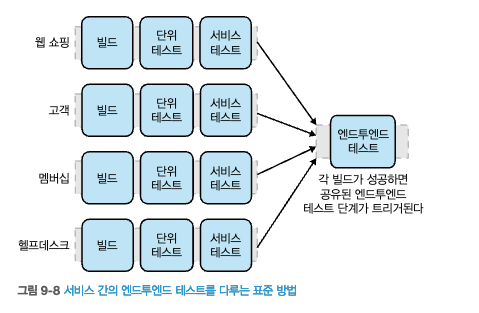

# 9. 테스트
- 기능이 분산 시스템에 걸쳐 있을경우, 효과적이고 효율적으로 테스트하는 방법에 대한 문제는 남아있다.
- 세분화된 시스템 테스트와 새 기능을 릴리스 하도록 도와주는 **몇 가지 해결책을 제시**한다.
- 이번장에서는 마이크로서비스 아키텍처 테스트가 모놀리식과 어떻게 다른지 중점을 둔다.
- **마이크로서비스를 테스트시 다른 차원의 복잡성이 추가**된다.
- **이전에는 주로 소프트웨어가 운영되기 전에 테스트를 진행**했지만, **점점 운영 환경에 진입 후 테스트를 수행**한다.
  - 개발과 운영 활동 사이의 경계가 모호해지고 있다.

## 9.1 테스트 유형
- `브라이언 마릭`이 고안한 테스트를 위한 분류시스템
- `애자일 테스팅:테스트와애자일 팀을 위한 실용 가이드`
  - **테스트 사분면**  
          
  출처 : 한빛미디어 - 마이크로서비스 아키텍처 구축        
- **기술 대면 테스트**
  - 개발자가 시스템 구축하는 데 도움을 주는 테스트
  - `단위 테스팅`, `속성 테스팅`
    - ex) `성능 테스트`, `단위 테스트` 
    - `자동화` 되어 해당 테스트를 진행 한다.
- **비즈니스 대면 테스트**
  - `비기술 이해관계자`가 `시스템 작동 이해도를 돕는 테스트` 이다.
    - `인수 테스트`, `탐색 테스팅`
      - ex) 넓은 범위의 엔드투엔드 테스트, 수동 테스팅(UAT)
- 위의 테스트는  **운영 전 검증에 초점**을 맞춘다.
  - 테스트를 통해 운영 환경에 배포되기 전에 충분한 품질을 갖췄는지 확인한다.
- 최근에는 가능한 한 **많은 반복 테스트를 자동화** 하기 위해 **수동 테스트에서 벗어나는 분위기** 이다.
- 소프트웨어를 빠르고 효율적으로 검증할 수 없다면 마이크로서비스의 이점을 얻지 못한다.

> **수동 탐색 테스팅**  
  > 이전에는 수동으로 수행했던 작업을 자동화 할 수 있게 됐다.  
  > 수동으로 했던 작업이 자동화 되므로, 덜 반복적인 탐색 테스팅에 집중할 수 있는 시간을 확보하게 됐다.
  > 수동 테스팅은 테스트 작성 비용으로 인해 자동화된 테스트를 구현하지 못할 경우 중요할 수 있다.
  > **자동화에 집중하라!.**

> **테스트 유형**   
> - 단위 테스트(Unit Testing)  
>   - 코드의 함수, 메소드, 클래스 부분을 테스트
> - 속성 테스트 (Attribute Testing)
>   - 소프트웨어의 특정 속성(보안,성능,신뢰성,호환성) 테스트
> - 탐색테스트(Exploratory Testing)
    >   - 탐색 테스트는 미리 계획된 테스트 케이스나 스크립트 없이 테스터가 시스템을 조사하고 탐색하는 테스트
> - 인수 테스트(Acceptance Testing)
>   - 소프트웨어나 시스템이 계약된 요구사항을 충족시키는지 확인

## 9.2 테스트 범위
- 마이크 콘은 `경험과 사례로 풀어내 성공하는 애자일` 에서 `어떤 유형의 자동화 테스트`가 필요한지 `테스트 피라미드 모델을 소개`했다.
- **마이크 콘의 테스트 피라미드**  
      
  출처 : 한빛미디어 - 마이크로서비스 아키텍처 구축
  - 단위테스트, 서비스 테스트, UI테스트 **총 3가지**로 나뉜다.
  - **올라갈수록 테스트 범위가 증가**하며, 테스트 중인 기능이 작동한다는 **확신이 커진다**.
    - 하지만, 올라갈수록 **테스트 시간이 오래**걸리며, 실패시 어떤 기능이 손상됐는지 확인하기 더 어렵다.
  - **내려갈수록 테스트가 훨씬 빠르다**.
    - **피드백 주기도 향상**된다.
    - **고장 난 기능을 더빨리 발견**한다.
    - **지속적 통합 빌드 빠르다**.
    - 각 테스트는 더 **잘 격리돼** 고장을 이해하고 수정하기가 더 쉽다.
  - 테스트 피라미드의 문제점은 **모든 용어가 사람마다 다른 의미**를 갖는다.
    - `서비스`라는 의미는 다중적, `단위 테스트` 정의는 사람마다 다르다.
    - 필자는 UI테스트를 `엔드투엔드 테스`트라고 부르는것을 선호한다.
### 9.2.1 단위 테스트
- **단위 테스트**는 `단일 함수` 또는 `메서드 호출을 테스트`한다.
  - **테스트 주도 설계**(TDD)도 단위 테스트에 포함(속성기반 테스트)
- **단위 테스트**
  - **마이크로서비스를 시작하지 않는다.**
  - **외부 파일 사용 및 네트워크 연결도 제한**된다.
  - **코드의 작은 부분을 격리해 테스트**한다.
- **단위 테스트의 핵심목표**
  - 기능이 정상적으로 작동하는지 **빠른 피드백 제공**
  - **코드 리팩터링을 지원**하는 데 중요
    - 안심하면서 코드를 재구성할 수 있다.  
        
  출처 : 한빛미디어 - 마이크로서비스 아키텍처 구축  

> **용어 정리**  
> - Test-Driven Development
>   - 코드 작성 단계에서 **테스트를 먼저 작성하는 개발 방법**
>   - Write a failing test case.  
      Write code to make the test pass.  
      Refactor the code to improve its design, performance, and other aspects.  
> - Test-Driven Design
>   - 디자인 단계에서 테스트를 기반으로 **시스템 아키텍처를 설계**하는 방법
>   - Write a specification for the system's behavior in the form of a test.  
      Write code to make the test pass.  
      Refactor the code to improve its design, performance, and other aspects.  

### 9.2.2 서비스 테스트
####  **[서비스 테스트]**
- 사용자 인터페이스를 우회하고 **마이크로서비스를 직접 테스트** 한다.
- 여러 마이크로서비스로 구성된 시스템의 경우, **서비스 테스트**는 **개별 마이크로서비스의 기능을 테스트** 한다.
- **서비스 테스트**는 테스트 범위는 **어느 정도 격리**돼 있다.
- 테스트 실패의 원인은 **테스트 중인 마이크로서비스로 제한**돼야 한다.
- [그림 9-5]와 같이 **외부 협업자를 모두 쳐내야한다**.  
         
  출처 : 한빛미디어 - 마이크로서비스 아키텍처 구축  
- 실제 **데이터베이스**에 대해 테스트하거나 **네트워크**를 통해 스텁 다운스트림 협업자와 통신하기로 결정한다면 **테스트 시간은 늘어 날 수 있다**.
- 단위 테스트보다 더 넓은 범위를 다루기 때문에, **단위 테스트보다 문제 탐지가 더 어렵다**.
- 광범위한 테스트보다는 취성(깨지기 쉬운 성질)이 낮다.

### 9.2.3 엔드투엔드 테스트
- 엔드투엔드 테스트는 **시스템 전체에 대해 테스트를 수행**한다.
- 엔드투엔드 테스트는 **마이크로서비스 맥락에서 제대로 테스트하기 까다롭다.**  
         
  출처 : 한빛미디어 - 마이크로서비스 아키텍처 구축  

> **통합 테스트는 어떤가?**  
> 사람마다 통합 테스트를 부르는 기준이 다름  
> - 어떤사람은 두 서비스 간의 상호작용, 코드와 데이터베이스 간의 연결만 담당  
> - 어떤사람은 엔드투엔드 테스트와 동일하게 사용

### 9.2.4 절충안
- 단위 테스트는 범위가 작으므로 실패를 빨리 찾을 수 있다.
- 테스트 범위가 커질수록 신뢰도는 높아지지만, 테스트 실행 시간이 길어져 **피드백이 느려진다**.
  - 테스트를 작성하고 유지하는 데 비용이 많이든다.
- 따라서, 최적안을 찾기위해 테스트 **유형별 테스트 수를 알맞게 조절**해야 할 경우가 많다.
- 서비스 또는 엔드투엔드 테스트와 같은 **넓은 범위의 테스트가 실패하면** 더 작은 범위의 **단위 테스트를 작성해 실패한 부분을 더 빨리 찾아야 한다**.
  - **범위가 더 큰 일부 테스트를 빠른 단위 테스트로 대체하라.**
- 테스트 관련 `안티패턴`은 **테스트 아이스크림콘** 또는 **역피라미드**이다.
  - 작은범위의 테스트가 거의 없고, 넓은 범위의 테스트에서 모든영역을 커버한다.
  - 테스트가 매우 느리게 수행, 피드백 주기가 매우 길다.
  - 지속적 통합의 일부로 실행될 경우, 빌드가 중단될 수 있다.  
         
  출처 : [https://k-hartanto.medium.com/testing-pyramid-and-testing-ice-cream-cone-what-is-the-difference-6ddde3876c20]()

## 9.3 서비스 테스트의 구현
- 서비스 테스트는 전체 마이크로서비스에서, **해당 마이크로서비스의 기능 일부를 테스트**한다.
- 서비스 테스트는 **테스트 중인 마이크로서비스로 제한**돼야 한다.
- 서비스 테스트 집합은 **다운스트림 협업자를 쳐내고** **테스트 중인 마이크로서비스**를 **스텁 서비스에 연결하도록 구성해야 한다**.
  - **스텁 서비스에서 응답을 보내도록 구성**해야한다.
 

### 9.3.1 목 또는 스텁 사용
- `목` 또는 `스텁`을 통해 **다운스트림 협력자를 스텁**한다.
  - stub : 미리 정해 놓은 값을 반환
    - 한번 또는 여러 번 호출되는지 여부는 중요하지 않다.
  - mock : 클래스나 인터페이스를 시뮬레이션 
    - 실제로 호출이 이뤄졌는지 확인 하며, 가짜 협업자가 더 영리해질 필요가 있으며, **과도하게 사용시 테스트가 취약**해질 수 있다.
- 제라스 메스자로스는 목과 스텁을 포함해 **테스트 더블(Test Double)** 라고 부른다.
  - 테스트 더블 : 컴포넌트나 객체를 대신하는 것을 총칭한다.
> [테스트 주도 개발로 배우는 객체 지향 설계와 실천] - 스티브 프리먼, 프라이스
  
### 9.3.2 더 영리한 스텁 서비스
- **마운티뱅크**(Mountebank)
  - **테스트 더블(Test Double)을 지원**하는 첫번째 오픈소스 도구
  - **메시징 프로토콜에 대한 스텁은 지원하지 않는다**.
  - 고객 마이크로서비스 테스트시
    - 멤버십 서비스 역할을 하는 **마운티뱅크 인스턴스 시작**  
           
    출처 : 한빛미디어 - 마이크로서비스 아키텍처 구축  

## 9.4 까다로운 엔드투엔드 테스트의 구현
- 엔드투엔드 테스트의 핵심은 사용자 인터페이스를 통해 전반적인 기능을 구동하는 것이다.
- 따라서, **엔드투엔드 테스트를 구현**하려면 여러 마이크로서비스를 배포한 다음에 **모든 마이크로서비스를 배포 해야한다**.
  - 넓은 범위를 다루고 있어, 시스템 작동을 더욱 확신하게 해준다.
  - 테스트는 느려지고, 실패를 찾아내기 어려워진다.   
- 모든 마이크로서비스와 협업하기 때문에, **다른 마이크로서비스의 어떤 버전**을 사용해야 하는지 모호하다.
- 다른 마이크로서비스가 수행하는 엔드투엔드 테스트와 동일한 테스트를 실행할 수 있으므로, **배포 중복의 문제**가 발생할 수 있다.  
  
출처 : 한빛미디어 - 마이크로서비스 아키텍처 구축  

- 여러 파이프라인을 **하나의 엔드투엔드** 테스트 단계로 **팬인**(fan in)해 모두 처리  
  
출처 : 한빛미디어 - 마이크로서비스 아키텍처 구축

### 9.4.1 불안정하고 깨지기 쉬운 테스트
- 테스트 범위가 증가하여, 테스트 대상 기능이 아닌 **다른 문제가 발생해 테스트가 실패하는 상황이 발생**할 수 있다.
  - 예를들어, CD를 주문할 수 있는지 확인하려면 4~5개의 마이크로서비스를 활용하여 테스트 중 네트워크 문제, 서버 다운 등등 여러 문제가 겹칠 수 있다.
- **구성 요소가 많을수록 테스트는 더 불안정해진다**.
- **엔드투엔드 테스트 신뢰할 수 없는 테스트가 될 가능성이 있다.**
  - 다수 스레드(프로세스)에서 수행되는 기능을 다루는 테스트 문제 가능성
  - 경합 조건, 타임아웃, 실제 기능 결함 등이 포함될 수 있다.
- **불안정한 테스트는 우리의 적이다.**
  - 불안정한 테스트를 감지하면 이를 제거하기 위해 최선을 다해야 한다.
  - 불안정한 테스트 집합은 **비정상의 정상화**(다이앤 본) 측면에서 희생양이 될 수 있다.
  > 비정상의 정상화 : 잘못된 것에 익숙해져, 문제가 아닌것으로 인지하는 현상
- `테스트에서 비결정론 근절하기`(마틴 파울러)
  - **불안정한 테스트가 있을경우, 테스트 집합에서 제거하도록 해야한다**. 
- **더 작은 범위의 테스트로 대체할 수 있는지 고려**해야 한다.

### 9.4.2 누가 엔드투엔드 테스트를 작성하는가?
- 해당 서비스를 소유한 팀이 해당 테스트를 작성하는 것이 합리적이다.
- 하지만, 여러 팀이 관련돼 있고, 엔드투엔드 테스트 단계가 팀 간에 공유된다면, **테스트 아이스림콘**에서 절정에 이른다.
- 이를 해결하기 위해, **특정 엔드투엔드 테스트를 특정 팀의 책임으로 지정**한다.
  - **엔드투엔드 테스트 집합을 각 팀들이 소유한 기능 그룹으로 분할**
  - 하지만, 근본적으로 다른 팀 사람들이 중단시킬 수 있는 테스트라는 문제점은 여전하다.
           
  출처 : 한빛미디어 - 마이크로서비스 아키텍처 구축  

- 때때로 조직은 테스트를 작성하는 전담 팀을 둬 대응한다.
  - **이 방식은 재앙을 초래**할 수 있다.
    - 소프트웨어를 개발하는 팀은 코드 테스트에서 점점 멀어진다.
    - 테스트 팀이 테스트를 작성하기 위한 시간이 든다.
- **팀 간 엔드투엔드 테스트에서 벗어나야 한다**.

### 9.4.3 엔드투엔드 테스트는 얼마나 오래 걸릴까?
- 엔드투엔드 테스트는 시간이 오래 걸린다.
- 이러한 느린 테스트 속도는 이러한 테스트가 대개 불안정하다는 사실과 더해져 큰 문제가 될 수 있다.
  - 기능과 관련 없이 자주 말썽을 일으키는 테스트 집합은 재앙이다.
- 기능이 고장났을때, 알아내는 데 많은 시간이 소요 된다.
- 셀레니움 그리드를 사용하여 테스트를 병렬 수행할 수 있지만, 불필요한 테스트를 제거하는일은 대체할 수 없다.
### 9.4.4 대규모 적체(쌓이고 쌓여 제대로 통하지 못하고 막힘)
- 엔드투엔드 테스트가 오래 걸리는 경우, 발견된 문제를 수정하는 데에도 많은 시간이 소요된다
  - 이것은 **적체**로 이어질 수있다.
- 또한, 고장 난 통합 테스트 단계를 수정하는 동안 **업스트림 서비스의 변경이 누적**될 수 있다.
- 엔드투엔드 테스트가 실패할경우, **체크인 제한**하는 것은 비현실적이다.
- 따라서, **테스트 집합을 더 빠르게 만드는 것이 해답이다.**
- **엔드투엔드 테스트로 인해** 작은 변경 사항을 **릴리스하는 시간이 느려지면 득보다는 실이 더 크다**.
### 9.4.5 메타버전
- 엔드투엔드 테스트 사용시, `전체 시스템을 위한 버전 번호 사용하는 건 어떨까?` 라는 대화로 이어질 수 있다.
  - 하지만, **마이크로서비스의 주요 이점**인 **다른 서비스와 독립적으로 배포**할 수 있는 능력을 잃게 된다.
- 여러 서비스를 함께 배포하는 것을 수용하는 방식은 **서비스가 결합되는 상황으로 이어진다**.
  - 이러한 종류의 결합은 모놀리식 애플리케이션 보다 더 나쁜 상황을 초래할 수 있다.
### 9.4.6 독립적인 테스트 가능성 부족
- 팀이 독립적으로 일한다면 **독립적으로 테스트** 할 수 있어야 한다.
  - 팀 자체적으로 테스트 환경을 제공해야 한다.
  - **테스트와 관련된 독립적인 인프라스트럭처를 활용**할수 있도록 환경을 조성해야 한다.
- **엔드투엔드 테스트는 팀의 자율성을 감소** 시킨다.
- `디지털 트랜스포메이션 엔진` 연구 내용
  - 성과가 높은 팀은 `통합 테스트 환경 없이도 요구에 따라 바로 대부분의 테스트를 수행할` 가능성이 더 높다

## 9.5 엔드투엔드 테스트를 피해야 할까?
- 엔드투엔드 테스트를 사용할 때 해결하려는 주요 문제 중 하나는 무엇인가?
  - 의미적 중단 포착
- 엔드투엔드 테스트는 **의미적 중단을 포착**하는데 도움이 되긴 하지만, **많은 비용**이 든다.
  - > `의미적 계약 위반`  
    > - 엔드포인트의 구조는 유지되지만, 서비스의 동작 방식이 변경
    > - 서비스가 기대와 다른 결과를 반환하거나, 다른 동작을 수행
- **의미적 중단의 변경을 축소된 범위로 테스트를 격리**할 수 있는 테스트가 있다.
  - `계약 테스트`와 `소비자 주도 계약`

### 9.5.1 계약 테스트와 소비자 주도 계약 //TODO
- 계약 테스트(contract test)
  - 외부서비스 사용팀이, 외부 서비스의 기대 작동 방식을 설명하는 테스트를 작성한다.
  - 외부 마이크로서비스를 테스트하는 것이 아니라 `외부 서비스의 작동 방식을 지정`하는 것이다.
- 소비자 주도 계약(consumer-driven contract, CDC)
### 9.5.2 결론
- 엔드투엔드 테스트는 구성 요소의 증가할수록 단점이 늘어난다.
- **엔드투엔드 테스트**는 소프트웨어 품질을 검증하는 **다른 메커니즘을 통해 대체**할 수 있다.
  - ex) 명시적 스키마, CDC 사용, 운영 환경 내 테스트, 카나리아 릴리스
  - 엔드투엔드 테스트는 **보조적 테스트 수단**이다.
## 9.6 개발자 경혐
- 개발자는 스텁이 없는 여러 마이크로서비스를 연결하는 넓은 범위의 테스트를 실행해야 하는 상황에 직면할 수 있다.
- 해결책으로 개발자가 클라우드 환경에서 개발 및 테스트를 수행할수 있도록 한다.
  - 로컬 환경에서만 일부 마이크로서비스를 실행, 나머지 협업 서비스는 클라우드 에서 실행
  - 피드백 주기가 더 나빠질 수 있다.
- 완전히 클라우드에서 개발하는 방법도 있다.
  - 클라우드 기반 IDE (Cloud9, aws)
- **개발자가 실제 작업 중인 마이크로서비스만 실행하는 것을 목표로 해야 한다.**
  - ex) 팀이 소유한 서비스가 5개이고, 팀 범위에 있는 서비는 로컬 스텁을 만들어야 한다.
## 9.7 운영 전 테스트에서 운영 중 테스트로
### 9.7.1 운영 환경 테스트 유형
### 9.7.2 운영 환경에서 안전한 테스트 만들기
### 9.7.3 MTBF 보다 MTTR?
## 9.8 교차 기능 테스트
### 9.8.1 성능 테스트
### 9.8.2 견고성 테스트

#### [요약]
