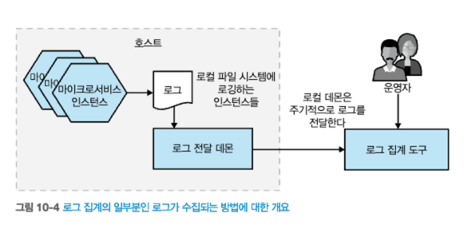
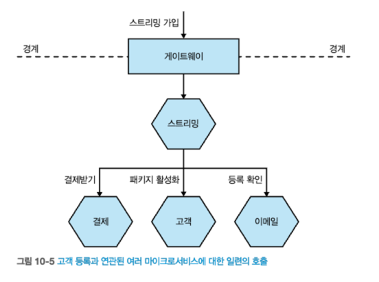
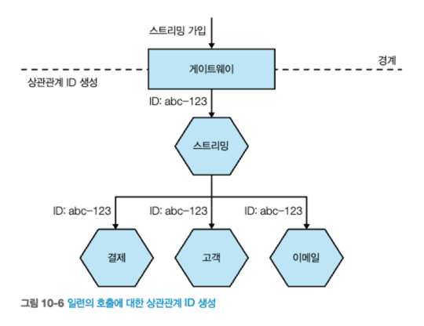
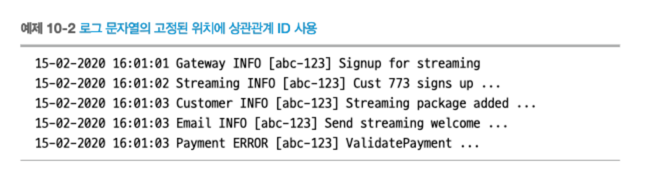

# 10 모니터링에서 관찰가능성으로
- 모놀리스 애플리케이션에서 작동했던 도구와 기술이 마이크로서비스 아키텍처에서는 적합하지 않다.
- 시스템을 마이크로서비스로 분해하면 **새로운 복잡성을 유발**한다.
- 이장에서는 **관찰가능성 개념**에 대해 알아본다.
  - 관찰가능성 : 무엇이 잘못됐는지 파악하도록 `시스템에 질문할 수 있는 방법`

> **운영 환경의 고충**
> - 실제 마이크로서비스를 운영하기 전까진 고통을 이해하지 못한다.
## 10.1 분열, 공황 그리고 혼란
- 단일 프로세스형 모놀리식은 오류 추적이 다소 쉽다.
  - 단일 장애 지점이 있으면 장애 추적은 간단해진다.

- **마이크로서비스의 장애는 추적하기가 까다롭다**.
  - 서비스 기능이 여러 마이크로서비스에 의해 제공된다.
  - 오류가 발생할 수 있는 표면적이 늘어나 확인 해야할 사항도 늘어난다.
- **마이크로서비스 모니터링 방법**
  - 작은 것을 모니터링하고 더 큰 그림을 볼 수 있도록 **집계**(aggretation)**를 제공**해야 한다.
  - 집계데이터를 데이터 조각으로 나누는 도구를 선택해야 한다.
  - 운영 환경에서 테스트한다는 개념을 수용해 시스템 정상 상태(health)에 대해 현명한 사고방식을 가져야 한다.
## 10.2 단일 마이크로서비스, 단일 서버
- 단일 호스트, 단일 서비스
- 문제가 발생했을 때 무엇을 모니터링 해야 할까?
- CPU, 메모리, 로그, 웹서버 로그, 상태 확인(health check)  
  
  
출처 : 한빛미디어 - 마이크로서비스 아키텍처 구축  
## 10.3 단일 마이크로서비스, 다수 서버
- 다수 호스트, 단일 서비스
- `서비스별로 문제를 격리`할 수 있는 방향으로 모니터링 해야한다.
  - 다수 호스트 메트릭정보를 수집해 분할하고 분석하는 방법 필요하다.
    - 로드밸런서 응답 시간 추적, SSH 멀티플렉서를 사용해 애플리케이션 로그 분석
  
  
출처 : 한빛미디어 - 마이크로서비스 아키텍처 구축  
## 10.4 다수 마이크로서비스, 다수 서버
- 다수의 마이크로서비스와 서버로 구성된 환경은 **복잡성**을 가지고 있ㄷ다.
- 수많은 로그에서 오류를 찾는 것은 어렵다.
  - **서버 단위의 문제인지 전체적인 문제**인지 판단할 수 있어야 한다.
  - 호스트 간 호출 체인에서 발생하는 **오류를 추적하고 해결하는 것이 필요**합니다.
- 정보 수집(**메트릭 및 로그**)과, 데이터를 효과적으로 이해하고 **선별**하는 것이 필요하다.
- 적극적인 관찰 가능성과 **운영 환경에서의 테스트로** 사고방식을 전환하는데 필요합니다.
  
  
출처 : 한빛미디어 - 마이크로서비스 아키텍처 구축  
## 10.5 관찰가능성 대 모니터링
- **관찰가능성**
  - 시스템의 `외부 출력을 통해 내부 상태를 이해할 수 있는 수준`을 의미한다.
  - 소프트웨어를 서로 다른 개체의 집합이 아닌 **하나의 시스템**으로 보는 것아 도 중요하다.
- **모니터링**
  - `시스템을 관찰하고 주시`하는 활동
  - 전통적인 모니터링은 `문제 예측`과 `경고 메커니즘` 중심
  - 하지만, 시스템이 점점 더 분산됨에 따라 **발생하지 않았을 문제에도 직면**
- **고도로 관측 가능한 시스템**을 활용하여 다양한 질문을 할 수 있는 **외부 출력을 제공**해야 한다.
  - 모니터링을 시스템의 속성인 **관찰가능성의 활동**으로 바라봐야 한다.

> 외부 출력  
> - 시스템이나 소프트웨어의 동작에 대한 결과를 의미
> - 시스템이 생성하는 메트릭은 CPU 사용량, 메모리 사용량, 네트워크 트래픽 등과 같은 정보
## 10.5.1 관찰가능성의 주축? 그다지 빠르지 않다
- 관찰 가능성은 주로 메트릭, 로깅, 분산 추적이라는 세 가지 주축에 집중된다.
  - 뉴렐릭 MELT(metrics, event, logs, traces)
- 이러한 접근은 너무 **환원주의적**이고 **핵심을 놓칠 수 있다**.
- 이러한 개념 사이에는 항상 명확한 경계가 존재하지 않을 수 있다.
- 관찰 가능성은 시스템의 작업을 이해하는 데 도움을 주는 이벤트, 로그, 메트릭 등을 포함한다.
- 필요한 것은 시스템을 이해하고 문제를 해결하는 데 집중하는 것이다.
- **시스템을 관찰 가능하게 만들 때 어떤 정보를 수집하고 분석할 것인지를 고려해야 한다**
> **note**  
> - 로그, 이벤트, 메트릭은 대상을 관찰 가능하게 만들도록 도와주지만, 
> - 많은 도구를 사용하기보다는 **시스템을 이해할 수 있도록 만드는 데 집중**해야 한다.

## 10.6 관찰가능성의 구성 요소
- **문제가 있다면, 사용자가 발견하기 전에 그 문제를 알아야 한다.**
- **충분한 정보를 갖고 문제가 재발되지 않도록 해야 한다.**
#### [시스템 아키텍처 관찰 가능성 개선할 수 있는 구성요소]
- **로그집계**
  - 여러 마이크로서비스 정보를 수집, **모니터링 및 관찰가능성의 구성요소** 
- **메트릭 집계**
  - 마이크로서비스와 인프라 수치를 캡처해 문제를 탐지, 용량 계획 추진
- **분산 추적**
  - 무엇이 잘못됐는지 파악 및 정확한 지연 시간 정보를 도출하기 위해, **마이크로서비스 경계에서 호출 흐름 추적** 
- **지금 괜찮은가?**
  - 에러 예산, SLA, SLO 마이크로서비스가 요구 사항을 충족하는지 확인하는 과정
- **알림**
  - 무엇을 알려야 할까? 좋은 알림이란 무엇일까?
- **시맨틱 모니터링**
- **운영 환경에서 테스팅**
  - 운영 환경의 다양한 테스트 기법에 대한 요약
### 10.6.1 로그 집계
- `로그`는 **운영 시스템에서 벌어지는 일을 이해하도록 돕는 가장 중요한 메커니즘 중 하나이다.**
- 분산시스템에서도 `로그`는 **문제 진단**, **주의가 필요한 항목**을 알려주는 중요한 도구이다.
- 로깅에는 다양한 도구가 있다.(대체로 동일한 방식으로 작동)
  - 로컬 데몬 프로세스가 로그를 수집하고, 일종의 저장소로 전달한다.
  - 이러한 시스템의 장점 중 하나는 마이크로서비스가 해당 로깅 시스템을 인식하지 못한다.
  - 코드 변경 없이 로컬 파일에 기록만 하면 된다.
  - 로그가 손실될 수 있는 상황을 이해하려면 로그 전달 프로세스와 관련된 실패 모드를 이해해야 한다.
    - 네트워크 문제, 수집기 장애, 디스크 부족, 로그 롤링, 전송실패 등  
  
출처 : 한빛미디어 - 마이크로서비스 아키텍처 구축  

- **로그 집계 도구의 구현은 마이크로서비스 아키텍처를 구현하기 위한 전제조건 이다.**
  - 첫째, 로그 집계는 매우 유용하다.
    - **특히 상관관계ID와 함께 사용될 때 매우 가치**가 있다.
  - 둘째, 로그 집계의 구현은 비교적으로 어렵지 않다.

> **TIP**
> - 무엇보다 먼저  
>   - 마이크로서비스 아키텍처를 구축하기전에, 먼저 로그 집계 도구를 준비하고 실행하라.
>   - **이 과정을 마이크로서비스 아키텍처를 구축하기 위한 전제 조건이라고 생각하라.**

#### [공통 포맷]
- **로그를 집계하려면** 로그를 대상으로 쿼리를 실행해 **유용한 정보를 추출할 수 있어야 한다.**
  - **합리적인 표준 로그 형식을 선택하는 것이 중요하다.** (날짜, 시간, 마이크로서비스 이름, 로그 레벨)
- 로그 전달 에이전트에서 로그를 재포맷하는 것이 아니라, 마이크로서비스 자체에서 기록할 로그를 변경하는 것이 좋다.
- **마이크로서비스 아키텍처 내에서** **내부적으로 표준화할 포맷을 정하는 것이 중요**하다.

#### [로그 문자열의 상관관계]
- [그림10-5] 고객 스트리밍 서비스 가입 -> 게이트웨이 -> 결제서비스 -> 고객서비스 -> 이메일서비스
  
출처 : 한빛미디어 - 마이크로서비스 아키텍처 구축
- **상관관계ID**를 통해, 모든 후속 호출을 연관 시키는데 사용할 **고유 ID를 생성**한다.
  
출처 : 한빛미디어 - 마이크로서비스 아키텍처 구축    
    
출처 : 한빛미디어 - 마이크로서비스 아키텍처 구축  

- 상관관계ID를 통해 후속 호출을 연관시켰다면, **상호작용 추적하는 도구를 만들 수 있다.**
  - 이러한 도구를 통해, **비용이 많이 드는 트랜잭션을 식별하는데 유용**하다.
- 시간이 지날수록 **로그의 상관관계ID**는 **엄청나게 유용하다.**

> 툴 : OpenTracing, Zipkin, Micrometer 

> **TIP**  
> - **로그 집계가 있다면 상관관계 ID를 신속히 적용**하라.  
> - **상관관계 ID는 로그의 가치를 비약적으로 향상시킬 것이다.**

#### [타이밍]
- **로그 문자열에 포함된 날짜와 시간 정보를 사용하여** **사건이 발생한 순서를 정확하게 판단할 수 없다.** 
  - 마이크로서비스는 각자의 컴퓨터에서 실행되며, 각 컴퓨터의 시계가 동기화되어 있지 않을 수 있다.
- 시스템 간 시간 오차는 **분산 시스템에서 다양한 문제를 일으킨다.**
  - 시간 동기화를 위해 NTP(Network Time Protocol)와 같은 프로토콜이 사용되지만, 완전한 동기화를 보장하지 않는다.
> **전반적인 호출 흐름에 대해 완전히 정확한 타이밍 정보를 얻을 수 없다.**
#### [구현]
- Fluentd와 같은 로그 전달 에이전트 -> Elasticsearch로 전송 -> Kibana를 통해 결과를 분석하는 것
- 필자의 우려사항 두가지
  1) Elasticsearch를 데이터베이스로 간주하는 경향이 있는데, 이는 적절하지 않다. 
    - 검색 인덱스는 데이터베이스와 다르게 동작하며, **데이터의 진실의 원천으로 간주해서는 안된다.**
  2) Elastic 회사에 행동, SSPL
- 이 분야에서 다양한 옵션이 있다.
  - **휴미오**(Humio)
  - **데이터독**(Datadog)
  - AWS CloudWatch
  - Azure Application Insights
#### [단점]
- 로그 집계는 실행 중인 시스템에서 정보를 신속하게 얻는 효과적인 방법이지만 **몇 가지 단점**이 있다.
1) **시간 왜곡으로 인해 로그 신뢰성**
   - 지연 시간을 추적하거나 정확한 타이밍을 파악하는 데 제한된다.
2) **데이터 양 증가와 관련된 비용 문제**
   - 많은 마이크로서비스와 호출이 발생할수록 로그 데이터의 양은 증가한다.
   - 하드웨어 및 서비스 제공업체에 지불해야 할 요금이 증가한다.
3) **인덱스 관리와 로깅 세밀 조정**
   - 인덱스를 유지하는데 많은 연산비용이 들며, 인덱스가 커질수록 해당 문제는 더 커진다. 
   - 인덱스로 인한 비용으로 인해, 가치 있는 로깅정보를 미룰수도 있다.
4) **데이터 보안과 권한 문제**
   - 로그에는 중요하고 민감한 정보가 포함될 수 있으므로 데이터 보안 및 액세스 권한에 대한 고려가 필요하다.
 
### 10.6.2 메트릭 집계
- 서비스 로그와 마찬가지로, **시스템에 대한 데이터를 수집해야한다.**

- **패턴과 추세 파악**
  - 오랜 시간 동안 시스템의 작동 방식을 기록하여 **정상 상태와 비정상 상태를 구분**할 수 있다.
- **새로운 호스트와 인스턴스 관리**
  - 새로운 마이크로서비스 인스턴스를 자주 프로비저닝하기 때문에 **메트릭을 쉽게 수집할 수 있는 시스템을 선택**해야 한다.
  - 모든 인스턴스에 대한 메트릭을 집계하고 해당 서비스의 전반적인 상태를 이해할 수 있어야 한다.
- **용량 계획**(capacity planning)
  - **현재 서비스가 한계에 근접**하고 있는지, **얼마나 더 필요한지** 알 수 있다.
- **다양한 해상도로 데이터 집계**
  - 데이터 해상도?
    - 데이터의 정밀도를 의미, 데이터의 간격 또는 빈도를 나타낸다.(낮은 해상도는 데이터가 큰 간격으로 수집, 높은 해상도는 작은 간격으로 수집)
- **상황에 맞게 데이터의 해상도를 조정하여 실시간 상황에 대응**할 수 있다. 
  - 최근 데이터에 더 높은 해상도를 사용하고 과거 데이터에는 일반적인 추세 분석을 적용할 수 있다.
  - 데이터를 집계할 때 **어떤 정보를 잃어도 되는지 사전에 결정**해야 한다.

#### [낮은 카디널리티 대 높은 카디널리티]
- 낮은 카디널리티
  - 적은 수의 고유한 값으로 구성된다.(성별)
- 높은 카디널리티
  - 많은 고유한 값으로 구성된다.(주민번호)
- 데이터를 쿼리하려는 필드가 많을수록 지원해야 하는 카디널리티는 높아진다.
  - 시계열 데이터베이스에서는 높은 카디널리티는 문제가 된다.
  - 예를들어, 프로메테우스
- 더 큰 시스템을 
#### [구현]

### 10.6.3 분산 추적
### 10.6.4 잘하고 있나요?
### 10.6.5 알림
//TODO
### 10.6.6 시맨틱 모니터링
### 10.6.7 운영 환경에서 테스팅

## 10.7 표준화

## 10.8 도구 선택
### 10.8.1 민주적 선택
### 10.8.2 쉬운 통합
### 10.8.3 맥락 제공
### 10.8.4 실시간
### 10.8.5 규모에 맞게

## 10.9 기계화된 전문가

## 10.10 시작하기

#### 요약
