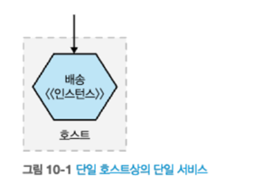
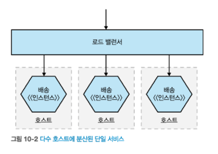
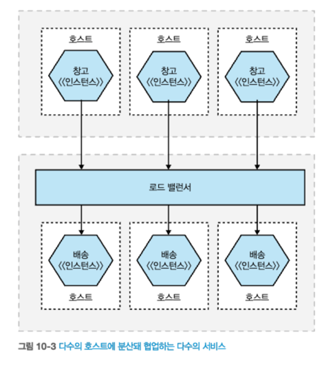

# 10 모니터링에서 관찰가능성으로
- 시스템을 마이크로서비스로 분해하면 **새로운 복잡성을 유발**한다.
- 이장에서는 **관찰가능성 개념**에 대해 알아본다.
  - 관찰가능성 : 무엇이 잘못됐는지 파악하도록 `시스템에 질문할 수 있는 방법`

> **운영 환경의 고충**
> - 실제 마이크로서비스를 운영하기 전까진 고통을 이해하지 못한다.
## 10.1 분열, 공황 그리고 혼란
- 단일 프로세스형 모놀리식은 오류 추적이 다소 쉽다.
  - 단일 장애 지점이 있으면 장애 추적은 간단해진다.

- 마이크로서비스의 장애는 추적하기가 까다롭다.
  - 서비스 기능이 여러 마이크로서비스에 의해 제공된다.
  - 오류가 발생할 수 있는 표면적이 늘어나 확인 해야할 사항도 늘어난다.
- 마이크로서비스 모니터링 방법
  - 작은 것을 모니터링하고 더 큰 그림을 볼 수 있도록 집계(aggretation)를 제공해야 한다.
  - 집계데이터를 데이터 조각으로 나누는 도구를 선별해야 한다.(확인해야한다)
  - 시스템 정상 상태(health)에 대해 현명한 사고방식을 가져야 한다.
## 10.2 단일 마이크로서비스, 단일 서버
- 단일 호스트, 단일 서비스
- 문제가 발생했을 때 무엇을 모니터링 해야 할까?
- CPU, 메모리, 로그, 웹서버 로그, 상태 확인(health check)  
  
  
출처 : 한빛미디어 - 마이크로서비스 아키텍처 구축  
## 10.3 단일 마이크로서비스, 다수 서버
- 다수 호스트, 단일 서비스
- `서비스별로 문제를 격리`할 수 있는 방향으로 모니터링 해야한다.
  - 다수 호스트 메트릭정보를 수집해 분할하고 분석하는 방법 필요하다.
    - 로드밸런서 응답 시간 추적, SSH 멀티플렉서를 사용해 애플리케이션 로그 분석
  
  
출처 : 한빛미디어 - 마이크로서비스 아키텍처 구축  
## 10.4 다수 마이크로서비스, 다수 서버
- 다수 호스트, 다수 서비스
- 여러 호스트에 있는 수천 줄의 로그에서 오류를 어떻게 찾을까?
  
  
출처 : 한빛미디어 - 마이크로서비스 아키텍처 구축  
## 10.5 관찰가능성 대 모니터링
## 10.5.1 관찰가능성의 주축? 그다지 빠르지 않다
