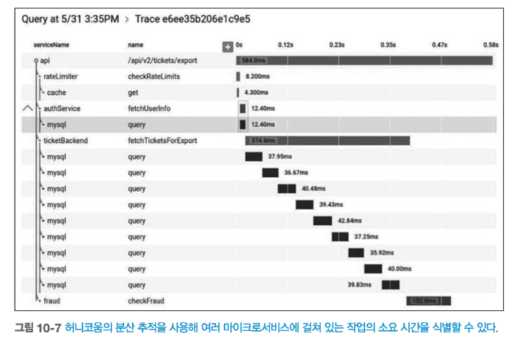

# 10 모니터링에서 관찰가능성으로
- 모놀리스 애플리케이션에서 작동했던 도구와 기술이 마이크로서비스 아키텍처에서는 적합하지 않다.
- 시스템을 마이크로서비스로 분해하면 **새로운 복잡성을 유발**한다.
- 이장에서는 **관찰가능성 개념**에 대해 알아본다.
  - 관찰가능성 : 무엇이 잘못됐는지 파악하도록 `시스템에 질문할 수 있는 방법`

> **운영 환경의 고충**
> - 실제 마이크로서비스를 운영하기 전까진 고통을 이해하지 못한다.
## 10.1 분열, 공황 그리고 혼란
- 단일 프로세스형 모놀리식은 오류 추적이 다소 쉽다.
  - 단일 장애 지점이 있으면 장애 추적은 간단해진다.

- **마이크로서비스의 장애는 추적하기가 까다롭다**.
  - 서비스 기능이 여러 마이크로서비스에 의해 제공된다.
  - 오류가 발생할 수 있는 표면적이 늘어나 확인 해야할 사항도 늘어난다.
- **마이크로서비스 모니터링 방법**
  - 작은 것을 모니터링하고 더 큰 그림을 볼 수 있도록 **집계**(aggretation)**를 제공**해야 한다.
  - 집계데이터를 데이터 조각으로 나누는 도구를 선택해야 한다.
  - 운영 환경에서 테스트한다는 개념을 수용해 시스템 정상 상태(health)에 대해 현명한 사고방식을 가져야 한다.
## 10.2 단일 마이크로서비스, 단일 서버
- 단일 호스트, 단일 서비스
- 문제가 발생했을 때 무엇을 모니터링 해야 할까?
- CPU, 메모리, 로그, 웹서버 로그, 상태 확인(health check)  
  
  
출처 : 한빛미디어 - 마이크로서비스 아키텍처 구축  
## 10.3 단일 마이크로서비스, 다수 서버
- 다수 호스트, 단일 서비스
- `서비스별로 문제를 격리`할 수 있는 방향으로 모니터링 해야한다.
  - 다수 호스트 메트릭정보를 수집해 분할하고 분석하는 방법 필요하다.
    - 로드밸런서 응답 시간 추적, SSH 멀티플렉서를 사용해 애플리케이션 로그 분석
  
  
출처 : 한빛미디어 - 마이크로서비스 아키텍처 구축  
## 10.4 다수 마이크로서비스, 다수 서버
- 다수의 마이크로서비스와 서버로 구성된 환경은 **복잡성**을 가지고 있ㄷ다.
- 수많은 로그에서 오류를 찾는 것은 어렵다.
  - **서버 단위의 문제인지 전체적인 문제**인지 판단할 수 있어야 한다.
  - 호스트 간 호출 체인에서 발생하는 **오류를 추적하고 해결하는 것이 필요**합니다.
- 정보 수집(**메트릭 및 로그**)과, 데이터를 효과적으로 이해하고 **선별**하는 것이 필요하다.
- 적극적인 관찰 가능성과 **운영 환경에서의 테스트로** 사고방식을 전환하는데 필요합니다.
  
  
출처 : 한빛미디어 - 마이크로서비스 아키텍처 구축  
## 10.5 관찰가능성 대 모니터링
- **관찰가능성**
  - 시스템의 `외부 출력을 통해 내부 상태를 이해할 수 있는 수준`을 의미한다.
  - 소프트웨어를 서로 다른 개체의 집합이 아닌 **하나의 시스템**으로 보는 것아 도 중요하다.
- **모니터링**
  - `시스템을 관찰하고 주시`하는 활동
  - 전통적인 모니터링은 `문제 예측`과 `경고 메커니즘` 중심
  - 하지만, 시스템이 점점 더 분산됨에 따라 **발생하지 않았을 문제에도 직면**
- **고도로 관측 가능한 시스템**을 활용하여 다양한 질문을 할 수 있는 **외부 출력을 제공**해야 한다.
  - 모니터링을 시스템의 속성인 **관찰가능성의 활동**으로 바라봐야 한다.

> 외부 출력  
> - 시스템이나 소프트웨어의 동작에 대한 결과를 의미
> - 시스템이 생성하는 메트릭은 CPU 사용량, 메모리 사용량, 네트워크 트래픽 등과 같은 정보
## 10.5.1 관찰가능성의 주축? 그다지 빠르지 않다
- 관찰 가능성은 주로 메트릭, 로깅, 분산 추적이라는 세 가지 주축에 집중된다.
  - 뉴렐릭 MELT(metrics, event, logs, traces)
- 이러한 접근은 너무 **환원주의적**이고 **핵심을 놓칠 수 있다**.
- 이러한 개념 사이에는 항상 명확한 경계가 존재하지 않을 수 있다.
- 관찰 가능성은 시스템의 작업을 이해하는 데 도움을 주는 이벤트, 로그, 메트릭 등을 포함한다.
- 필요한 것은 시스템을 이해하고 문제를 해결하는 데 집중하는 것이다.
- **시스템을 관찰 가능하게 만들 때 어떤 정보를 수집하고 분석할 것인지를 고려해야 한다**
> **note**  
> - 로그, 이벤트, 메트릭은 대상을 관찰 가능하게 만들도록 도와주지만, 
> - 많은 도구를 사용하기보다는 **시스템을 이해할 수 있도록 만드는 데 집중**해야 한다.

## 10.6 관찰가능성의 구성 요소
- **문제가 있다면, 사용자가 발견하기 전에 그 문제를 알아야 한다.**
- **무엇이 잘못됐고 문제가 재발되지 않도록 무엇을 할 수 있는지 알아낼 만한 충분한 정보가 필요하다..**
#### [관찰 가능성 개선할 수 있는 구성요소]
- **로그집계**
  - 여러 마이크로서비스 정보를 수집, **모니터링 및 관찰가능성의 구성요소** 
- **메트릭 집계**
  - 마이크로서비스와 인프라 수치를 캡처해 문제를 탐지, 용량 계획 추진
- **분산 추적**
  - 무엇이 잘못됐는지 파악 및 정확한 지연 시간 정보를 도출하기 위해, **마이크로서비스 경계에서 호출 흐름 추적** 
- **지금 괜찮은가?**
  - 에러 예산, SLA, SLO 마이크로서비스가 요구 사항을 충족하는지 확인하는 과정
- **알림**
  - 무엇을 알려야 할까? 좋은 알림이란 무엇일까?
- **시맨틱 모니터링**
  - 시스템의 상태와 새벽 3시에 우리를 깨워야 하는 것에 대해 다른 방식으로 생각한다.
- **운영 환경에서 테스팅**
  - 운영 환경의 다양한 테스트 기법에 대한 요약
### 10.6.1 로그 집계
- `로그`는 **운영 시스템에서 벌어지는 일을 이해하도록 돕는 가장 중요한 메커니즘 중 하나이다.**
- 분산시스템에서도 `로그`는 **문제를 진단 하는데 도움이 되며**, **주의가 필요한 항목**을 알려주는 중요한 도구이다.
- 로깅에는 다양한 도구가 있으며, 대체로 동일한 방식으로 작동한다.
  - 로컬 데몬 프로세스가 로그를 수집하고, 일종의 저장소로 전달한다.
  - 이러한 시스템의 장점 중 하나는 마이크로서비스가 해당 로깅 시스템을 인식하지 못한다.
  - 코드 변경 없이 로컬 파일에 기록만 하면 된다.
  - 로그가 손실될 수 있는 상황을 이해하려면 로그 전달 프로세스와 관련된 실패 모드를 이해해야 한다.
    - 네트워크 문제, 수집기 장애, 디스크 부족, 로그 롤링, 전송실패 등  
  
출처 : 한빛미디어 - 마이크로서비스 아키텍처 구축  

- **로그 집계 도구의 구현은 마이크로서비스 아키텍처를 구현하기 위한 전제조건 이다.**
  - **첫째**, 올바르게 사용한다면 로그 집계는 매우 유용하다.
    - **특히 상관관계ID와 함께 사용될 때 매우 가치**가 있다.
  - **둘째**, 로그 집계의 구현은 마이크로서비스 아키텍처가 가져올 다른 고충과 비교할 때 어렵지 않다.

> **TIP**
> - **무엇보다 먼저**  
>   - 마이크로서비스 아키텍처를 구축하기전에, **먼저 로그 집계 도구를 준비하고 실행**하라.
>   - **이 과정을 마이크로서비스 아키텍처를 구축하기 위한 전제 조건이라고 생각하라.**

#### [공통 포맷]
- **로그를 집계하려면**, 해당 로그를 대상으로 쿼리를 실행해 **유용한 정보를 추출할 수 있어야 한다.**
  - **합리적인 표준 로그 형식을 선택하는 것이 중요하다.** (날짜, 시간, 마이크로서비스 이름, 로그 레벨)
- 로그 전달 에이전트에서 로그를 재포맷하는 것이 아니라, 마이크로서비스 자체에서 기록할 로그를 변경하는 것이 좋다.
- **마이크로서비스 아키텍처 내에서** **내부적으로 표준화할 포맷을 정하는 것이 중요**하다.
- **로그에서 필요한 정보를 구문 분석하고 추출하도록 로그 집계 도구를 구성**해야 한다. 

#### [로그 문자열의 상관관계]
- 하나로 시작한 호출이 여러 다운스트림 호출을 생성할 수 있다.
- [그림10-5] 서비스 흐름도
  - 고객 스트리밍 서비스 가입 -> 게이트웨이 -> 결제서비스 -> 고객서비스 -> 이메일서비스
    
  출처 : 한빛미디어 - 마이크로서비스 아키텍처 구축
- 만약 결제서비스에 대한 호출이 오류를 발생시키면 어떻게 될까?
- **상관관계ID**를 통해, 모든 후속 호출을 연관 시키는데 사용할 **고유 ID를 생성**한다.
  
출처 : 한빛미디어 - 마이크로서비스 아키텍처 구축    
    
출처 : 한빛미디어 - 마이크로서비스 아키텍처 구축  

- 상관관계ID를 통해 후속 호출을 연관시켰다면, **상호작용 추적하는 도구를 만들 수 있다.**
  - 이러한 도구를 통해, **비용이 많이 드는 트랜잭션을 식별하는데 유용**하다.
- 시간이 지날수록 **로그의 상관관계ID**는 **엄청나게 유용하다.**

> 툴 : OpenTracing, Zipkin 

> **TIP**  
> - **로그 집계가 있다면 상관관계 ID를 신속히 적용**하라.  
> - **상관관계 ID는 로그의 가치를 비약적으로 향상시킬 것이다.**

#### [타이밍]
- **로그 문자열에 포함된 날짜와 시간 정보를 사용하여** **사건이 발생한 순서를 정확하게 판단할 수 없다.** 
  - 마이크로서비스는 각자의 컴퓨터에서 실행되며, 각 컴퓨터의 시계가 동기화되어 있지 않을 수 있다.
- 시스템 간 시간 오차는 **분산 시스템에서 다양한 문제를 일으킨다.**
  - 시간 동기화를 위해 NTP(Network Time Protocol)와 같은 프로토콜이 사용되지만, 완전한 동기화를 보장하지 않는다.
> **전반적인 호출 흐름에 대해 완전히 정확한 타이밍 정보를 얻을 수 없다.**
#### [구현]
- Fluentd와 같은 로그 전달 에이전트 -> Elasticsearch로 전송 -> Kibana를 통해 결과를 분석하는 것
- 필자의 우려사항 두가지
  1) Elasticsearch를 데이터베이스로 간주하는 경향이 있는데, 이는 적절하지 않다. 
    - 검색 인덱스는 데이터베이스와 다르게 동작하며, **데이터의 진실의 원천으로 간주해서는 안된다.**
  2) Elastic 회사에 행동, SSPL
- 이 분야에서 다양한 옵션이 있다.
  - **휴미오**(Humio)
  - **데이터독**(Datadog)
  - AWS CloudWatch
  - Azure Application Insights
#### [단점]
- 로그 집계는 실행 중인 시스템에서 정보를 신속하게 얻는 효과적인 방법이지만 **몇 가지 단점**이 있다.
1) **시간 왜곡으로 인해 로그 신뢰성**
   - 지연 시간을 추적하거나 정확한 타이밍을 파악하는 데 제한된다.
2) **데이터 양 증가와 관련된 비용 문제**
   - 많은 마이크로서비스와 호출이 발생할수록 로그 데이터의 양은 증가한다.
   - 하드웨어 및 서비스 제공업체에 지불해야 할 요금이 증가한다.
3) **인덱스 관리와 로깅 세밀 조정**
   - 인덱스를 유지하는데 많은 연산비용이 들며, 인덱스가 커질수록 해당 문제는 더 커진다. 
   - 인덱스로 인한 비용으로 인해, 가치 있는 로깅정보를 미룰수도 있다.
4) **데이터 보안과 권한 문제**
   - 로그에는 중요하고 민감한 정보가 포함될 수 있으므로 데이터 보안 및 액세스 권한에 대한 고려가 필요하다.
 
### 10.6.2 메트릭 집계
- 서비스 로그와 마찬가지로, **시스템에 대한 데이터를 수집해야한다.**

- **패턴과 추세 파악**
  - 오랜 시간 동안 시스템의 작동 방식을 기록하여 **정상 상태와 비정상 상태를 구분**할 수 있다.
- **새로운 호스트와 인스턴스 관리**
  - 새로운 마이크로서비스 인스턴스를 자주 프로비저닝하기 때문에 **메트릭을 쉽게 수집할 수 있는 시스템을 선택**해야 한다.
  - 모든 인스턴스에 대한 메트릭을 집계하고 해당 서비스의 전반적인 상태를 이해할 수 있어야 한다.
- **용량 계획**(capacity planning)
  - **현재 서비스가 한계에 근접**하고 있는지, **얼마나 더 필요한지** 알 수 있다.
- **다양한 해상도로 데이터 집계**
  - 데이터 해상도?
    - 데이터의 정밀도를 의미, 데이터의 간격 또는 빈도를 나타낸다.(낮은 해상도는 데이터가 큰 간격으로 수집, 높은 해상도는 작은 간격으로 수집)
  - **상황에 맞게 데이터의 해상도를 조정하여 실시간 상황에 대응**할 수 있다. 
    - 최근 데이터에 더 높은 해상도를 사용하고 과거 데이터에는 일반적인 추세 분석을 적용할 수 있다.
    - 데이터를 집계할 때 **어떤 정보를 잃어도 되는지 사전에 결정**해야 한다.

#### [낮은 카디널리티 대 높은 카디널리티]
- **카디널리티**
  - **데이터 에서 쿼리할 수 있는 필드의 수**
    - 높은 카디널리티 : 많은 고유한 값으로 구성된다.(주민번호)
    - 낮은 카디널리티 : 적은 수의 고유한 값으로 구성된다.(성별) 
- 최신 도구들은 **높은 카디널리티 데이터를 효과적으로 저장하고 검색할 수 있도록 디자인** 되었다.
- 낮은 카디널리티 시스템은 높은 카디널리티 데이터를 처리하는 데 어려움을 겪을 수 있다.
  - ex) 그라퍄냐 
- 시스템이 복잡해짐에 따라 **관찰가능성을 개선**하기 위해 **더 많은 정보를 수집하고 분석하는 도구를 갖춰야 한다.**
#### [구현]
- 메트릭 수집 및 집계를 위한 오픈소스 도구인 **프로메테우스**
  - 프로메테우스와 같이 낮은 카디널리티 데이터에 대해 구축된 시스템은 높은 카디널리티 데이터를 처리하기 어렵다
- 높은 카디널리티 데이터를 저장하고 관리하면서 시스템
  - **허니코움**(Honeycomb) 
  - **라이트스텝**(Lightstep)

> **모니터링 및 관찰 시스템은 운영 시스템이다**  
> - 마이크로서비스 아키텍처를 관리하기 위한 도구가 늘어남에 따라 그 **도구 자체도 운영 시스템이라는 점을 기억**해야 한다.   
> - `로그 집계 플랫폼`, `분산 추적 도구`, `경보 시스템` 등 모두 **소프트웨어만큼 중요**하며 임무 수행에 **필수적인 애플리케이션**이다. 
> - 운영 환경의 모니터링 도구를 관리하는 측면에서 우리가 작성하고 관리하는 **소프트웨어에 쏟는 정도의 노력을 들여야 한다.**
> - 또한 이러한 도구가 외부 공격의 잠재적인 요소가 될 수 있다는 것도 인식해야 한다.

### 10.6.3 분산 추적
- 지금까지 주로 격리된 정보 수집에 대해서 이야기 하였다. 
  - 해당 정보를 집계하고 있지만, 이 정보가 캡처된 곳의 상황을 폭넓게 이해하는 것이 중요하다.
- 마이크로서비스 아키텍처는 작업을 수행하기 위해 함께 작동하는 **일련의 프로세스다.**
- 시스템이 복잡해짐에 따라 시스템에서 **일련의 프로세스를 보는 방법이 중요해졌다**.
  - 따라서 서비스별 서로 다른 데이터를 가져와 **상호 연관된 호출을 함께 볼 수 있어야 한다.**

#### [작동 원리]
- 분산 추적 도구는 대부분 유사한 방식으로 작동한다.
  - 스레드 로컬활동은 **스팬**(span) 으로 캡쳐된다.
  - 각각의 스팬은 고유 식별자를 사용해 연결되며, **하나의 트레이스**(trace)로 **구성**되도록 **중앙 수집기로 전송**된다.
    
출처 : 한빛미디어 - 마이크로서비스 아키텍처 구축
- 충분한 정보를 수집하는 것은 시스템 자체에 직접적인 영향을 미칠 수 있다.
  - 일부 정보를 명시적으로 제외하는 것이 필요하다.
  - **올바른 정보를 삭제하고 관찰 결과를 올바르게 추론하도록 충분한 샘플을 계속 수집하는 것이다.**
- 구글의 대퍼(Dapper)
  - 많은 분산 추적 도구에 영감을 주었다.
  - 무작위 샘플링을 수행한다.
- 예거(jaeger) 기본설정에서 1000건의 호출 중 1건만 캡처한다.
  - 시스템 자체가 처리하지 못할 정도로 많은 정보를 캡처하지 않는다.
- 허니코움, 라이트스텝은 무작위 샘플링보다 더 섬세하고 동적인 샘플링을 제공한다.
  - 예시) 성공적인 작업이 유사하다면, 100건중 1건만 샘플링해도 만족할 수 있다.
#### [분산 추적 구현]
- 시스템에 분산 추적을 하려면 몇 가지 사항이 필요하다.
  - **스팬 정보**를 캡쳐해야 한다.
    - 라이브러리 OpenTracing, OpenTelemetry
  - **스팬 정보를 수집기로 보낼 방법이 필요**하다.
    - 로그 전송 에이전트를 인스턴스 로컬로 실행 하여, 스팬 정보를 중앙 수집기로 주기적으로 전송한다.
  - 정보를 수신하고 모든 정보를 이해할 수 있는 **중앙 수집기가 필요**하다.
    - 오픈소스에서는 **예거**
    - 상업용 도구는 **라이트스텝**, **허니코움**
    - 하지만 **OpenTelemetry API를 지원하는것을 추천**한다.
      - DB 드라이버, 웹 프레임워크 코드 추적을 지원하는 표준화된 방법을 제공한다.(API 명세)
        - API를 구현하면 애플리케이션의 다양한 부분에서 발생하는 정보를 효과적으로 수집하고 분석할 수 있다.
      - 또한 이식성이 좋다.

### 10.6.4 잘하고 있나요?
- 분산 시스템에서는 `업/다운` 이진 상태로 **시스템 상태를 평가하기 어렵다.**
- 개별 요소의 문제가 **전체 시스템의 문제를 의미하지 않는다.**
  - 예시) 하나의 벌이 다쳤 다고 해서, 벌집이 문제가 있는것은 아니다
- 서비스 간의 상호작용이 더 복잡해질수록 **하나의 지표를 살펴보는 것만으로는 시스템의 작동 여부를 판단할 수 없다.**
  - 많은 정보를 수집할 수 있지만, 그 자체로는 전체 시스템의 정상 작동 여부를 질문에 답하기는 어려울 수 있다.
- 사이트 안정성 엔지니어링(SRE)
  - **시스템의 안정성을 보장**하면서 **변화를 허용할 수 있는 방법에 초점을 맞춘다.**

#### [서비스 수준 계약]
- **SLA**, 서비스 수준 계약(service-level agreement)
 - 시스템을 **구축하는 사람과 시스템을 사용하는 사람 사이의 계약**이다.
 - **시스템의 가용성과 성능을 명확히 정의**하고, **시스템이 제공할 수 있는 최소한의 수준을 보장**한다.
#### [서비스 수준 목표]
- SLA는 다소 광범위하기 때문에, **팀 수준에서 서비스 수준 목표를 정의**한다.
- **SLO**, 서비스 수준 목표(service-level objective)
  - **팀이 제공하기로 한 서비스 수준 목표를 정의**합니다.
- SLO는 단순히 SLA를 달성하기 위한 것이 아니며, 팀 자체의 목표를 설정하고 조직 내 변화를 위한 노력을 포함할 수 있다.
#### [서비스 수준 지표]
- SLO를 충족하는지 확인하려면 실제 데이터 수집 필요하다.
  - **SLI**는 서비스 수준 목표(SLO)를 평가하고 개선하기 위해 필요한 데이터를 제공한다. 
- **SLI**, 서비스 수준 지표(service-level indicator)
  - **소프트웨어가 수행하는 작업의 척도이다.**
  - 예를 들어, 특정 프로세스의 응답 시간, 등록 중인 고객 수, 발생한 오류 수, 진행 중인 주문 수 등이 SLI가 될 수 있다.
#### [오류 예산]
- **오류 예산**(error budget)
  - 시스템 안정성을 유지하면서 **새로운 시스템 변화를 허용하기 위해** 도입하는 개념이다.
- SLO를 기준으로 **오류 예산을 설정**하고 실제 서비스 수준을 모니터링하여 팀이 적절한 결정을 내릴 수 있도록 돕는다.
- **오류 예산을 초과하면 새로운 기능 도입을 연기하고 시스템 안정성을 개선하는 데 집중**해야 한다.

### 10.6.5 알림
- **마이크로서비스 아키텍처**에서는 호출,프로세스,인프라스트럭처가 많아질수록 **잘못되는 경우가 빈번**해진다.
  - **어떤 종류의 문제를 알리고 어떻게 알려야 하는지 정확히 파악하는것이 중요**하다.
#### [어떤 문제는 다른 문제보다 훨씬 더 심각하다]
- 잠재적 문제의 요인이 증가하면 **어떤 유형의 알림을 발생시켜야 하는지 우선순위를 잘 지정**해야 한다.
- **사소한 일과 긴급한 일을 구분하는 것이 중요**하다.
#### [알림 피로]
- **운영자에게 과도한 알림을 보내는 것이 오히려 상황을 악화**시킬 수 있다. 
- **운영자가 알림의 우선순위를 결정할 수 있도록 하는 방법을 고려**해야 한다.
#### [더 나은 알림을 위해]
- 유용하지 않은 알림을 보내는것을 피해야 한다.
- 엔지니어링 장비 및 자재 사용자 협회 (EEMUA)에서 제공하는 **좋은 알림에 대한 규칙**
 - 관련성 (Relevance): 알림의 경고가 실제로 **가치 있고 중요한 정보를 제공**해야 한다.
 - 고유성 (Uniqueness): 알림은 다른 경고와 **중복되지 않도록** 해야 한다.
 - 적시성 (Timeliness): 알림을 신속하게 받아 처리할 수 있도록 **제때 알림을 받아야** 한다.
 - 우선순위 (Prioritized): 알림을 **처리할 순서를 결정할 수 있도록** 운영자에게 **충분한 정보를 제공**해야 한다.
 - 알기 쉬움 (Understandable): 알림의 내용은 **명확하고 읽기 쉬워야** 한다.
 - 진단 (Diagnostic): 알림은 무엇이 **잘못되었는지 명확하게 설명**해야 한다.
 - 자문 (Advisory): 운영자가 **취해야 할 조치를 이해하도록 도와주는 정보가 포함**되어야 한다.
 - 집중 (focusing) : **가장 중요한 문제에 주목**하라.

### 10.6.6 시맨틱 모니터링
- 시맨틱 모니터링을 통해 우리는 시스템의 허용 가능한 시맨틱(의미론)에 대한 모델을 정의하고 있다.
- 시스템이 허용 가능한 범위 내에서 작동한다고 생각하기 위해 **시스템이 갖춰야 할 특성은 무엇**일까?
  - 오류의 존재를 찾기보다는 `시스템이 기대하는 대로 동작하는가?` 라는 **한 가지 질문**을 끊임 없이 해야 한다.
  - 시스템이 올바르게 동작한다면, 우리가 보고 있는 **오류의 우선순위를 정하는 방법을 이해하는 데 도움**이 된다.
- `올바르게 동작하는 시스템에 대한 모델을 어떻게 정의하는가?`
  - 예시)
    - 신규 고객은 등록해 가입할 수 있다.
    - 피크 시간대에는 시간당 최소 2만 달러의 제품을 판매하고 있다.
    - 우리는 정상적인 속도로 주문 제품을 배송하고 있다.
- 모델을 정했다면, 현재 **시스템 동작이 이 모델을 충족하는지 확인**해야 한다.
  - 보통 2가지로 정리된다.
  - **실사용자 모니터링**(real user monitoring, RUM)
  - **합성 트랜잭션**(synthetic transaction)
#### [실사용자 모니터링]
- 실사용자 모니터링을통해 **운영 시스템에서 발생하는 상황을 살펴보고** `시맨틱 모델과 비교`한다.
  - ex) 가입자 수, 주문 수
- 실제 사용자 모니터링 문제는 **필요한 정보를 적시에 사용하지 못하는 경우가 많다.**
- 실사용자 모니터링의 주요 단점 중 하나는 기본적으로 노이즈가 많다는 것이다.
  - 많은 정보를 수집하고 있어 문제가 있는지 알아보려고 정보를 면밀히 살펴보는 것은 어려울 수 있다.
  - **실제 사용자 모니터링**은 이미 발생한 일을 알려주므로 **문제가 발생한 후에야 문제를 파악**할 수 있다.
> 운영 환경 테스트의 또 다른 형태인 **합성 트랜잭션을 사용**하면, **노이즈를 줄이고** **사용자가 인식하기 전에 문제를 발견**할 수 있다.
### 10.6.7 운영 환경에서 테스팅
> 운영 환경에서 테스트하지 않는 것은 마치 집에서 독주 연습이 잘됐다고 전체 오케스트라와 함께 연습하지 않는 것과 같다.(체레티 메이저스)
- 운영 환경 테스트는 매우 유용하고 안전한 활동이 될 수 있다.
- 운영 환경에서 모든 형태의 테스트는 `모니터링`활동의 한 형태다.
  - 운영 환경에서 이뤄지는 다양한 형태의 테스트는 사용자가 알아채기도 전에 문제를 해결하는 데 매우 효과적이다.

#### [합성 트랜잭션]
- `합성 트랜잭션`을 통해 **가짜 사용자 행동을 운영 환경 시스템에 주입**한다.
  - 가짜 사용자 행동에는 `정해진 입력`과 `예상 출력`이 포함된다.
  - 예시) 뮤직코프의 경우, 새 고객을 인위적으로 생성후 정상적으로 생성되었는지 확인한다. 이러한 `합성 트랜잭션은 정기적으로 실행`되어, 문제를 포착한다.
  - 예시)나기오스(Nagios)라는 도구를 사용하여 가짜 이벤트를 삽입 하고, 지정 시간 내에 처리되지 않으면 문제로 판단하고 리포트한다.
- 시맨틱 모니터링을 수행하려고 `합성 트랜잭션`을 사용하는 것이 저수준의 메트릭 경고보다 **시스템의 문제를 훨씬 더 잘 나타내는 지표**이다.
  - 합성 트랜잭션이 실패한 이유를 알아낼때, **여전히 저수준의 메트릭 정보는 필요**하긴하다.
#### [합성 트랜잭션 구현]
- 전체 시스템을 엔두투엔드 테스팅하는 테스트가 있다면, 시맨틱 모니터링을 구현하는 데 필요한 대부분이 갖춰져 있는 상태이다.
  - 이미 시스템은 **실행하고 결과를 확인하는데 필요한 훅(hook)을 노출하고 있다.**
- 시스템을 모니터링을 지속적으로 실행하는것은 어떨까?
  - **예기치 않은 부작용이 발생하지 않도록 주의**해야 한다.
    - 예시) 상품 주문시, 실제 상품 배송
   
#### A/B 테스트
- A/B 테스트를 통해 동일한 기능의 두 가지 기능을 노출하여, 어떤 버전이 더 잘 수행되는지 확인한다.
  - 예시) 두 가지 다른 고객 양식을 A/B로 나눠, 어떤 것이 가입유도에 효과적인지 확인할 수 있따.
#### 카나리아 릴리스
- **사용자 중 일부만 새 기능의 릴리스**를 볼 수 있다.
  - `새 기능이 정상`작동하면, 새 기능에 대한 사용자 비율을 늘린다.
  - `새 기능에 문제`가 있다면, 일부에만 영향을 미치므로 변경 사항을 되돌릴 수 있다.
#### 병렬 실행
- 병렬 실행을 사용하여 **동일한 기능의 두 가지 동등한 구현을 나란히 실행**한다.
  - **모든 사용자 요청은 두 버전으로 라우팅되며 결과를 비교**할 수 있다.
#### 스모크 테스트
- 소프트웨어가 **운영 환경에 배포**되고 나서 **출시되기 전에 소프트웨어에 대해 스모크 테스트(smoke test)를 실행**함으로써 제대로 작동하는지 확인한다.
- **일반적으로 완전히 자동화**되며, 해당 마이크로서비스가 실행 중인지 확인하는 등 **매우 간단한 활동부터 합성 트랜잭션을 실행**하는 것까지 다양하다.
#### 합성 트랜잭션
- **완전한 가짜 사용자 상호작용이 시스템에 주입된다.**
- 일종의 엔드투엔드 테스트와 매우 유사하다.
#### 카오스 엔지니어링
- `카오스 엔지니어링(chaos enginerring)`은 **운영시스템에 결함을 주입해 예상되는 문제를 처리한다고 보장**한다.
  - 넷플리스의 카오스 몽키(Chaos Monkey) 라이브러리
    - 예상치 못한 장애 상황에 얼마나 잘 대응하는지 확인 및 테스트
> **카오스 몽키**  
> - 랜덤 장애 시뮬레이션
>   - 시스템 요소(컨테이너, 머신, DB등) 종료 및 중단  
> - 분산 시스템 내구성 테스트  
>   - 분산 시스템이 서로에게 영향을 주지 않으면서 장애 상황을 견뎌내는 능력을 평가  
> - 실시간 모니터링 및 대응  
>  - 구성요소가 중단되었을 때 실시간 모니터링하여 이상 상태를 감지하고 대응할 수 있는 기능을 제공하는지   

## 10.7 표준화
- `단일 마이크로서비스`에 대해 좁게 **의사결정을 내릴 수 있는 부분**과 `시스템 전체`** 표준화해야 하는 부분** 사이에서 균형을 잡아야 한다.
- `모니터링` 및 `관찰가능성`은 **표준화가 매우 중요한 영역중 하나다.**
- 마이크로서비스가 다양한 방식으로 협업한다면 **시스템을 전체적으로 볼 수 있어야 한다.**
- `로그`는 **표준 형식으로 기록**해야 한다.
## 10.8 도구 선택
- 시스템의 관찰가능성을 개선하기 위해 사용할 다양한 도구가 있다.
  - 허니코움, 라이트스텝
- 마이크로서비스 관찰가능성의 솔루션이 계속 개선됨에 따라 미래에는 다른 도구도 필요할 것이다.
- 마이크로서비스 **관찰가능성의 도구에 중요하다고 생각되는 기준에 대한 몇가지**가 있다.
### 10.8.1 민주적 선택
- 숙련된 운영자만 사용할 수 있는 **작업하기 어려운 도구**는 운영 **활동에 참여할 수 있는 인원 수를 제한**한다.
- 또한, 너무 비싼 도구를 사용한다면 도구를 운영환경에 밖에 접하지 못할 수 도 있다.
- 따라서 **사용하길 원하는 모든 사용자의 요구를 고려해 도구를 선택**해야 한다.
### 10.8.2 쉬운 통합
- 실행중인 시스템에서 올바른 정보를 얻고, 이전보다 더 많은 정보를 다양한 포맷으로 추출해야 할 수도 있다.
- 따라서, 이러한 도구는 **가능한 한 쉽게 통합할수 있는 것이 중요**하다.
  - OpenTracing, 표준 API 제공하여 **통합&이식을 수월**하게 해준다.
  - **OpenTelemetry**
### 10.8.3 맥락 제공
- **일어날 일을 이해하는 데 도움이 되도록 가능한 한 많은 맥락(context)을 제공하는 도구가 필요**하다.
- 라이트스텝 에서 제공하는 분류시스템
  - 시간적 맥락 : 1분, 시간, 1일 또는 1개월 전과 비교해 어떻게 보이는가?
  - 상대적 맥락 : 시스템의 다른 것과 관련해 어떻게 변경됐는가?
  - 관계적 맥락 : 이것에 의존하는 것이 있는가? 혹은 이것이 다른 것에 의존하는가?
  - 비례적 맥락 : 얼마나 나쁜가? 범위가 크거나 작은가? 어떤 것이 영향을 받는가?
### 10.8.4 실시간
- 시스템 맥락에서 사용자보다 먼저 문제를 발견할 수 있도록 충분히 신속하게 정보가 필요하다.
  - 분, 시간이 아니라 **초**를 이야기 하는것이다.
### 10.8.5 규모에 맞게
- 시스템보다 훨씬 더 큰 규모의 관찰가능성 시스템을 위한 솔루션을 도입 시도 할 수 있다.
  - 벤 시글먼(라이트스텝 설리자)
    - 작은 시스템에서, 구글이 사용하는 것과 같은 도구를 사용해서는 절대로 안 된다.
- **규모에 따라 확장할 수 있는 도구가 이상적**이며 비용 효율성은 또한 중요하게 작용한다.
## 10.9 기계화된 전문가
- 순전히 모니터링 측면에서 세상을 보는 관점에서 시스템을 더 관찰 가능하게 만드는 방법으로 변화했다.
- 기계 학습(ML)과 인공지능(AI)이 자동 이상 감지에 대해 자동화 할 수 있다고 가정하는 것은 무리가 있다.
- **자동 이상 감지**(automated anomaly detection) 같은 기능이 계속해서 개선될 것이지만, 현재 시스템의 전문가는 인간이며 앞으로도 당분간은 인간일 것이다.
## 10.10 시작하기
- 무엇을 어떻게 캡쳐해야 할까?
- 마이크로서비스가 실행 중인 호스트에 대한 기본 정보(CPU 비율, I/O 등)을 캡처한다.
- 각 마이크로서비스 인스턴스에 대해 해당 서비스 인터페이스의 응답 시간을 캡처하고 모든 다운 스트림 호출을 로그에 기록한다.
- 전용 분산 추적도구로 시작하면 좋지만, 도구를 직접 실행하고 호스팅 해야하는 복잡성이 추가될 수 있다.
  - 완전 관리형 서비스를 제공받아 쉽게 할 수 있으면 좋다.
- 시스템의 중요한 측면이 제대로 작동하는지 더 잘 이해하는 방법으로 **합성 트랜잭션** 생성하는것을 적극 고려하라.
- 기본적인 정보 수집뿐 아니라, **실행 중인 시스템에 질문을 하기 위해 정보를 걸러낼 수 있는지 확인하는 것은 매우 중요**하다.
- **시간이 지남에 따라** 더 많은 정보를 수집하고 도구를 개선해 플랫폼의 **관찰가능성을 개선**해야 한다.

#### 요약
- 분산 시스템은 이해하기 복잡하며, 분산될수록 운영 환경에서 문제를 해결하는 작업이 더 어렵다.
- **문제 발생시**, 상황을 바로잡기 위해 무엇을 해야 하는지 알아낼 수 있는 **올바른 정보를 갖고 있는 것이 중요**하다.
- 간단한 시스템의 경우, 처음부터 로그 집계를 구축하고 로그 문**자열에 상관관계ID**도 삽입하라.
- 모든 작은 문제에 대해 알림을 생성하는 것이 아니라, **수용 가능한 것에 대해 보다 총체적으로 생각**하라.
- 알림 피로를 줄이고 적절하게 **주의를 집중하기 위해 SLO를 수용하고 이 원칙에 따라 알림을 보내는것을 적극 고려하라.**
> **관찰가능성 책 추천**  
> - Observability Enginerring (O'Relilly)
> - SRE를 위한 시스템 설계와 구축 (한빛미디어)
> - The Site Reliability Workbook (O'Relilly)

