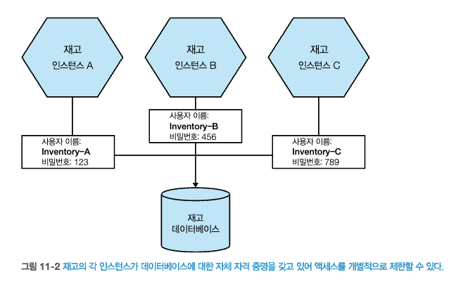

# 11 보안
- 보안이라는 주제에 대해 인식을 갖추는 것은 **처음부터 소프트웨어 보안을 구축하는 데 필요**하다.
- 단일 머신에서 유지되던 데이터가 마이크로서비스로 넘어가며 **네트워크를 통해 더 많이 흐르고 있어** **공격 표면이 훨씬 더 넓다.**
- 아이러니하게도 마이크로서비스는 **심층 방어를 할 수 있고 접근 범위를 제한**하는 더 많은 기회를 제공한다.
  - **잠재적으로 시스템 보호 기능을 더욱 강화하는 동시에 공격이 발생할 경우 영향을 줄인다.** 
> 마이크로서비스 아키텍처의 **보안과 관련해 올바른 균형을 찾는 데 도움이 되는 주제**들이 있다.  
> - 핵심 원칙
>    - 보다 안전한 소프트웨어를 구축하려 할 때 수용하는 데 유용한 기본 개념 
>  - 사이버 보안의 다섯 가지 기능
>    - 애플리케이션 보안을 위한 다섯 가지 주요 기능 영역(식별, 보호, 탐지, 대응, 복구)에 대한 개요
>  - 애플리케이션 보안의 기초
>    - 애플리케이션 보안의 특정한 몇 가지 기본 개념과 자격 증명, 보안, 패치 백업, 재빌드를 포함해 마이크로서비스에 적용하는 방법
>  - 암묵적 신뢰 대 제로 트러스트
>    - 마이크로서비스 환경에서 신뢰를 위한 다양한 접근 방식과 이 방식이 보안 관련 활동에 미치는 영향
>  - 데이터 보안
>    - 데이터가 네트워크를 통해 이동하고 디스크에 저장될 때 데이터를 보호하는 방법
>  - 인증 및 권한 부여
>    - 마이크로서비스 아키텍처에서 SSO(Single Sign-On)가 작동하는 방식, 중앙 집중식 대 분산식 인증모델, 그 일부인 JWT 토큰의 역할 

## 11.1 핵심 원칙
- 알아둬야 할 수많은 문제를 조명하기 위해 간략히 살펴봐야 하는 **애플리케이션 보안의 몇 가지 기본 측면**이 있다.
  - 안전한 소프트웨어를 구축하려 할 때 수용하는 데 유용한 기본 개념
### 11.1.1 최소 권한의 원칙
- 개인, 외/내부 시스템, 마이크로서비스 애플리케이션 **액세스 권한에 주의를 기울여야 한다.**
- **최소 권한의 원칙**(principle of least privilege)은 권한 부여시, **최소한의 액세스 권한을 필요한 기간동안 부여하는 개념**이다.
### 11.1.2 심층 방어
- 애플리케이션 보안에 보호 기능을 구축할 때 공격자로부터 방어하기 위해 **여러 보호 장치를 갖추는 것이 중요**하다.
  - 마이크로서비스로 분리하고, **수행할 수 있는 범위를 제한 하는 방법**
  - 네트워크 보안
- 마이크로서비스는 하나의 제로 데이 취약점이 전체에 영향을 끼치지 않도록 할 수 있다.
  - 제로 데이 취약점 : 아직까지 패치되지 않은 보안 취약점을 이용한 해킹의 통칭
- **마이크로서비스는** 단일 모놀리식 애플리케이션 보다 **더 심층적으로 방어하는 기능을 제공**하여 조직이 더 안전한 시스템을 구축하도록 돕는다.

> **보안 통제 유형** : 시스템 보안을 위해 적용하는 보안통제를 다음과 같이 분류
> - 예방형(preventive)
>   - 공격이 발생하지 않도록 secret 안전하게 저장, 데이터 암호화, 적절한 인증 및 권한 부여를 구현 
> - 탐지형(detective)
>   - 공격이 발생하고 있거나 발생했다는 사실을 알려준다. 방화벽 또는 침입 탐지 서비스가 예시 이다.
> - 대응형(responsive)
>   - 공격 중 또는 공격 후 대응을 돕는다. 시스템을 재구축하는 자동화된 매커니즘, 데이터 복구를 위한 백업

### 11.1.3 자동화
- 마이크로서비스 아키텍처에서 동작 부분이 훨씬 더 많아지면서 **자동화는 복잡한 시스템을 관리하기 위한 핵심 개념**이 되었다.
  - 컴퓨터는 우리보다 더 빠르고 효율적으로 작업을 수행하며 변동성도 적다.
  - 인적 오류 최소화 가능하다.
  - **자동화는 사건 발생 후 복구하는 데 도움이 된다.**
    - 보안키를 취소하거나 교체하고 도구를 사용해 보안 문제를 보다 쉽게 감지할 수 있다.
    - 자동화 문화를 수용하면 보안과 관련해 큰 도움이 될 것 이다.
### 11.1.4 제공 프로세스에 보안 주입
- **보안은 사후에 고려되는 사항으로 간주되는 경우가 흔하다.**
- **개발자가 보안 관련 사항에 보다 일반적인 인식을 갖게 만들고, 보안 전문가가 제공 팀에 합류할 수 있는 방법을 찾으며, 보안 관련 개념을 소프트웨어에 구축할 수 있도록** 해야 한다.
  - 교차 사이트 스크립팅(XSS)과 같이 시스템 취약성을 조사할 수 있는 자동화된 도구(`ZAP`, Zed Attack Proxy)
  - 루비를 위한 `브레이크맨`(적정 분석)
  - 제삼자 라이브러리에 알려진 의존성 취약점을 찾아내는 `스니크`
- 이러한 도구들은 **CI 빌드에 통합할 수 있으므로 표준 체크인에 통합하는 것이 좋은 출발점**이 될 수 있다.

## 11.2 사이버 보안의 다섯 가지 기능
- **애플리케이션 보안 5가지 모델**(NIST, National Institute of Standards and Techonologty)
1) 잠재적인 `공격자`가 누구인지, `공격 대상`이 무엇인지, `가장 취약한 곳`은 어디인지 **식별하라.**
2) 잠재적인 해커로부터 `주요 자산`을 **보호하라.**
3) 최선의 노력에도 불구하고 `공격이 발생했는지` **감지하라.**
4) 나쁜 일이 발생했다는 것을 알게 되면 **대응하라.**
5) 사고 발생후 **복구하라.**

### 11.2.1 식별
- 무엇을 보호해야 하는지 파악하기 전에, `누가` 우리것을 노리는지, 그들이 `무엇을 찾고 있는지` 알아야 한다.
  - 공격자의 사고방식으로 행동하는 것은 어렵지만 반드시 해야 할 일이다.
- 애플리케이션 보안에서 이와 같은 측면을 다룰때 살펴봐야할 것이 **위협 모델링**(threat modeling) 이다.
- 마이크로서비스 아키텍처 맥락에서 개발자와 이야기해보면, JWT 및 상호 TLS에 대해 이야기한다.(기술적 해결책에 치중하려고 한다)
  - 시스템, 기량, 경험에 대한 `제한된 시각`에 크게 좌우 받는다.
  - 이러한 관점은 안전한 정문과 활짝 열린 뒷문을 가진 상황을 초래할 수 있다.
- 모든 요소를 고려하고 **가장 큰 위험이 어디에 있는지 파악할 시간을 가져야 시간을 더 효율적으로 쓸 수 있다.**
- **위협 모델링의 목표**는 **공격자가 시스템에서 원하는 것이 무엇인지 이해하도록 도와준다.**
  - 위협 모델링을 제대로 수행하려면 `공격자의 입장이 돼 외부에서 내부를 들여다 보는 것이 중요`하다.
  - 위협 모델링을 수행할때는 시스템의 **작은 집합이 아닌** **전체적으로 살펴봐야 한다.**

    
[출처](https://www.spiceworks.com/it-security/network-security/articles/what-is-threat-modeling-definition-process-examples-and-best-practices/) 

> 보안 위협 모델링 : 위협 식별과 대응을 위한 소프트웨어 설계 (아담 쇼스탁)

### 11.2.2 보호
- 취약한 자산을 식별한 후에는 **자산이 적절하게 보호되는지 확인해야 한다.**
  - 마이크로서비스 아키텍처는 **공격할 수 있는 표면적이 훨씬 넓기 때문에** 보호해야 할 대상도 많고, **심층 방어를 위한 많은 방법도 제공**한다.
### 11.2.3 탐지
- **마이크로서비스 아키텍처는 장애 감지가 더 복잡하다.**
  - 모니터링해야 할 네트워크와 감시해야 할 기계가 더 많기 때문이다.
- **원천 정보가 크게 증가해 문제 탐지도 어렵다.**
  - `로그집계`와 같은 많은 기술을 통해 **잘못될 수 있는 것을 감지**하는 정보를 수집하는 데 도움이 된다.
- **불량 행위를 탐지하는 침입 탐지(intrusion detection)시스템**과 같은 특수한 도구가 있다.
  - ex) 아쿠아(Aqua)
    - Aqua Security는 컨테이너, 쿠버네티스, 서버리스 및 기타 클라우드 네이티브 애플리케이션의 보안을 제공하는 플랫폼
### 11.2.4 대응
- **효과적인 사고 대응을 위한 접근법을 이해하는 것**은 **침해로 인한 손상을 최소화 하는데 필수적**이다.
  - 침해 범위와 노출된 데이터를 이해하는 것에서 시작한다.
  - 노출된 데이터가 개인 식별정보가 포함된 경우 개인정보 보호 사고 대응 및 알림 프로세스를 따라야 한다.
- 침해 사고 여파에 잘못 대응함으로써 더욱 악화시켜 재정적 처벌이 가중되는 경우도 많다.
  - **관련 법이나 규정 준수를 지키고 소프트웨어 사용자를 보호해야 한다.**
### 11.2.5 복구
- 복구는, **공격 발생 후 시스템을 가동하고 실행하는 능력**과 **문제가 재발되지 않도록 하는 능력**을 뜻한다.
- **마이크로서비스 아키텍처 사용시 복구가 복잡**하다.
  - 마이크로서비스 시스템을 `주문형(on-demand)으로 재구축`하고, **시스템을 최대한 빨리 백업하고 실행**해야 한다.

## 11.3 애플리케이션 보안의 기초
- 더 안전한 시스템을 구축하기 위해 **마이크로서비스 아키텍처의 기본적인 보안 주제**를 살펴본다.
  - `자격 증명`, `패치`, `백업`, `재구축`

### 11.3.1 자격 증명
- `자격 증명` 이란 제한된 자원에 대한 **액세스 권한을 부여**한다.
- 마이크로서비스 아키텍처는 **더 많은 자격 증명이 필요**하다.
  - 서비스, 로컬머신, 데이터베이스 계정 등등
- `자격 증명`은 **두 가지 주요 영역**으로 나눌 수 있다.
  - 첫째, **시스템 사용자의 자격 증명**
  - 둘째, 마이크로서비스를 실행하는 데 중요한 정보인 **시크릿**
  - 두 자격 증명 모두 **교체, 폐기, 권한 제한**의 문제를 고려 해야 한다. 

#### [사용자 자격 증명]
- **사용자 인증정보**는 소프트웨어 사용시 필수적 요소이지만, 잠재적인 취약점이 되기도 한다.
  - 해킹으로 인한 사건의 80%에서 자격 증명 탈취가 이뤄졌다.
- API가 주도하는 시스템의 시대에서 자격 증명은 제삼자 시스템을 위한 API 키(aws 공급자용 계정)와 같은것도 관리대상에 포함된다.

#### [시크릿]
- `시크릿`은 마이크로서비스가 작동하는데 필수적이며, **민감한 정보**이다.
  - TLS, SSH키, 공개/비공개 API 키 쌍, DB 자격증명 등
- 시크릿의 암호 관리시 고려사항
  - `생성`
    - 처음 시크릿을 어떻게 만드는가?
  - `배포`
    - 시크릿 생성후 어떻게 올바른 장소에 전달되도록 할 수 있는가?
  - `저장`
    - 권한을 가진 당사자만 액세스할 수 있도록 시크릿이 저장돼 있는가?
  - `모니터링`
    - 이 시크릿이 어떻게 사용되고 있는지 알고 있는가?
  - `교체`
    - 문제없이 시크릿을 변경할 수 있는가?

- **마이크로서비스가 여러 개 있고, 각각 다른 시크릿을 원할경우 관리도구를 사용**해야 한다.
  - 쿠버네티스의 내장된 시크릿 솔루션
  - 하시코프의 **볼트**
    - 시크릿 관리계의 진정한 `스위스 군용 칼`
    - 시크릿 `동적 업데이트 지원`
  - AWS 시크릿 매니저
  - Azure 키 볼트

#### [교체]
- **자격 증명을 자주 교체해 피해를 제한하는 것이 이상적**이다.
- 자격 증명을 자주 교체하는 프로세스로 옮기는 것은 어려울 수 있다.
  - 자격 증명 범위가 제한돼 있으면 자격증명 교체의 영향도 크게 줄지만, 그 반대일 경우에는 어려울 것이다.
- **자격 증명 교체의 프로세스를 자동화하는 도구를 채택**하고, **자격 증명의 범위를 제한**하는 것이 `현명한 방법`이다.

#### [폐기]
- 자격 증명이 잘못된 사람의 손에 들어간다면, **자동으로 자격 증명을 폐기하고 재생성하는 것이 가장 이상적**이다.
- **중앙 집중식 시크릿 관리용 도구 사용**하여, 값이 변경되면 마이크로서비스가 변경된 값을 사용할수 있도록 할 수 있다.
  - 쿠버네티스 시크릿 저장소
  - 볼트 

> **키 스캔**  
> - 개인 키를 실수로 소스 코드 리포지터리에 체크인하는 것은 자격 증명이 유출되는 흔한 방법이다.
> - 시크릿 관련 적용할 수 있는 도구
>   - git-secrets : 키 스캔
>   - commit hook : 키 스캔, 커밋 생성 불가
>   - gitleaks

#### [범위 제한]
- 자격 증명의 범위를 제한하는 것은 **최소 권한 원칙을 수용하는 개념의 핵심**이다.
- **액세스 권한을 부여하는 범위를 제한하는 것은 매우 유용**하다.
  - [그림 11-1] 재고 마이크로서비스의 해당DB에 대해 동일 사용자&패스워드 사용, 데베지움 읽기 전용 엑세스 제공
      
    출처 : 한빛미디어 - 마이크로서비스 아키텍처 구축  
  - [그림 11-2] 각 인스턴스가 서로 다른 자격 증명 집합을 얻도록 변경 
      
    출처 : 한빛미디어 - 마이크로서비스 아키텍처 구축  
- 이와 같은 접근 방식을 사용하려면, 시크릿을 관리하는 자동화 도구는 필수이다.

### 11.3.2 패치
- **점점 더 복잡한 시스템**을 배포함에 따라 **패치를 처리하는 문제가 더욱 복잡**해지고 있다.
- [그림 11-3] 모든 인프라스트럭처를 직접 운영시, 모든 계층의 관리와 패치를 담당한다.
    
  출처 : 한빛미디어 - 마이크로서비스 아키텍처 구축  
- [그림 11-4] 관리를 일부 클라우드 공급자에게 전가하면 부담을 줄일 수 있다. 소유권 범위가 크게 줄어든다.
    
  출처 : 한빛미디어 - 마이크로서비스 아키텍처 구축  
- **컨테이너도 이미지 이기 때문에, 사용 중인 이미지도 지속적인 패치를 해야 한다.**
  - 아쿠아와 같은 회사는 실행중인 컨테이너의 취약점 분석도구를 제공한다.
- **제 삼자 라이브러리 취약점이 있을 수 있다.**
  - `스니크`(Snyk), `깃허브 코드 스캐닝`(code scanning)과 같은 도구가 있다.
  - 자동으로 제삼자 의존성을 스캔, 취약성이 알려진 라이브러리를 경고한다.

### 11.3.3 백업
- 백업은 그 어느 때보다 중요하다. **중요한 데이터를 백업**하라.
- **가치 있는 대상을 백업 대상으로 지정**해야 한다.
  - 예시) 데이터베이스의 데이터, 애플리케이션 로그
- **별도의 장소에 백업을 보관해야 한다.** 
  - **핵심 시스템과 최대한 격리된 방식으로 저장**되어야 한다.

> **정리**  
> - 중요한 데이터를 백업    
> - 기본 운영 환경과는 다른 별도의 시스템에 백업을 보관    
> - **정기적으로 복원해 백업이 실제로 작동하는지 확인하라.**

> **TIP 슈뢰딩거 백업을 피하라**
> - 실제로 복구를 시도하기 전까지는 실제 백업용인지 아니면 디스크에 기록된 0과1의 뭉치인지 모른다.
> - 가장 좋은 방법은 백업을 **실제로 복구해 실제 백업인지 확인**하는 것이다.

### 11.3.4 재구축
- 악의적인 당사자가 시스템에 접근했다면 어떻게 해야할까?
  - **승인되지 않은 당사자의 액세스 권한을 제거**해야 한다.
- 존재하는 서버를 지우고 완전히 재구축하는 능력은 알려진 공격뿐 아니라 **공격자의 영향을 줄이는 측면에서도 상당히 효과적이다.**
- **전체 시스템을 재구축하는 능력은 자동화와 백업의 품질에 달려 있다.**
  - 소스 제어에 저장된 정보를 기반으로 각 서비스를 처음부터 배포하고 구성할 수 있다면 좋은 출발을 한 것이다.
  - 이를 견고한 `백업 복원 프로세스와 결합`해야 한다.
- 백업과 마찬가지로 마이크로서비스의 **자동화된 배포 및 구성이 작동하는지 확인하는 가장 좋은 방법은 많은 작업을 수행하는 것**이다.
  - 모든 배포에 수행하는 것과 `동일한 프로세스를 마이크로서비스 재구축에 적용`하는 것이다.
  - 새 버전의 컨테이너 집합을 배포하고 이전 집합을 종료한다.

> **TIP**  
> - 마이크로서비스를 재구축하고 자동화된 방식으로 해당 데이터를 복구할 수 있다면, 피해를 복구하는 데 도움이 되며 개발 테스트 운영 환경의 운영 활동에 긍정적으로 전반적인 배포를 더 쉽게 만들 수 있는 이점이 있다.

## 11.4 암묵적 신뢰 대 제로 트러스트
- `마이크로서비스 아키텍처`는 사물 간의 **많은 통신으로 구성**된다.
- 네트워크에서 실행되는 모든 것을 신뢰하는가? 아니면 모든 것을 의심스럽게 볼까?
  - `암묵적 신뢰`와 `제로 트러스트`라는 두가지 사고 방식을 고려할 수 있다.
### 11.4.1 암묵적 신뢰
- **서비스에 대한 호출을 암묵적으로 신뢰한다고 가정**하는 것이다.
- 조직에서 가장 흔히 볼 수 있는 내부 경계 신뢰의 형태다.
### 11.4.2 제로 트러스트
- 제로 트러스트는 **이미 침해당한 환경에서 작업하고 있다고 가정**해야 한다. 
  - 제로 트러스트에서는 `경계`의 개념이 없다.(경계 없는 컴퓨팅)
- 시스템이 침해당했다고 가정하고 있으므로 다른 마이크로서비스의 `모든 인바운드 호출을 적절하게 평가`해야 한다.
  - **이 클라이언트를 정말로 신뢰해도 될까?**
### 11.4.3 스펙트럼
- **액세스할 정보의 민감도에 따라** `암묵적 신뢰`, `제로 트러스트`로 나뉠 수 있다.
- **모든 보안 구현 비용은 위협 모델에 의해 정당화되고 주도돼야 한다.**

[메딜컬코의 데이터 접근 방식 분류]
- 공개(public) 정보
  - 외부와 공유할 수 있는 데이터이다.
- 비공개(private) 정보
  - 로그인한 사용자만 사용할 수 있는 정보다. 권한 부여 제한으로 추가로 제한될 수 있다.
- 비밀(secret) 정보
  - 매우 특정한 상황에서만 개인 이외의 사람이 액세스할 수 있는 정보이다.

- [그림 11-5] 사용하는 민감한 데이터를 기반으로 분류됐다.
  - 각 서비스는 자신이 사용하는 민감한 데이터와 일치하는 영역에서 실행돼야 한다.
  - 덜 안전한 공개 영역은 `암묵적 신뢰 환경`, `비밀 영역`은 제로 트러스트로 가정한다.
    
출처 : 한빛미디어 - 마이크로서비스 아키텍처 구축  

//TODO
## 11.5 데이터 보안
### 11.5.1 전송 중인 데이터
### 11.5.2 보안 중인 데이터
## 11.6 인증과 권한 부여
### 11.6.1 서비스 간 인증
### 11.6.2 사람 인증
### 11.6.3 일반적인 SSO 구현
### 11.6.4 일반적인 SSO 구현
### 11.6.5 세밀한 권한 부여
### 11.6.6 혼동된 대리인 문제
### 11.6.7 중앙 집중식 업스트림 권한 부여
### 11.6.8 분산식 권한 부여
### 11.6.9 JSON 웹 토큰

#### 요약

  
출처 : 한빛미디어 - 마이크로서비스 아키텍처 구축
