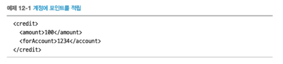
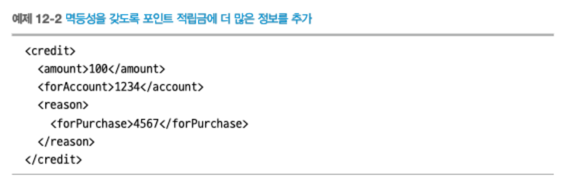
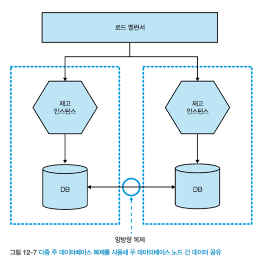

# 12 회복탄력성
- 우리는 신뢰할 수 있는 소프트웨어를 만들어야 하는 임무가 있다.
  - 근무 시간동안만 소프트웨어를 지원해야 하는 시대는 저물었다.
- 전 세계 조직에서 `마이크로서비스 아키텍처`를 선택하는 데는 여러 이유가 있다.
  - 마이크로서비스 아키텍처가 **회복 탄력성**을 `향상시킬 것이라는 기대`가 주된 이유 이다.

## 12.1 회복 탄력성이란?
- **회복 탄력성(resiliency)의 네 가지 개념**
  - `견고성(robustness)`
    - 예상되는 변동을 **흡수하는 능력**
  - `회복성(rebound)`
    - 충격적인 사건 이후 **회복하는 능력**
  - `원만한 확장성(graceful extensiblity)`
    - 예상치 못한 상황에 **얼마나 잘 대처**하는가?
  - `지속적인 적응력(sustained adaptability)`
    - 변화하는 환경, 이해관계자, **요구 사항에 지속적으로 적응**하는 능력

### 12.1.1 견고성
- `견고성`은 **소프트웨어와 프로세스가 예상되는 문제를 수용할 수 있도록 메커니즘을 구축하는 개념**이다.
- 직면할지도 모를 **변동의 종류를 잘 이해**하고 이러한 **문제가 발생할 때 시스템이 잘 처리할 수 있도록 조치**를 취한다.
  - 호스트 고장 -> 교체 호스트 자동 가동
  - 네트워크 연결 시간 초과 -> 재시도 수행
- `견고성`은 사람에게도 적용될 수 있다.
  - 백업 담당자
- `견고성`은 **사전 지식이 필요**하다.
  - **알려진 변동을 위한 조치**를 취한다.
  - 예상하지 못한일이 발생 후 개선될 수 있다.
- 어플리케이션의 `견고성`을 높일수록 **많은 복잡성이 추가**되어 문제가 될 수 있다.
  - 비용/이점 분석 & 복잡한 시스템에 만족 여부 고려해야 한다.

### 12.1.2 회복성
- **시스템이 중단된 후 얼마나 잘 복구되는지**가 **회복 탄력성을 구축하는 핵심**이다.
- **시스템의 견고성을 개선**해 **예상되는 나쁜 상황에서 보호하려고 노력**해야 한다.
- **사전에 준비**하면 장애로부터 **회복하는 능력이 향상**된다.
  - 예를들어, 백업
- **회복 능력을 향상시키기 위해**서는 시스템 중단 후 실행할 수 있는 `플레이북`을 포함해야 한다.
  - 장애 발생 시, 개인들이 어떤 역할을 해야하는지, 누구와 소통해야 하는지 등등.. 

### 12.1.3 원만한 확장성
- `회복성`과 `견고성`은 주로 예상되는 문제를 다루고 있지만, **예측하지 못한 일이 발생할 수 있다.**
- 예측하지 **문제가 발생**했을때, **수평 조직은 더 잘 대처**할 수 있다.
- 시스템을 최적화하려는 과정에서 **시스템의 취약성이 증가**할 수 있다.
  - 예를들어, 자동화는 돌발 상황을 처리할 수 없다.

### 12.1.4 지속적인 적응력
- `지속적인 적응력`을 갖추려면 **안주하지 않아야 한다**
  - 과거의 성공이 미래의 성공을 보장하지 않는다.
- **미래의 회복 탄력성을 보장하기 위해** **지속적으로 적응하려는 노력**을 해야 한다.
  - **지속적인 적응력**을 구축시 **카오스 엔지니어링**은 유용한 도구이다.
- `지속적인 적응력`을 위해서는 **전체적인 관점이 필요**하다.
  - 소규모 자율적인 팀에 국부적 책임을 강화하면 큰 그림을 보지 못할 수 있다.
  - `전역 최적화`와 `지역 최적화` 사이의 균형을 조정해야 하며, 이는 고정되지 않는다(15장)//TODO
- 마이크로서비스의 소유권을 갖고 사용자 대면 기능을 제공하는 **스트림 정렬 팀의 역할이 중요**하다.(15장) //TODO
- 징계에 대한 두려움 없이 **자유롭게 정보를 공유하는 환경의 구축을 중시하는 문화**는 **장애로부터 학습을 장려하는 데 필수적**이다.
- `지속적인 적응력`을 위해서는 일회성이 아닌 **지속적인 투자가 필요하다.**
  - 이러한 지속적인 투자는 **문화의 핵심 부분**으로 만들어 준다.

### 12.1.5 그리고 마이크로서비스 아키텍처
- `회복 탄력성을 제공하는 능력`은 소프트웨어가 아니라, **시스템을 구축하고 운영하는 사람들의 속성**이다.

## 12.2 장애는 어디에서나 발생한다.
- 고장 원인을 제한하려고 최선을 다할 수 있지만, 일정 규모 이상이 되면 **고장을 피할 수 없다.**
  - 대규모에서 고장은 통계적으로 확실해진다.
- **고장 가능성을 받아들여야 한다.**
  - 실패할 가능성을 이해하는 것이 **시스템의 견고성을 개선하는 핵심**이다.
- 모든 것이 실패할 수 있다는 것을 가정하면, **문제의 해결 방법을 달리 생각**하게 된다.
  - 예를들어, 구글에서는 서버 자체에 로컬 전원 공급 장치가 설치되어 있다.
  - 또한, 하드드라이브를 쉽게 교체할 수 있도록 찍찍이 테이프로 고정되어 있다.
- **실패가 발생할 수 있다고 가정**해야 한다.
  - 실패를 대비한 계획에 이 생각을 포함한다면 절충안을 만들 수 있다.

## 12.3 얼마나 많아야 너무 많은 건가?
- `교차 기능 요구 사항(9장)`을 이해하는 것은 데이터 내구성, 서비스 가용성, 처리량, 허용 가능한 지연시간 등을 포함하는 의미이다.
  - ex) 웹 페이지 허용 가능 지연시간, 시스템이 지원해야하는 사용자 수, 장애인용 UI 접근성, 데이터에 대한 보안 수준
- **교차 기능 요구사항은 서비스마다 다르다.**
  - 얼마나 많은 실패를 허용할지, 얼마나 빨라야 하는지는 **시스템 사용자에 의해 결정**된다.
  - 예를들어, 리포팅 시스템과, 전자상거래, 인트라넷의 교차 기능 요구사항은 다르다. 
- 부하와 실패를 더 잘 처리 하기 위해서는 **아래의 요구 사항을 이해**하는 것에서 시작하라.
  - `응답시간/지연시간`, `가용성`, `데이터 내구성`

#### 응답시간/지연시간
- **부하 증가가 응답 시간에 어떤 영향을 주는지** 사용자 수를 **측정**하는 것이 유용하다.
- **응답의 특정 백분위수에 대한 목표를 설정**하라.
- 목표대상에는 **소프트웨어가 처리할 동시 접속** 및 **사용자 수도 포함**돼야 한다.
- 목표예시
  - `초당 200개의 동시 접속을 처리할 때 응답 시간 90%가 2초 미만을 유지한다.`
#### 가용성
- 서비스가 다운될 것을 예상하는가?
- 연중무휴 서비스로 간주되는가?
#### 데이터 내구성
- 데이터 손실은 어느 정도 까지 허용되는가?
- 데이터를 얼마나 오래 보관해야 하는가?

> 이러한 요구 사항을 토대로 서비스 수준 목표(SLO)를 명확히 정의하여 소프트웨어 제공 프로세스의 핵심 부분으로 자리 잡게 하는 것이 좋다.

## 12.4 기능 저하
- 회복 탄력적 시스템을 구축하는 데 필수적인 부분은 **기능을 안전하게 저하시킬 수 있는 능력**이다.
  - 예를들어, MSA로 만들어진 전자상거래 서비스중 하나가 다운돼 사이트를 사용할 수 없다면, 단일 서비스보다 회복 탄력성이 떨어지는 시스템이다.
- **각 장애의 영향도를 파악**하고 **기능을 적절하게 저하시키는 방법**을 찾아야 한다.
- `단일 서비스`에서 시스템 상태는 `정상 또는 중단으로 이분법` 적이지만, **MSA 아키텍처는 미묘한 상황을 고려해야 한다.**
  - 장바구니 서비스가 다운됐을 때 비지니스 맥락을 이해하지 못하면 어떤 조취를 취해야 할지 이해할 수 없다.
- 모든 고객을 대면하는 인터페이스&여러 다운스트림과 협업하는 서비스에 대해 **이들이 다운되면 어떻게 될까?** 라고 `자문`하며 `무엇을 할지 알고 있어야` 한다.
- **교차 기능 요구사항 측면**에서 각 기능들의 중요성을 판단하면, **무엇을 할 수 있는지 더 잘 정할 수 있다.**

> 기술적 관점에서 실패 발생시 처리방법에 대한 일을 고려해보자.
## 12.5 안정성 패턴
- 무언가가 잘못될 경우 **심각한 파급효과를 피하기 위해** **사용하는 몇 가지 패턴**이 있다.
  - 한 명의 나쁜 시민이 전체를 무너뜨리지 않도록 **이 패턴(안전성 패턴)들을 적극 활용**해야 한다.

#### [필자 경험]
- **교살자 무화과 패턴**을 사용해, 모든 호출을 가로채 필요한 경우 이전 시스템으로 요청을 전달했다.
  - `교살자 무화과 패턴` : 기존에 구축된 레거시 시스템을 한 번에 완전히 대체하는 대신, 시스템의 일부를 점진적으로 대체하면서 새로운 시스템으로 전환하는 방식
- 원인은 서비스중 하나인 그림[12-1]의 `순무 광고` 였다.
  - `순무 광고`서비스가 매우 느리게 응답하기 시작했다.
- **시스템이 느려지면 리소스 경합이 발생**하여, **연쇄적인 장애를 초래**한다.
    
출처 : 한빛미디어 - 마이크로서비스 아키텍처 구축  

- 그림[12-2]에 요약된 `몇 가지 문제를 발견`했다.
  - 다운스트림 HTTP 호출시 타임아웃이 설정되어 있었으나, **느린 다운스트림 서비스로 워커(worker)가 모두 타임아웃 까지 대기** 했다.
  - 따라서, **워커 스레드를 필요로 하는 요청은 블록**(block)되었다. 
- `느리게 작동하는 시스템`이 빠르게 실패하는 시스템보다 **다루기 훨씬 어렵다.** 
  - `분산 시스템에서 지연 시간은 치명적`이다.
- 잦은 타임아웃&실패로 인해 `순무`서비스가 정상적이지 않다는 것은 분명했지만, 계속 트래픽을 전송했다.
- 이러 일이 재발되지 않도록 **세가지 수정 사항을 구현**했다.
  - **타임아웃** 설정
  - **벌크헤드** 구현
  - **회로 차단기** 구현
    
출처 : 한빛미디어 - 마이크로서비스 아키텍처 구축  

### 12.5.1 타임아웃
- `분산 시스템`에서 **타임아웃을 올바르게 이해하는 것이 중요**하다.
- 애드버트코프의 **타임아웃 관련 2가지 문제점**
  - 첫째, `HTTP 요청 풀에 타임아웃이 누락`되면 **워커가 가용해질 떄까지 요청 스레드가 블록된다.**
  - 둘째, `순무 광고 시스템`에 **요청을 할 수 있는 HTTP 워커가 생겼을때 호출을 포기하기까지 너무 오래 걸린다.**
- **인바운드 & 다운스트림 요청 타임아웃 조절하여 해결**할 수 있다.
  - 광고 시스템에 `인바운드 타임아웃 1초`, 순무 광고 서비스 `다운스트림 호출에 1초` **타임아웃**
    - 최악의 경우 `순무 시스템`정보를 얻기위해 약 2초를 기다려야한다.

> **TIP**  
> - 타임아웃은 매우 유용하다.
> - 다른 프로세스를 호출하는 데 **항상 타임아웃을 설정**하고 **모든 곳에 기본 타임아웃 값을 지정**하라.
> - 타임아웃 발생시 기록하고, 살펴보고 **그 결과에 따라 변경하라.**

> **CAUTION**
> - **단일 서비스 호출에 대한 타임아웃만 고려하면 안된다.**
> - 해당 작업 전체에 대한 타임아웃을 생각하고 **전체 타임아웃 예산이 초과하면 연산 전체를 중단**하라.  

    
출처 : 한빛미디어 - 마이크로서비스 아키텍처 구축  

### 12.5.2 재시도
- `재시도`해야 할 다운스트림 **호출 실패의 종류를 고려하면 유용**하다.
  - 404는 재시도의 의미가 없지만 503,504는 일시적 오류로 간주해 재시도하는 것이 적절하다.
- `재시도`하기 전에 **지연 시간이 필요**할 수 있다.
  - 서비스 과부하가 걸려 타임아웃이나 에러가 발생한 경우 추가 요청을 쏟아내는 것은 좋지 않다.
- `재시도`하려면, **타임아웃 임계값을 염두**에 둬야한다.
  - 전체 타임아웃 예산을 이미 초과했다면, 재시도를 수행하지 않을 수 있다.

### 12.5.3 벌크헤드
- `성공적인 출시를 위한 소프트웨어 설계와 배치(마이클 나이가드)`에서 **실패로부터 격리하는 방법으로 벌크헤드(bulkhead, 격벽)이라는 개념을 소개**한다. 
- `소프트웨어 아키텍처 관점`에서는 **매우 다양한 벌크헤드**가 있다. 
- 애드버트코프의 서비스별 다른 커넥션 풀 사용하여 **벌크헤드 적용**
  - [그림 12-4]와 같이 하나의 커넥션 풀이 소진되더라도 다른 것은 영향을 받지 않는다.
  - 각각 다운스트림 연결 위한 별도의 컨넥션풀을 두는 것이 좋다.
  - 나아가 회로 차단기 사용을 고려할 수 있다.
      
  출처 : 한빛미디어 - 마이크로서비스 아키텍처 구축  
- **벌크헤드**는 살펴본 패턴 중 **가장 중요하다.**
  - `타움아웃`과 `회로 차단기`는 자원이 제한될 때 **자원을 확보하는데 도움**을 준다.
  - **벌크헤드는 처음부터 자원이 제한되는 것을 방지한다.**
- **시스템의 자원이 과부하 상태에 도달하지 않도록 특정 조건에서 요청을 거부할 수 있는 기능을 제공**할 수 있는데, 이를 **로드 셰딩(Load Shedding)** 이라고 한다.
  - API 게이트웨이, 웹서버
- **때로는 요청을 거부하는 것**이 중요한 시스템을 무너뜨리지 않고 **병목 현상이 발생하지 않도록 하는 가장 좋은 방법**이다.

### 12.5.4 회로 차단기
- 회로 차단기는 **다운스트림 문제로부터 소비자를 보호**하며, **다운스트림 서비스를 보호**하기 위해 벌크헤드(격벽)를 봉쇄하는 자동 메커니즘이다.
- `연쇄적 실패 위험을 감안`하여, **동기식 다운스트림 호출에 대해 회로 차단기를 의무화**하는 것이 좋다.
- 애드버트코프 예시
  - 올바른 타임아웃을 설정했더라도, 타임아웃 임계치에 도달해야 에러가 발생하고 자원을 반납하기 때문에 **전체 시스템도 느려진다.**
  - **회로 차단기를 사용**하면, 자원에 대한 요청이 **일정 횟수 이상 실패한 후(에러 또는 타임아웃)에 차단기는 끊어진다.**
- [그림 12-5]와 같이 **회로 차단기가 활성화**되면, **빠르게 실패**한다.
  - 일정 시간이 지나고 클라이언트는 다운스트림 서비스가 복구됐는지 확인하기 위해 `몇 개의 요청을 보내고`, 정상 응답을 받으면 `회로 차단기를 재설정` 한다.
  - 회로 차단기 구현은 `실패한` 요청의 의미에 따라 다르다.
    - HTTP 연결과 같은 경우, 5XX 응답하위 집합을 의미한다.
- **회로 차단기를 올바르게 설정**하는 것은 **까다로울 수 있다.**
  - `너무 일찍 끊거나, 오래 걸려 끊는것`을 **피해야 한다.**
- 회로 차단기가 끊어진 동안 몇 가지 옵션
  - 요청을 큐에 넣고 나중에 재시도 (비동기 작업의 일부로 수행될 때 적합) 
    
출처 : 한빛미디어 - 마이크로서비스 아키텍처 구축  

- **회로 차단기는** 애플리케이션이 빠르게 실패하는 데 도움이 된다.
- **빠르게 실패하는 것**이 느리게 실패하는 것 보다 항상 더 낫다.
- **회로 차단기를 사용**하면 **자원을 낭비하기 전에 실패**하게 된다.
  - 회로차단기의 상태를 확인하여, 작업을 시작하기 전에 중단할 수 있다. 
    
출처 : 한빛미디어 - 마이크로서비스 아키텍처 구축    

//TODO
### 12.5.5 격리
- `하나의 서비스`가 `다른 서비스`의 **가용성에 의존** 할수록 **작업 수행 능력에 영향을 끼친다.**

#### [서비스간 격리시 이점]
- 업스트림 서비스가 다운스트림 서버 중단으로 인한 **영향도**를 줄인다. 
- 또한, 서비스 **소유자(팀) 간의 조정 작업이 줄어든다.**
  - 각 팀들은 더 많은 **자율성**을 갖게 된다. 
- `격리`는 논리적인 것에서 **물리적인 것으로 전환하는 방식에도 적용**된다.
  - ex) 물리머신 1대에 두 개의 마이크로서비스 실행, 하나의 서비스가 CPU를 100% 점유시 문제 발생
  - ex) 물리머신 1대에 DB 인프라 2대

#### [서비스간 격리를 위한 노력]
- 마이크로서비스 배포를 고려하여, 장애 격리를 보장하기 위해 노력해야 한다.
  - ex) 컨테이너에서 인스턴스 실행하여, **서비스별 제한된 컴퓨팅자원 사용**
- 마이크로서비스를 서로 다른 머신에서 실행하면 효과적으로 격리 가능하다.
  - 관리 비용이 증가한다.
  - 시스템의 복잡성을 증가시켜 또다른 장애를 유발할 가능성 있다.
  - 더 많은 인프라를 관리하기 위한 도구 필요

> 격리와 비용 및 복잡성 사이의 절충점을 찾아야한다.

### 12.5.6 이중화
- 이중화는 구성 요소의 견고성을 향상시키는 좋은 방법이다.
  - 마이크로서비스 인스턴스도 두 개 이상 있을 때 장애 발생 시 기능을 계속 제공
- **이중화**가 얼마나 필요하고 어디에 필요한지 **고려사항**들이 있다.
  - `잠재적 장애 모드`
    - ex) AWS의 단일 EC2 인스턴스는 가동 시간에 대한 SLA가 없어 중단될 가능성을 고려해야 한다.
  - `장애 시 영향`
  - `추가 비용`

### 12.5.7 미들웨어
- `메시지 브로커`는 **메시지 전달을 보장**하는 기능을 갖추고 있다.
#### [애드버트코프의 사례]
- 미들웨어를 사용해 다운스트림 순무 시스템과의 요청 및 응답 통신을 처리하는 것은 큰 도움이 되지 않았을 가능성이 있다.
  - 자원 경합을 완화하는 **대신 브로커에서 보류 중인 요청이 증가**할 수 있다.
- `메시지 브로커`와 같은 미들웨어는 **일부 견고성 문제를 해결하는 데 유용**할 수 있지만, 모든 상황에 적용되지는 않는다.
### 12.5.8 멱등성
- **멱등성**이란 연산을 여러 번 적용하더라도 **결과가 달라지지 않는 성질**이다.
- 연산에 `멱등성이 있다면` 부정적인 영향 없이 **호출을 여러 번 반복**할 수 있다. 
  - 멱등성을 활용해, **에러 복구시 사용**할 수 있다.

#### [포인트 추가 적립 예시]
- 그림 [12-1] 호출이 여러번 수신되면 100 포인트가 여러 번 추가되며, 이는 **멱등적이지 않다.**
    
출처 : 한빛미디어 - 마이크로서비스 아키텍처 구축    

- 그림 [12-2] **멱등적으로 만들 수 있도록 정보를 추가**해야 한다.
  - 특정 주문에 대해 적립금을 지급
    
출처 : 한빛미디어 - 마이크로서비스 아키텍처 구축  

#### [멱등적 연산 고려사항]
- 호출을 수신했다는 사실을 로그에 기록하거나, 호출 응답 시간을 기록하고 모니터링하기 위한 **데이터 수집에는 여전히 영향을 미친다.**
- HTTP 명세에 따르면 GET과 PUT 같은 일부 동사는 멱등적이라고 정의돼 있다.
  - 그러나 **멱등적**으로 처리하려면 **서비스에 의존**해야 한다.

## 12.6 위험 분산
#### [호스트 분산]
- `여러 서비스가` **한 호스트**에 있을 경우 **장애가 여러 서비스에 영향을 미칠 수 있다.**
  - **호스트를 여러 물리 머신으로 분산**하여 이 위험을 줄일 수 있다.
#### [데이터 센터 분산]
- 모든 서비스가 데이터 센터의 단일 랙에서 실행되지 않도록 하거나 **둘 이상의 데이터 센터에 분산**시켜야 한다.
- 서비스 제공업체의 **SLA(서비스 수준 계약)를 확인하고 계획을 세우는 것이 중요**하다.
  - ex) **AWS**는 단일 노드나 가용 영역의 가용성을 보장하지 않으므로 **여러 가용 영역에 서비스를 분산**해야 한다.

## 12.7 CAP 정리
- **분산시스템**에서, **CAP 정리**는 `일관성`(Consistency), `가용성`(Availability), `단절내성`(Partition Tolerance) **세 가지 조건을 서로 절충**할 수 있다고 이야기 한다.
- CAP 정리의 세 가지 조건
  - `일관성` (Consistency): 여러 노드에서 동일한 답을 얻을 수 있는 시스템 특성.
  - `가용성` (Availability): 모든 요청이 응답을 받는 특성.
  - `단절내성` (Partition Tolerance): 부분 간 통신이 가끔 불가능하다는 사실을 처리하는 능력.

- 그림 [12-7]에서 데이터 동기화가 진행되지 않는다면 실패동안에는 어떻게 될까?
    
출처 : 한빛미디어 - 마이크로서비스 아키텍처 구축
### 12.7.1 일관성 희생
### 12.7.2 가용성 희생
### 12.7.3 단절내성 희생?
### 12.7.4 AP 아니면 CP?
### 12.7.5 양자택일이 아니다
### 12.7.6 그리고 현실에서는

## 12.8 카오스 엔지니어링
### 12.8.1 게임 데이
### 12.8.2 운영 환경의 실험
### 12.8.3 견고성을 넘어

## 12.9 비난

## 요약

    
출처 : 한빛미디어 - 마이크로서비스 아키텍처 구축  