# 13 확장
- 시스템 확장 2가지 이유
  - **더 많은 부하** 처리, **지연시간 개선**
  - **시스템 견고성 개선**

## 13.1 확장의 네가지 축
- 확장 육면체(Scale Cube), `The Art of Scalability`  
  - 기능 분해, 수평 복제, 데이터 파티셔닝 3가지 범주로 세분화
  - 수직 확장에 대한 이야기는 없지만, 마이크로서비스 아키텍처를 가장 잘 **확장**할 수 있는 유용한 매커니즘 이다.
  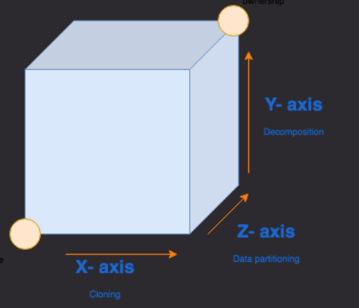    
  출처 : https://isamatov.com/scale-your-app-better-with-scaling-cube/  

- **수직 확장(vertical scaling)**
  - 더 큰 머신을 사용하는 것
- **수평 복제(horizontal duplication)**
  - 동일한 작업을 수행하는 여러 대의 기기를 두는 것(인스턴스 추가)
- **데이터 파티셔닝(data partitioning)**
  - 데이터의 일부 속성에 따라 작업을 나누는 것.
- **기능 분해(functional decomposition)**
  - 마이크로서비스와 같이 업무를 분리하는 것.

### 13.1.1 수직확장
- 큰 머신을 사용하면 **지연 시간**(latency)과 **처리량**(throughput)이 향상돼 시간 대비 더 많은 작업을 처리할 수 있다.
- 과거에는 수직확장을 위해 하드웨어 구매, 실제 필요한 크기보다 더 큰 규모로 정하는 일이 흔했다.
- **가상화 및 공용 클라우드** 등장으로 **수직확장**이 수월 해졌다.

#### [구현]
- 구현 방법은 **실행 중인 인프라스트럭처**에 따라 다르다.
  - `가상화` => VM 크기 조정
  - `베어메탈(bare metal) 서버` => 더 좋은 하드웨어 구매
    - 베어메탈 : 한 소비자 또는 테넌트만 사용하는 물리적 컴퓨터 서버를 임대(클라우드 서비스의 한 형태)
  - `클라우드` => 목적에 맞는 다양한 머신 선택, 간단하고 빠르게 확장 가능

#### [주요 이점]
- 가상화된 인프라스트럭처(공용 클라우드 제공업체) **수직확장을 빠르게 구현** 할 수 있다.
  - 수직 확장은 빠르고 안전하게 시도할 수 있는 장점이 있다.
- `수직 확장`을 통해 다른 확장 유형들을 더 쉽게 수행 가능 하다.
  - 데이터베이스 인프라스트럭처를 더 큰 머신으로 옮기면, 논리적 데이터베이스(마이크로서비스용)를 더 많이 호스팅 가능하다.
- `수직 확장`시 **코드나 데이터베이스를 변경할 필요 없다.**
  - 변경된 하드웨어 활용시, 런타임 플래그로 메모리양을 늘릴 수 있다.

#### [제한 사항]
- `수직 확장`시, CPU가 빨라지는게 아니라, 코어 수만 증가한다.
  - 소프트웨어가 멀티코어 하드웨어를 활용하지 못하는 경우가 많다.
- 더 큰 시스템이 무조건 **견고성을 개선하지는 않는다.**
- 더 큰 머신일수록 비용이 증가하지만, **가용 자원이 증가가 항상 비례하지는 않는다.**
  - 소수의 대형 머신보다 다수의 소형 머신이 더 비용 효과적일 수 있다.

### 13.1.2 수평 복제
- `수평복제`는 단순한 편에 속하며, 초기에 시도하는것 중 하나다.
  - 모놀리식 시스템 부하가 있다면, 수평 복제를 시도하는 것도 좋은 방법이다.

#### [구현]
- **로드 밸러서를 통해 여러 복제본으로 요청 분산**
  - 과거에는 로드 밸런서를 전용 하드웨어의 관점에서 주로 생각 했다.
  - 최근에는 더 많은 로드 밸런싱이 클라이언트 측에서 실행되는 경우가 많다. (envoy)  
  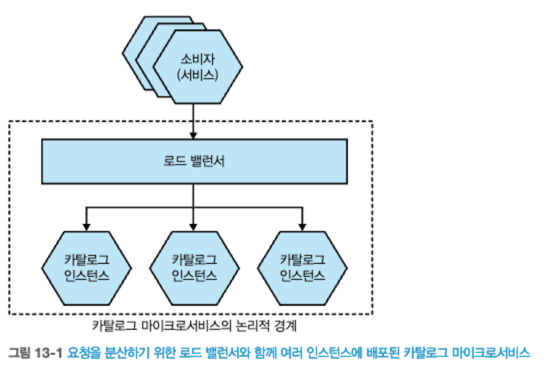    
  출처 : 한빛미디어 - 마이크로서비스 아키텍처 구축  

  - [그림 13-2] 뮤직코프에 새로운 노래가 업로드 되는 사진이다.
    - 노래 트랜스코더 서비스 인스턴스들이 작업을 두고 경쟁
    - 처리량 증가를 위해 인스턴스를 추가할 수 있다.  
    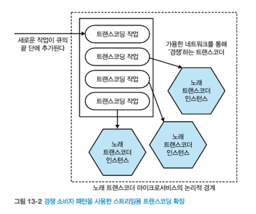     
    출처 : 한빛미디어 - 마이크로서비스 아키텍처 구축  

  - [그림 13-3] 푸드코의 DB 수평복제
    - 읽기 복제본 라우팅은 마이크로서비스 내부적으로 처리  
    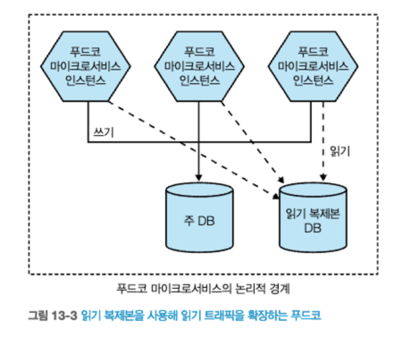    
    출처 : 한빛미디어 - 마이크로서비스 아키텍처 구축   

- **경쟁 소비자 패턴**

#### [주요 이점]
- 수평 복제는 비교적 간단하다.

#### [제한 사항]
- 많은 인프라스트럭처가 필요 => 더 많은 비용 발생
- 수평복제는 부하 분산 매커니즘이다
  - 고정 세션이 필요한 경우 부하 분산 메커니즘이 제한될 수 있다. 

### 13.1.3 데이터 파티셔닝
- `데이터 파티셔닝`은 데이터의 일부 측면을 기반으로 부하를 분산시킨다.
- 예시 mysql 샤딩
  - https://www.youtube.com/watch?v=8Eb_n7JA1yA&t=208s&pp=ygUVbXlzcWwgZGIg7YyM7Yuw7IWU64ud
#### [Horizontal Partitioning]  
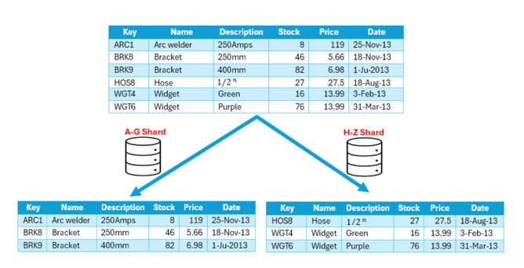   
출처 : https://www.baeldung.com/cs/databases-horizontal-vertical-partitioning  

#### [Vertical Partitioning]  
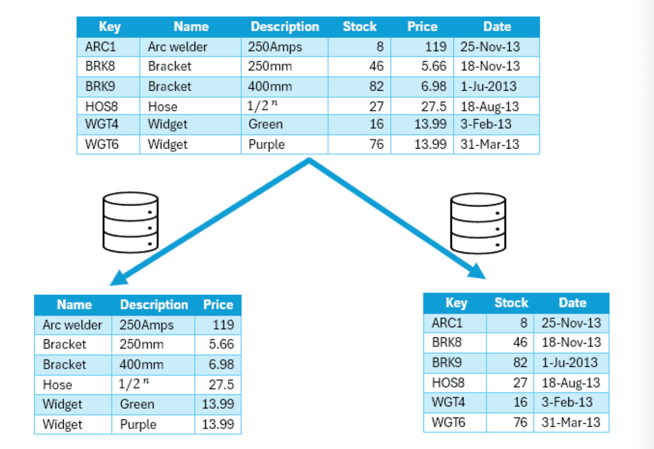      
출처 : https://www.baeldung.com/cs/databases-horizontal-vertical-partitioning   

#### [Sharding]   
- 수평 vs 샤딩  
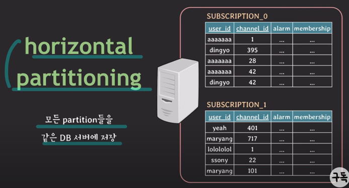    
출처 : https://www.youtube.com/watch?v=P7LqaEO-nGU     
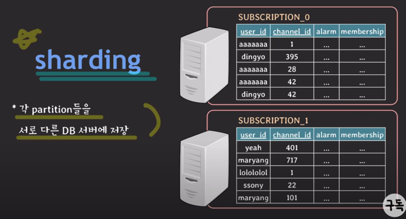   
출처 : https://www.youtube.com/watch?v=P7LqaEO-nGU

#### [replica]  
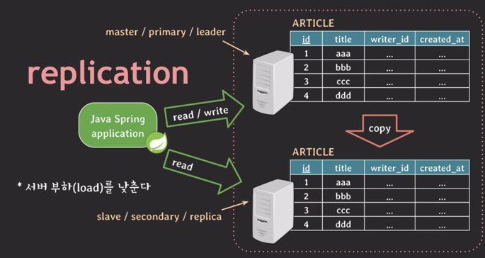    
출처 : https://www.youtube.com/watch?v=P7LqaEO-nGU

#### [구현]
[키에 함수를 적용한 파티션]
- 워크로드와 관련된 키를 가져온 후, `키에 함수를 적용`하여 **얻은 파티션(샤드)에 부하를 분산**
- 예를들어, [그림 13-4] 성을 기준으로 두 파티션으로 나눠 부하를 분산한다.  
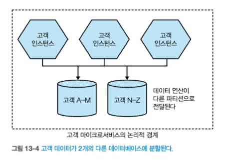    
출처 : 한빛미디어 - 마이크로서비스 아키텍처 구축  

[인스턴스 레벨 파티셔닝]
- 인스턴스 수준에서 파티셔닝도 가능하다. 
- 인바운드 요청으로부터 프록시를 통해, 어떤 파티션에 매핑되어야 하는지 파악가능하다.
- 예를들어, [그림 13-5]는 고객 요청헤더에 이름을 통해 인스턴스 매핑 시킨다.  
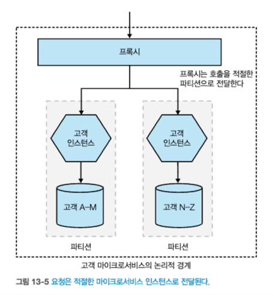    
출처 : 한빛미디어 - 마이크로서비스 아키텍처 구축

[지리적 기준 파티셔닝]
- 국가별 지역별로 파티션을 만들 수 있다.

> **데이터 파티셔닝을 구현했다는 사실은 해당 마이크로서비스 내부의 구현 세부 사항으로 취급**돼야 한다

#### [주요 이점]
- `데이터 파티셔닝`은 **트랜잭션 워크로드에 유용**하게 확장 가능하다.
  - 쓰기 제약이 있는 시스템의 경우 큰 개션 효과를 얻을 수 있다.(각 파티션이 독립적으로 트랜잭션을 처리하기 때문)
- `데이터 파티셔닝`은 **유지 보수 활동의 영향도와 범위**를 쉽게 줄일 수 있다.
  - 파티션별 업데이트, 다운타임이 필요한 작업도 단일 파티션에만 영향
- `데이터 파티셔닝`은 **수평 복제와 함께 잘 동작**한다.
  - 각 파티션은 해당 작업을 처리하는 여러 노드로 구성될 수 있다.

#### [제한 사항]
- `데이터 파티셔닝`은 **시스템 견고성을 개선하는 데 한계**가 있다.
  - 예를들어, 4개의 파티션중 하나의 파티션이 다운되면 25%의 요청은 실패하게 된다. 
  - 데이터 파티셔닝과 **수평 복제 기술을 결합**해 특정 **파티션의 견고성을 향상**시킨다.
- `파티션 키`를 **올바르게 설정하는 것은 어렵다.**
  - 키를 잘못선정한다면, 부하가 고르게 분산되지 않을 수 있다.
  - 고객에게 부여된 고유 ID를 기반으로 파티셔닝 분할 => 부하를 균등하게 분산 가능성이 높다.

> 데이터베이스 선택 기준 책 추천 
> - NoSQL : 빅 데이터 세상으로 떠나는 간결한 안내서  

### 13.1.4 기능 분해
- `기능을 분해`하면 **독립적으로 확장**할 수 있다.
- [그림 13-6]은 주문 기능을 모놀리식 시스템에서 추출한 예시이다.
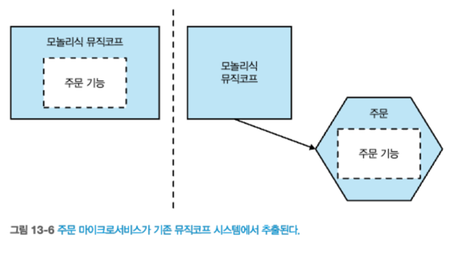    
출처 : 한빛미디어 - 마이크로서비스 아키텍처 구축  

#### [구현]
- 3장 참조.

#### [주요 이점]
- 워크로드를 분리했으므로, **인프라스트럭처의 크기를 조정**할 수 있다.
  - 부하가 크지 않은 기능은 소규모 머신에 배포할 수 있다.
  - 부하가 큰 경우 수평 복제를 통해 부하를 분산시킬 수 있다.
  - `비용 최적화`하는 데 유연성을 확보할 수 있다.
- 기능 분해를 통해 **다양한 기술을 사용할 기회**가 늘어난다.
  - `서비스 유형`에 맞는 **데이터베이스 선택** 등

#### [제한 사항]
- `기능 분해`는 **복잡**하며, 단기간에 이점을 제공하기 어렵다.
  - `프론트&백엔드 코드에 가장 큰 영향`을 미칠 수 있는 확장 방식이다.
- `기능 분해`는 **시스템의 전반적인 복잡성을 증가**한다.
  - 유지 관리, 견고성 확보, 확장 등 필요한 항목이 더 많아진다.
- 필자는 시스템 확장시 `기능적 분해 이전`에 **다른 가능성 부터 모두 고려**한다.

## 13.2 결합모델
- `확장 육면체의 의미`는 한 가지 유형의 확장으로 좁게 생각하는 것을 지양하며, **필요시 축에 따라 애플리케이션을 확장하는것을 돕기 위한 것**이다.

- [그림 13-7] 주문 마이크로서비스를 여러 복제본으로 분리해 확장  
  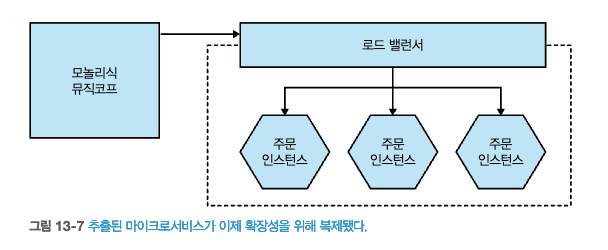      
  출처 : 한빛미디어 - 마이크로서비스 아키텍처 구축  

- [그림 13-8] 서로 다른 지리적 위치에 따른 주문 마이크로서비스
  - 수평 복제는 각각의 지리적 경계 안에서 적용된다.   
  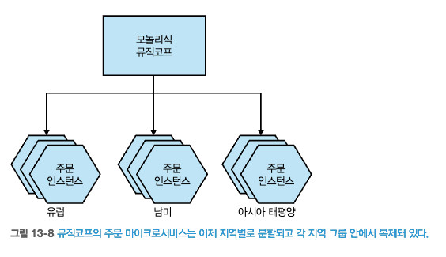      
  출처 : 한빛미디어 - 마이크로서비스 아키텍처 구축    

- **한 축을 확장**하면 **다른 축을 더 쉽게 활용**할 수 있다.
  - 주문 기능을 분해(기능분해) => 주문 처리 부하 분산(수평복제)
- 확장시 다양한 매커니즘이 있다는 점을 인식해야 한다. => 수평 복제, 수직복제, 데이터 파티셔닝, 기능분해
  - 각 매커니즘의 장단점을 이해하여 적합한것을 파악해라!

## 13.3 작게 시작하라
- 존재하지 않는 문제를 해결하기 위해 **시스템을 최적화**하는 것은 `시간효율성이 좋지 않고`, `더 복잡한 시스템을 만드는 지름길`이 된다.
  - 도널드 크누스, The Art of Computer Programming
    - `프로그래머들이 엉뚱한 곳에서 시간 효율성에 대해 걱정하는데 많은 시간을 소비한다. 조기 최적화는 프로그래밍에서 악의 근원이다.`
  - 따라서, **모든 형태의 최적화는 필요에 의해 주도돼야 한다.**
- 병목 현상 파악 이후, **추가 작업이 합당한지 확인**하려면 **실험 과정이 필수적**이다.
  - 제안한 솔루션이 효과가 있는지 확인하기 위해 **수행 가능한 작은 작업을 찾아보라.**

> **CQRS와 이벤트 소싱**
> - `명령과 조회의 책임 분리(Command Query Responsibility Segregation, CQRS)` **읽기 및 쓰기에 대한 책임을 별도의 모델에서 처리하는 매커니즘**이다.
>   - 읽기 및 쓰기를 독립적으로 확장할 수 있다.
>   - CQRS 패턴은 복잡한 패턴이다. => 따라서, 쉬운것 부터 진행하라
> - 이벤트 소싱 : **데이터 저장 방식 중 하나로 발생한 이벤트를 저장하는 기법**
>   - 애그리거트를 DB에 일련의 이벤트로 저장하는 기법. 각 이벤트는 애그리커트의 상태 변화를 나타냄.
>   - 이벤트의 최종 결과값이 아닌 전체 순서를 모두 저장하여 관리

## 13.4 캐싱
- **캐싱(caching)은 성능 최적화 방법**으로, 후속 요청에 대해 **저장된 값을 사용할 수 있게 해준다.**
  - 예를들어, 캐시를 적용하여 추천 서비스가 재고 수준을 조회시 1차적으로 `로컬 캐시`에서 조회
    - 필요한 항목 발견시 **캐시 히트(cache hit)로 간주**
    - 데이터를 찾기 못하면 **캐시 미스(cache miss)이므로** 재고 마이크로서비스에서 정보를 가져온다.
- **캐시는 지연 시간을 줄이고, 애플리케이션을 확장, 시스템의 견고성을 개선**하는 데 도움이 된다.

### 13.4.1 성능을 위해
- 마이크로서비스 사용시, 여러 마이크로서비스와 상호작용해야 하는 비용을 우려하는 경우가 많다.
- **캐시에서 데이터를 가져오면 네트워크 호출 없어져**, `다운스트림 부하를 줄이는데 큰 도움`이 된다.
  - `네트워크 홉`을 피할뿐 아니라, `요청에 대한 데이터 생성`할 필요성도 줄어든다.

### 13.4.2 확장성을 위해
- `읽기`를 `캐시로 전환`하면 **시스템 경합을 피해 더 나은 확장성을 확보**할 수 있다.
  - 예를들어, 데이터베이스 읽기 복제본을 사용 => 주 데이터베이스 부하 줄어, **읽기를 효과적으로 확장**
- `확장성`을 위한 캐싱은 원본이 **경합 지점이 되는 상황에서 유용**하다.
- `클라이언트와 원본 사이에 캐시를 배치`하면 **원본의 부하를 줄여 확장성을 높일 수 있다.**

### 13.4.3 견고성을 위해
- `로컬 캐시`에 전체 데이터 집합이 있다면, **원본이 가용하지 않을 경우에도 작동**할 수 있다. => **견고성 향상**
- `견고성을 위한 캐싱` 사용시 **주의 사항**이 몇 가지 있다.
  - 캐시 무효화 이전까지는 **데이터를 캐시에 보관**해야 한다. => 캐시 무효화시, 원본을 사용할 수 없을 가능성이 있음.
  - 원본이 오프라인일 경우에 **오래된 데이터라도 읽어올 준비를 해야 한다.**
  - 원본을 사용할 수 없는 상황에서, `로컬 캐시를 통해 견고성을 확보`하는 것은 일관성보다 **가용성을 우선시**한다는 의미이다.

### 13.4.4 캐싱 위치
- 캐시를 저장할 수 있는 다양한 장소가 있다.
- `최적화 유형`에 따라 **가장 적합한 캐시 장소를 찾을 수 있다.**
- [그림 13-9] 캐시 적용 장소 선정 상황 예시
  - 판매 마이크로서비스에 지난 7일간 판매된 상위 10개 베스트셀러 목록 요청
  - 판매 마이크로서비스는 CD의 이름을 알지 못하고 ID 만 알고 있다.
  - 카탈로그 서비스를 통해 CD의 이름을 알아야 하는 상태이다.  
  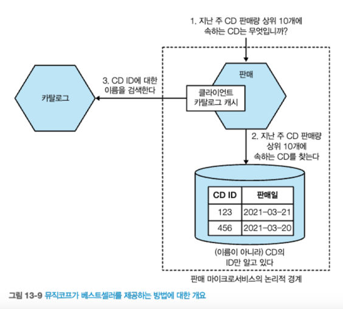    
  출처 : 한빛미디어 - 마이크로서비스 아키텍처 구축  

#### [클라이언트 측 캐싱]
- `클라이언트 측 캐싱` 사용시, 데이터는 **원본 범위를 벗어난 곳에 캐싱**된다.
- [그림 13-10]과 같이 판매 프로세스 내부에 앨범 ID와 이름이 정보가 포함된 정보를 캐싱 한다.
  - CD와 관련된 내용 캐시 히트시, 카탈로그 호출 불필요.
- `클라이언트 측 캐싱`은 네트워크 호출을 피할 수 있기 떄문에, **지연시간 개선**, **견고성**을 위한 캐싱에도 적합하다.  

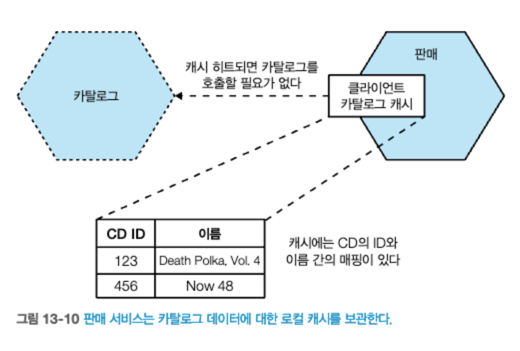    
출처 : 한빛미디어 - 마이크로서비스 아키텍처 구축

- `클라이언트 측 캐싱` **단점**
  - 첫째, **무효화 메커니즘 선택 범위가 제한**된다.
  - 둘째, **클라이언트 사이에 불일치 발생**
    - `판매,프로모션,추천 서비스` 서로다른 카탈로그 캐시 데이터 => 알림 기반 무효화 but, 완전히 해소X 
    - [그림 13-11] **클라이언트 측 캐시를 공유** 하거나, **레디스/멤캐시드 를 사용하여 완화**시킬 수 있다. => 클라이언트간 불일치 해소
      - 관리해야 하는데이터의 복사본 수가 줄기 떄문에, 리소스 사용측면에서도 더 효율적이다.
      - 한편으로 클라이언트는 공유 캐시 까지 네트워크 호출이 있어야 한다.
      - 하지만, `공유 캐시`는 클라이언트 측 캐싱과 서버 측 캐싱 사이의 경계를 모호하게 만든다.
        - 캐시 데이터가 어느 쪽에서 관리되고 제공되는지 명확하지 않게 된다

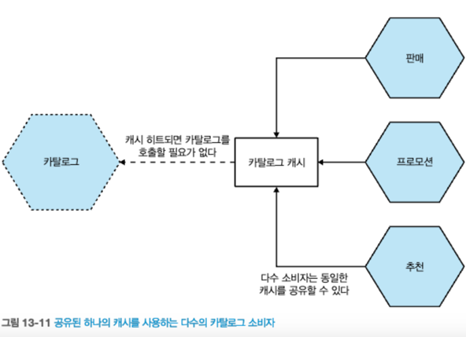    
출처 : 한빛미디어 - 마이크로서비스 아키텍처 구축  

#### [서버 측 캐싱]
- [그림 13-12] **서버 측 캐싱을 사용하는 예시**를 보여준다.  
  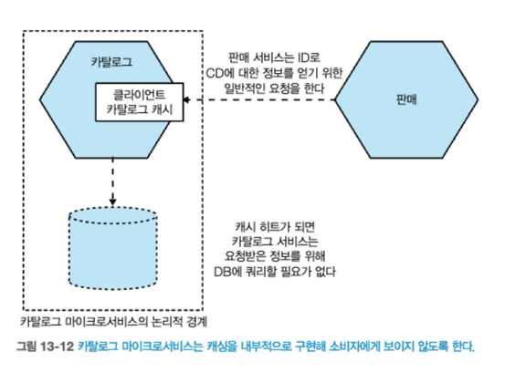    
  출처 : 한빛미디어 - 마이크로서비스 아키텍처 구축  
  - `카탈로그 서비스`는 **캐시 관리에 대해 책임**진다.
  - 인메모리 데이터 구조, 로컬 캐싱 노드 등을 활용한다. 
    - **정교한 캐시 무효화 매커니즘을 구현하기가 더 용이** 하다. => 클라이언트에게 데이터 일관성 보장
    - **연속 쓰기 캐시**(write-through cache) 상황에서도 구현이 훨씬 간단하다. => 클라이언트에게 데이터 일관성 보장
  - `클라이언트 측 캐싱` **불일치 해결**할 수 있다.
- 마이크로서비스 인스턴스 코드에서 캐싱을 구현해야 한다는 의미는 아니다.
  - 역방향 프록시를 두거나, 레디스, 읽기전용 데이터베이스의 복제본으로 전환
- `서버 측 캐싱` 문제점은 소비자 서비스가 네트워크 호출을 하므로 **지연 시간 최적화 범위가 줄어든다.**
- `서버 측 캐싱`은 전체적인 **견고성을 상대적으로 감소** 시킨다.
- `서버 측 캐싱`이 도움이 될지 여부는 우려 사항에 따라 결정된다.
  - 예를들어, 지연 시간 최적화는 **클라이언트 측 캐싱이 더 많은 성능 이점을 제공**

#### [요청 캐시]
- `요청 캐시`는 **원본 요청에 대한 응답을 캐싱**해 저장한다.
  - **속도 최적화 측면에서 가장 효과적인 캐시 방법**이다.
- 매우 효율적인 캐싱 방법이지만, 요청의 결과만 캐싱하기 때문에 매우 **한정적인 캐싱 방법**이다.
  - 카탈로그 서비스를 호출하는 다른작업들은 캐싱되지 않는다. 

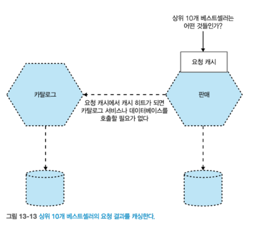    
출처 : 한빛미디어 - 마이크로서비스 아키텍처 구축  

### 13.4.5 무효화
> 필 칸튼
> - 컴퓨터 과학에서 어려운 것은 **캐시 무효화**와 **작명**, 이 두가지 뿐이다.

- `무효화`는 **캐시에서 데이터를 제거하는 과정**이다.
  - 구현 방법은 다양하다.
- `무효화`를 **어떤 상황에서 진행**해야 하는지 결정 하는 것이 중요 하다.

#### [TTL]
- `TTL(time to live)`은 캐시 무효화에 사용하는 **가장 간단한 매커니즘** 중 하나다.
  - **시간이 만료되면 데이터는 무효화되고 새 사본을 가져온다.**
  - TTL `유효기간` 및 `타임스탬프`를 사용하여 만료처리 한다.
- `HTTP`는 **TTL**(Cache-Control 헤더)과 **응답의 Expires 헤더**를 통해 캐싱을 지원한다.
  - 다운스트림 클라이언트가 데이터를 얼마나 오랫동안 최신으로 간주해야 하는지 알려 줄 수 있다.
- `TTL 기반 무효화의 한 가지 문제점`은 **그다지 정교하지 못하다는 점**이다.
  - 예를들어, TTL이 5분인 데이터의 새 복사본 요청완료후 1초 후 원본 데이터 갱신 가능성 => **TTL 절충점 필요**

#### [조건부 GET]
- `HTTP`는 응답에 Cache-Control 및 Expires 헤더를 지정해, **클라이언트 측 캐싱**을 제공한다.
- `HTTP`는 **ETag**라는 기능을 제공한다.
  - `ETag`는 **리소스 값이 변경됐는지 여부를 확인**한다.
- ETag는 **조건부 GET(condition GET)을** 사용할 때 강력해진다.
  - GET 요청시, 추가 헤더를 지정해 특정 기준이 충족되는 경우에만 클라이언트에 자원을 내려보도록 서비스에 지시할 수 있다.
- **어떤 경우에 조건부 GET이 유용**할까?
  - 응답을 만드는 데 `많은 비용이 들고`, `값비싼 DB 쿼리 집합 수행`시 **조건부GET을 통해 캐싱효과를** 가져갈 수 있다.

#### [알림 기반]
- **알림 기반 무효화**(notification-based invalidation)은 이벤트를 통해 구독자가 **로컬 캐시 항목을 무효화할지 여부**를 알 수 있게 해준다.
- `TTL 기반 무효화`와 비교해 **상대적으로 복잡**한 단점이 있다.
- [그림 13-14] 추천 서비스는 클라이언트 캐시 사용하고 있다.
  - 캐시 무효화 시점 : `재고 서비스` => `이벤트 발행`

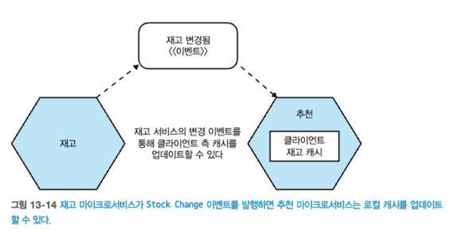    
출처 : 한빛미디어 - 마이크로서비스 아키텍처 구축
- `알림 기반 무효화`는 오래된 데이터를 제공할 가능성을 줄인다.
- `단점`은 **구현이 복잡**하다.
  - 알림을 발행 및 구독처리를 해야한다. => **메시지 브로커가 적합**
  - 하지만, `알림 기반 무효화`를 위해 **메시지 브로커를 사용**하는 것은 과한 조치이다.
- `알림 기반 무효화` **사용시 유의점**은, 클라이언트가 **알림 메커니즘이 실제 정상 작동**하고 있는지 알 필요가 있다.
  - 알림 메커니즘을 통해 심박(heartbeat) 이벤트를 전송하여 알림이 계속 수신되고 있는지 확인할 수 있다.
- 알림에 포함된 내용도 고려해야 한다.
  - 알림에 많은 데이터가 포함되면 **크기와 관련된 문제**가 발생할 수 있고, **민감한 데이터가 광범위하게 노출**될 수 있다.

#### [연속 쓰기]
- `연속쓰기 캐시(Write-Through Cache)`는 원본의 상태와 동시에 캐시가 업데이트되는 방식이다.
- 서버 측 캐싱에서 동일한 트랜잭션 내에서 DB와 인메모리 캐시를 업데이트하므로, 비교적 구현이 간단하다.
- 일반적으로 마이크로서비스 아키텍처에서 **연속 쓰기 캐시가 사용**된다.

#### [나중 쓰기]
- `나중쓰기 캐시(write-behind cache)`는 `캐시가 먼저 업데이트`된 다음 원본이 업데이트 되는것이다. (캐시는 버퍼의 개념)
- `나중쓰기`는 **데이터 손실 가능성**이 있다.
  - 캐시 내구성이 떨어진다면, **원본에 기록되기 전에 손실**될 수 있다.
- 나중 쓰기 캐시를 사용하면 `원본 데이터에 대한 구분`이 **불명확** 해진다.
  - 캐시에 있는 데이터가 원본일까?
- 나중 쓰기 캐시는 최적화에 자주 사용되지만, **마이크로서비스 아키텍처에서는 거의 사용되지 않는다.**
  - 원본에 쓰기 전에 `캐싱된 데이터의 손실을 처리하는것이 복잡`하기 때문이다.

### 13.4.6 캐싱의 황금 법칙
- **너무 많은 곳에 캐시를 만들지 않도록 주의**해야 한다.
  - 캐시가 많을수록 데이터가 오래될 가능성이 높아지며, **최신 데이터를 판단하기 어려워진다.**
  - 캐시 데이터를 **무효화해야 할 위치를 추론**하기도 **더 어려워 진다.**
- 데이터 신선도와 시스템 성능(부하 및 지연 시간) 간의 균형을 맞추는 것은 까다롭다. => 캐싱 절충점 찾기 어려움.
- 캐싱 예시, 재고 서비스 <=> 추천서비스
  - 재고 서비스는 서버측 캐시 1분, 추천 서비스는 클라이언트 캐시 1분 => **추천서비스는 최대 2분까지 오래된 데이터를 유지**
- 캐싱된 데이터를 입력으로 기반으로 하는 작업의 결과를 캐싱한다면, 결과물이 명확하지 않다.
- `캐싱`은 **복잡성을 증가**시키므로 가능한 **최소한으로 유지**해야 한다.
  - 캐싱 장소의 이상적은 수는 `제로(0)`다.

> **TIP**
> - 캐싱은 성능 최적화를 위한 것으로 고려하라.
> - **데이터의 신선도를 더 쉽게 추론**할 수 있도록 **가능한 적은 위치에 캐시를 저장**하라.

### 13.4.7 신선도 대 최적화
- `최종 사용자`와 `시스템에 요구 사항`에 따라 캐싱을 적용하는 것이 좋다.
  - 데이터 원본 시스템이 부하를 받아, 다운되면 안된다.
  - 캐시에 장애가 발생하면 원본 서버에 과부하가 걸릴 수 있으므로, 기능을 끄는 것이 때로는 가장 안전하다. 
- 무엇을, 어디에, 어떻게 캐싱할지 정할 때는 **균형**을 맞춰야 한다.
- **캐시가 적을수록 시스템에 대한 추론이 더 쉽다.**

### 13.4.8 캐시 중독:주의해야 할 이야기
- 예시) 애드버트코프
  - Expires: Never 헤더가 적용되어, 일부 페이지가 누락
  - 해당 헤더가 포함된 페이지는 캐시에서 절대 무효화되지 않음.
  - 해결 방법은 URL을 변경하여 다시 가져오도록 하는 것뿐.
- 캐싱은 매우 강력하지만, **데이터의 전체 경로를 이해 해야 발생하게 될 문제를 인식**할 수 있다. 

## 13.5 자동 확장
- `예측적 확장`
  - 일정한 패턴에 따라 확장을 계획
  - **부하가 어떻게 변화는지 파악하려면 판단할 데이터가 필요**하다.
- `반응형 확장`
  - 실시간 부하 증가나 인스턴스 장애에 대응하여 확장
  - 증가 추세를 발견하면 **얼마나 빨리 확장할 수 있는지 파악**하는 것이 중요하다.

- 예시 : 뉴스사이트
  - 예측적 확장 + 반응적 확장 혼합해 사용
  - 아침부터 점심시간 까지 조회수 상승, 주말 감소 => 예측적 확장
  - 빅뉴스 발생 => 반응적 확장

- 부하에 따라 자동확장 하려면, 너무 빨리 축소하지 않도록 유의하라.
  - 대부분 더 많은 컴퓨팅 성능을 보유하는 것이 부족한 것보다 낫다.

## 13.6 다시 시작하기
- 초반의 아키텍처가 다양한 부하를 처리하기에 적합하지 않을 수 있다.
- 시스템 아키텍처에 영향을 거의 미치지 않는(예: 수직 확장, 수평 복제)확장 방법 있지만, 시스템 아키텍처를 변경하려면 급진적인 조치가 필요할 수 있다.
- 예측치 않은 성장을 지원하기 위해 기존 모놀리스를 분리하거나 새로운 데이터 저장소를 선택하는 등의 `재설계`가 필요할 수 있다.
  - `재설계`는 동기식 시스템 => 이벤트 기반 시스템으로 전환, 새로운 배포 플랫폼을 도입, 기술 스택 전체를 변경하는 것을 포함할 수 있다.
- 특정 확장 임계값에 도달하면 처음부터 대규모로 구축해야 한다는 인식이 생길 수 있지만, 이는 재앙이 될 수 있다.
  - 더 중요한 활동에 공을 들이지 못할 수 있다.
  - 예시를들어, 에릭 리스는 아무도 다운로드 하지 않은 제품을 6개월동안 개발하였다.
- `확장을 위해 시스템을 변경하는 것`은 **실패가 아닌 성공의 신호**일 수 있다.

## 요약
- 수직 확장
  - 간단히 말해. 더 큰 머신을 사용하는 것을 의미한다.
- 수평 복제
  - 동일한 작업을 수행할 수 있는 여러 대의 기기를 두는 것을 의미한다.
- 데이터 파티셔닝
  - 고객 그룹과 같이 데이터의 일부 속성에 따라 작업을 나누는 것이다.
- 기능 분해
  - 마이크로서비스 세분화와 같이 유형에 따라 업무를 분리하는 것이다.

> **무엇을 확장할지에 대해 이해하고, 확장을 적용해야 한다.**
