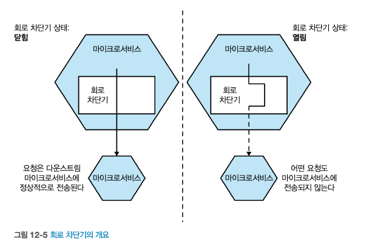

# 13 확장
- 시스템 확장 2가지 이유
  - **더 많은 부하** 처리, **지연시간 개선**
  - **시스템 견고성 개선**

## 13.1 확장의 네가지 축
- 확장 육면체(Scale Cube), The Art of Scalability
  - https://chanwookpark.github.io/microservice/scalecube/%EB%B2%88%EC%97%AD/chris/2014/04/12/scale-cube/

- **수직 확장(vertical scaling)**
  - 더 큰 머신을 사용하는 것
- **수평 복제(horizontal duplication)**
  - 동일한 작업을 수행하는 여러 대의 기기를 두는 것(인스턴스 추가)
- **데이터 파티셔닝(data partitioning)**
  - 데이터의 일부 속성에 따라 작업을 나누는 것.
- **기능 분해(functional decomposition)**
  - 마이크로서비스와 같이 업무를 분리하는 것.

### 13.1.1 수직확장
- 구현
- 주요 이점
- 제한 사항

### 13.1.2 수평 복제
- 구현
- 주요 이점
- 제한 사항

### 13.1.3 데이터 파티셔닝
- 구현
- 주요 이점
- 제한 사항

### 13.1.4 기능 분해
- 구현
- 주요 이점
- 제한 사항

## 13.2 결합모델

## 13.3 작게 시작하라

## 13.4 캐싱

### 13.4.1 성능을 위해

### 13.4.2 확장성을 위해

### 13.4.3 견고성을 위해

### 13.4.4 캐싱 위치
#### [클라이언트 측 캐싱]
#### [서버 측 캐싱]
#### [요청 캐시]

### 13.4.5 무효화
#### [TTL]
#### [조건부 GET]
#### [알림 기반]
#### [연속 쓰기]
#### [나중 쓰기]

### 13.4.6 캐싱의 황금 법칙
### 13.4.7 신선도 대 최적화
### 13.4.8 캐시 중독:주의해야 할 이야기

## 13.5 자동 확장
## 13.6 다시 시작하기

## 요약

    
출처 : 한빛미디어 - 마이크로서비스 아키텍처 구축  
