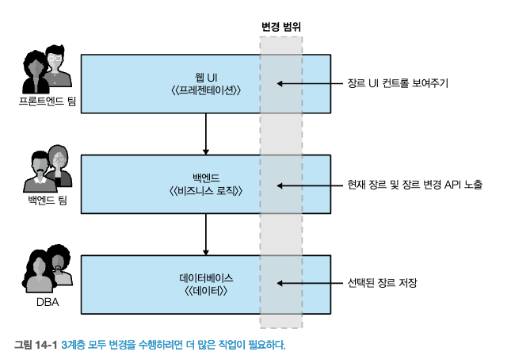
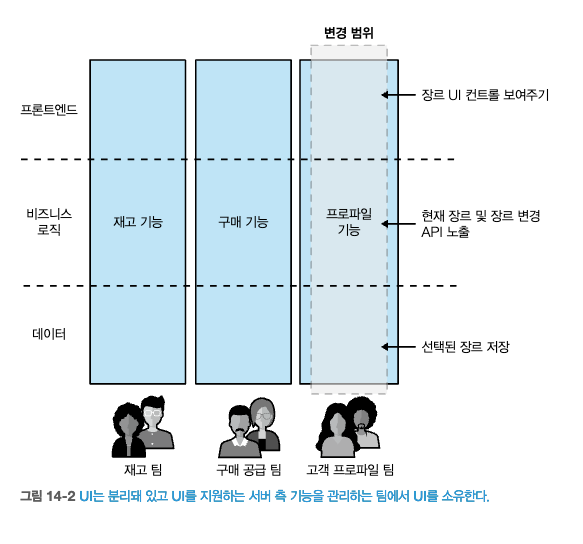

# 14 사용자 인터페이스
- 오늘날에는 사용자에게 그래픽 사용자 인터페이스(GUI)를 제공하기 위한 다양한 환경(다양한 플랫폼과 각 플랫폼에 맞는 다양한 기술)이 있다.
- `이러한 다양한 기술 범위`는 마이크로서비스가 지원하는 효과적인 인터페이스를 만드는 방법에 대해 **다양성을 제공**한다.

## 14.1 디지털을 향해
- `고객`이 `제품`과 어떻게 상호작용할지 정확히 예측할 수 없다는 인식은 **더욱 세분화된 API의 도입을 촉진**했다.
  - 데스크톱 어플리케이션, 모바일 기기, 웨어러블 기기
- `UI`를 사용자에게 제공하는 **다양한 기능을 한데 엮는 곳**으로 생각하라.
  - UI를 제공할 때 **누구에게 어떤 책임이 있는지** `조직척 측면`을 고려해야 한다.
  - **인터페이스를 구현하는 데 사용 가능한** `일련의 패턴`을 살펴볼 것 이다.

## 14.2 소유권 모델
- 계층화된 아키텍처는 소프트웨어를 효과적으로 제공하는 측면에서 문제가 될 수 있다.
- [그림 14-1] 에서 간단한 컨트롤 하나를 추가하면 서로 다른 세 팀이 작업을 수행해야한다. => 팀간 지속적 조정이 필요하므로, 비효율적  
        
  출처 : 한빛미디어 - 마이크로서비스 아키텍처 구축  
- [그림 14-2]는 독립적 배포 가능성을 위해 적합한 모델이다. => 엔드투엔드 기능에 소유권을 가지면 더 빠르게 진행 가능    
        
  출처 : 한빛미디어 - 마이크로서비스 아키텍처 구축  
- 이러한 단점에도 불구하고, `전담 프로트엔드 팀`이 **마이크로서비스 아키텍처를 사용하는 회사에서 일반적인 패턴**이다.
  
### 14.2.1 전담 프론트엔드 팀 추구
- 전담 프론트엔드 팀에 대한 수요는 `전문가 부족`, `일관성 추구`, `기술적 문제` 요소 때문이다.
- `전문성`
  - UI를 제공하려면 어느정도의 전문 기술이 필요하다.
- `일관성`
  - UI가 일관된 룩앤필(look and feel)을 유지할 수 있다.
  - * 룩앤필 : 사용자의 제품 체험과 겉모양, 인터페이스의 주된 기능을 나타낸다.
- `기술적`
  - SPA, 앵귤러, 리액트, 뷰

## 14.3 스트림 정렬 팀을 향해
### 14.3.1 전문가 공유
### 14.3.2 일관성 보장
### 14.3.3 기술적 문제 극복

## 14.4 모놀리식 프론트엔드
### 14.4.1 적용 시점

## 14.5 마이크로 프론트엔드
### 14.5.1 구현
### 14.5.2 적용 시점

## 14.6 페이지 기반 분해
### 14.6.1 적용대상

## 14.7 위젯 기반 분해
### 14.7.1 구현
### 14.7.2 적용 시점

## 14.8 제약

## 14.9 중앙 집계 게이트웨이
### 14.9.1 소유권
### 14.9.2 다양한 종류의 사용자 인터페이스
### 14.9.3 여러 문제
### 14.9.4 적용 시점 

## 14.10 프론트엔드를 위한 백엔드
### 14.10.1 얼마나 많은 BFF가 필요한가?
### 14.10.2 재사용과 BFF
### 14.10.3 데스크톱과 그 이상을 위한 BFF
### 14.10.4 적용 시점

## 14.11 그래프QL
## 14.12 하이브리드 방식

## 요약