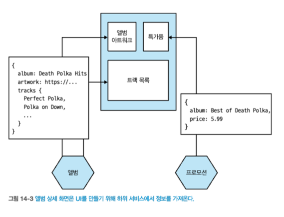
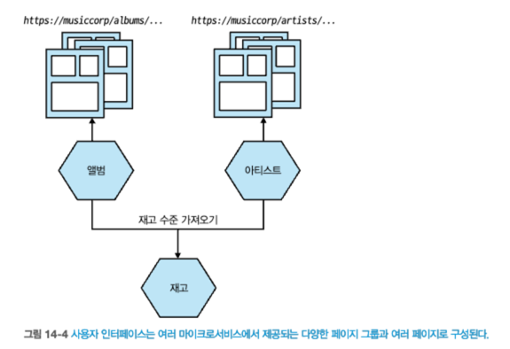
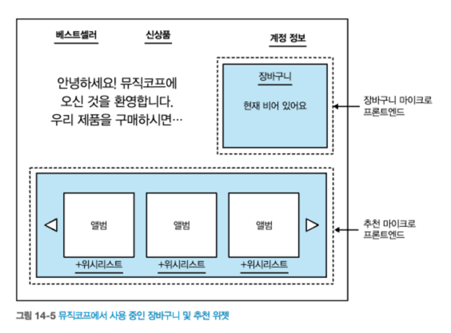
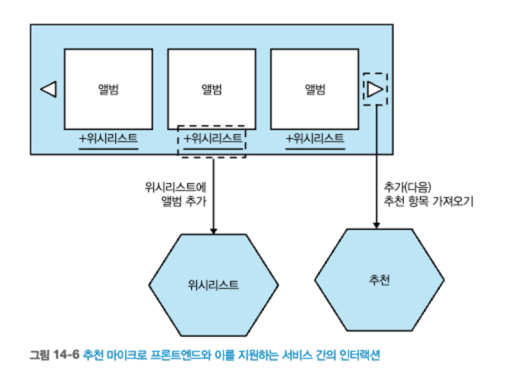

# 14 사용자 인터페이스
- 오늘날에는 사용자에게 그래픽 사용자 인터페이스(GUI)를 제공하기 위한 다양한 환경(다양한 플랫폼과 각 플랫폼에 맞는 다양한 기술)이 있다.
- `이러한 다양한 기술 범위`는 마이크로서비스가 지원하는 효과적인 인터페이스를 만드는 방법에 대해 **다양성을 제공**한다.

## 14.1 디지털을 향해
- `고객`이 `제품`과 어떻게 상호작용할지 정확히 예측할 수 없다는 인식은 **더욱 세분화된 API의 도입을 촉진**했다.
  - 데스크톱 어플리케이션, 모바일 기기, 웨어러블 기기
- `UI`를 사용자에게 제공하는 **다양한 기능을 한데 엮는 곳**으로 생각하라.
  - UI를 제공할 때 **누구에게 어떤 책임이 있는지** `조직척 측면`을 고려해야 한다.
  - **인터페이스를 구현하는 데 사용 가능한** `일련의 패턴`을 살펴볼 것 이다.

## 14.2 소유권 모델
- 계층화된 아키텍처는 소프트웨어를 효과적으로 제공하는 측면에서 문제가 될 수 있다.
- [그림 14-1] 에서 간단한 컨트롤 하나를 추가하면 서로 다른 세 팀이 작업을 수행해야한다. => 팀간 지속적 조정이 필요하므로, 비효율적  
        
  출처 : 한빛미디어 - 마이크로서비스 아키텍처 구축    
- [그림 14-2]는 독립적 배포 가능성을 위해 적합한 모델이다. => 엔드투엔드 기능에 소유권을 가지면 더 빠르게 진행 가능    
        
  출처 : 한빛미디어 - 마이크로서비스 아키텍처 구축  
- 이러한 단점에도 불구하고, `전담 프로트엔드 팀`이 **마이크로서비스 아키텍처를 사용하는 회사에서 일반적인 패턴**이다.
  
### 14.2.1 전담 프론트엔드 팀 추구
- 전담 프론트엔드 팀에 대한 수요는 `전문가 부족`, `일관성 추구`, `기술적 문제` 요소 때문이다.
- `전문성`
  - UI를 제공하려면 어느정도의 전문 기술이 필요하다.
- `일관성`
  - UI가 일관된 룩앤필(look and feel)을 유지할 수 있다.
  - * 룩앤필 : 사용자의 제품 체험과 겉모양, 인터페이스의 주된 기능을 나타낸다.
- `기술적`
  - SPA, 앵귤러, 리액트, 뷰

## 14.3 스트림 정렬 팀을 향해
- 처리량을 최적화하기 위해 전담 프론트엔드 팀을 두는것은 실수이다.
- 필자가 선호하는 모델은 **도메인**의 특정 부분에서 **엔드투엔드로 제공하는 전담 팀**이다.
- `팀 토폴로지`, 매튜 스켈톤과 마누엘 페이스가 설명한 `스트림 정렬 팀(stream-aligned team)`과 정확히 일치한다.
  - 스트림 정렬팀은 **가치 있는 단일 업무 스트림에 정렬**된다.
  - 업무 중 일부를 수행하기 위해 다른 팀에 핸드오프를 할 필요가 없다.
- 엔드투엔드 팀은 최종 사용자와도 더 분명하고 직접적인 관계를 맺는다.
  - 고객들이 필요한 것에 더 집중할 수 있다.

### 14.3.1 전문가 공유
- 전통적인 조직 구조(같은 기술을 가진 사람들 동일팀 배치)는 **고립된 조직을 초래**한다.
- **고립된 조직구조**는 많은 기술을 습득할 기회를 잃게 된다.
  - 예를들어, 많은 db작업이 소프트웨어 팀으로 넘어가면서, 개발자는 db 관련 이해도가 높아졌다.
  - 전문가를 전단 팀에서 뺀다고 전문가의 업무 수행 능력을 저하시키는 것은 아니다.
- **전문가를 더 효과적으로 배치하는 방법**을 찾는 것이 중요하다.
- `팀 토폴로지`에서 **활성화 팀(enabling team)**
  - **새로운 제품 기능을 제공하는 팀을 돕는 것**이다. => 내부 컨설팅
  - `조직의 사일로`를 없애는 동시에 `동료의 기량을 향상`시키는 데 도움을 줄 수 있다.

### 14.3.2 일관성 보장
- 전담 프론트엔드 팀이 필요한 이유는 일관성이다.
- 한 팀이 사용자 UI를 담당하게 함으로써 UI의 **일관적인 룩앤필**을 **보장** 할 수 있다.
- 일관성을 유지하는 여러 방법이 있다.
  - **활성화 팀 모델을 사용**하여, 각 팀에서 수행되는 작업의 일관성 유지에 도움을 준다.
  - 활성화 팀의 예시로는, `파이낸셜 타임즈`의 오리가미 팀은 일관된 룩앤필을 보장하도록 한다.
- 활성화 팀은 두 가지 형태의 지원을 제공한다.
  - 이미 구축한 컴포넌트 제공 & 전문지식 제공
  - UI에서 일관된 사용자 경험을 제공

### 14.3.3 기술적 문제 극복
- 다양한 기기에서 동일한 사용자 인터페이스 제공 시 추가 문제 발생한다.
- SPA, 모바일 장치 등의 문제를 해결하며 `사용자 인터페이스 기능을 분리`하고 `통합`하는 **방법이 필요**하다.

## 14.4 모놀리식 프론트엔드 - 패턴
- `모놀리식 프론트엔드 방식`은 백엔드 서비스를 호출하고, **모든 UI 상태 및 동작이 UI자체에 정의**되는 아키텍처 이다.
  - 예시, [그림 14-3] 
          
  출처 : 한빛미디어 - 마이크로서비스 아키텍처 구축
- `전담 프론트엔드 팀`과 함께 **모놀리식 단일 페이지 애플리케이션 구축**시 일반적으로 사용하는 모델이다.

### 14.4.1 적용 시점
- `모놀리식 프론트엔드` 방식에는 **몇 가지 단점**이 있다.
  - 첫째, 여러 팀에서 모놀리식 프론트엔드에 대한 `책임을 공유`해 **여러 곳에서 경합이 발생**할 수 있다.
  - 둘째, `다양한 종류의 기기`에 맞게 **응답을 조정할 수 있는 능력**이 거의 없다.
    - 지원하는 마이크로서비스에 대한 호출을 변경할 수 없다.
    - 예를들어, 주문 10개의 필드만 표시하지만, 서비스에서 100개의 주문 필드를 전달해준다. => 그래프QL을 통해 해결
- `모놀리식 프론트엔드`는 하나의 배포 가능한 단위에서 **UI의 모든 구현과 동작을 처리하고 싶을때 가장 적합**하다.
- 소프트웨어 작업을 하는 팀이 둘 이상인 경우 `조직 사일로`와 `계층형 아키텍처`로 만들려는 충동에 맞서야 한다.
  - `조직 사일로` : 팀 간의 단절을 의미. 여러 팀이 협력하지 않고 각자 독립적으로 일할 때 발생함.

## 14.5 마이크로 프론트엔드
- `마이크로 프론트엔드`방식은 **프론트엔드 여러 부분을 독립적으로 작업하고 배포**할 수 있는 조직 패턴이다.
  - 캠 잭슨, **마이크로 프론트엔드**는 독립적으로 제공 가능한 프론트엔드 애플리케이션들이 더 큰 전체를 구성하는 아키텍처 스타일 이라고 정의하였다.
- `마이크로 프론트엔드`는 백엔드 서비스와 UI를 모두 소유하려는 **스트림 정렬 팀에게 필수 패턴**이다.
- `마이크로 프론엔드`를 사용하면 여러 팀에서 프론트엔드 여러 부분을 작업하고 변경할 수 있다.

### 14.5.1 구현
- 웹 기반 프론트엔드의 경우 `마이크로 프론트엔드 패턴`의 구현을 `두 가지 분해기술`을 고려할 수 있다.
- `위젯 기반 분해 기술`
  - 프론트엔드의 여러 부분을 단일 화면으로 함께 연결 작업이 필요하다.
- `페이지 기반 프론트엔드 분해`
  - 프론트엔드가 독립적인 웹 페이지로 분리된다.

### 14.5.2 적용 시점
- `마이크로 프론트엔드 패턴`은 **엔드투엔드 스트림 정렬팀 도입시 필수적**이다.
- 계층화된 아키텍처를 유지하지만, 프론트엔드 기능이 너무 커져서 **여러 전담 프론트엔드 팀이 필요한 상황에서 유용**하다.
- 이 방식에는 한 가지 중요한 문제가 있다.
  - **상호작용 형태가 복잡**할수록 이 모델은 적합할 가능성은 낮아지고, API 호출로 돌아갈 가능성이 높아진다.

## 14.6 페이지 기반 분해
- 

        
출처 : 한빛미디어 - 마이크로서비스 아키텍처 구축  

### 14.6.1 적용대상

## 14.7 위젯 기반 분해

        
출처 : 한빛미디어 - 마이크로서비스 아키텍처 구축  

        
출처 : 한빛미디어 - 마이크로서비스 아키텍처 구축

### 14.7.1 구현
#### [의존성]
#### [페이지 내 위젯 간 통신]

### 14.7.2 적용 시점

## 14.8 제약

## 14.9 중앙 집계 게이트웨이
### 14.9.1 소유권
### 14.9.2 다양한 종류의 사용자 인터페이스
### 14.9.3 여러 문제
### 14.9.4 적용 시점 

## 14.10 프론트엔드를 위한 백엔드
### 14.10.1 얼마나 많은 BFF가 필요한가?
### 14.10.2 재사용과 BFF
### 14.10.3 데스크톱과 그 이상을 위한 BFF
### 14.10.4 적용 시점

## 14.11 그래프QL
## 14.12 하이브리드 방식

## 요약
