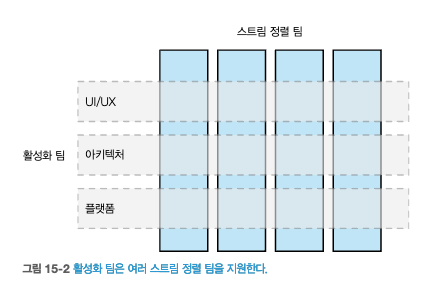

# 15 조직 구조

## 15.1 느슨하게 결합된 조직
## 15.2 콘웨이의 법칙
### 15.2.1 증거
## 15.3 팀 규모
## 15.4 콘웨이의 법칙 이해
## 15.5 소규모 팀, 대규모 조직
## 15.6 자율성에 관해
## 15.7 강력한 소유권 대 공동 소유권
### 15.7.1 강력한 소유권
### 15.7.2 공동 소유권
### 15.7.3 팀 수준 대 조직 수준
### 15.7.4 균형 모델

## 15.8 활성화 팀
//TODO
- `활성화 팀`은 **스트림 정렬 팀을 지원**하기 위해 일하는 팀이다.
- [그림 15-2]처럼 횡당 면에서 여러 스트림 정렬 팀을 지원하기 위해 일하는 활성화 팀이 있다.  
        
  출처 : 한빛미디어 - 마이크로서비스 아키텍처 구축  
- `활성화 팀`은 **다양한 형태**와 **규모**로 구성될 수 있다.
- [그림 15-3] 이 예시이다.
  - 각 팀은 다른 프로그래밍 언어를 사용하기로 결정했다.
        
  출처 : 한빛미디어 - 마이크로서비스 아키텍처 구축  
- `활성화 팀`은 외부에서 더 잘 고칠 수 있는 문제를 식별하는 데 도움이 된다.

### 15.8.1 실천 공동체
- `실천 공동체(community of practice, COP)`는 **동료 간의 공유와 학습을 촉진하는 교차 그룹**이다.
  - 지속적으로 배우고 성장할 수 있는 조직을 만드는 멋진 방법이다.
- `CoP`랑 `활성화 팀`은 역할이 다르다.
  - `공통점`으로는, 조직 내 여러 팀에서 일어나는 일에 대한 통찰력을 제공한다.
  - `활성화 팀`은 다른 팀과 협력하고 돕기 위해 많은 시간 & 노력을 투자한다.
  - `실천 공동체`는 **동료간의 학습을 활성화하는 데 중점**을 둔다.
- `CoP`와 `활성화 팀`은 효과적으로 협업할 수 있다.
  - CoP는 활성화 팀에게 통찰력을 제공한다.

### 15.8.2 플랫폼
- 

#### [플랫폼 팀]
#### [포장된 길]

## 15.9 공유 마이크로서비스
### 15.9.1 너무 어려운 분할
### 15.9.2 횡단 변경 사항
### 15.9.3 전달 병목 현상

## 15.10 내부 오픈 소스
### 15.10.1 핵심 커미터의 역할
### 15.10.2 성숙도
### 15.10.3 도구

## 15.11 플러그 가능한 모듈식 마이크로서비스
### 15.11.1 변경 사항 검토

## 15.12 고아 서비스
## 15.13 사례 연구:realestate.com.au
## 15.14 지리적 분포
## 15.15 콘웨이의 역법칙
## 15.16 사람

## 요약

      
출처 : 한빛미디어 - 마이크로서비스 아키텍처 구축  
