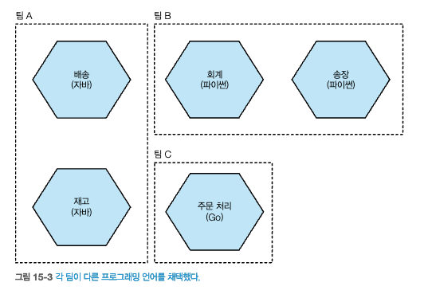

# 15 조직 구조

## 15.1 느슨하게 결합된 조직
## 15.2 콘웨이의 법칙
### 15.2.1 증거
## 15.3 팀 규모
## 15.4 콘웨이의 법칙 이해
## 15.5 소규모 팀, 대규모 조직
## 15.6 자율성에 관해
## 15.7 강력한 소유권 대 공동 소유권
### 15.7.1 강력한 소유권
### 15.7.2 공동 소유권
### 15.7.3 팀 수준 대 조직 수준
### 15.7.4 균형 모델

## 15.8 활성화 팀
### 15.8.1 실천 공동체
### 15.8.2 플랫폼

## 15.9 공유 마이크로서비스
### 15.9.1 너무 어려운 분할
### 15.9.2 횡단 변경 사항
### 15.9.3 전달 병목 현상

## 15.10 내부 오픈 소스
### 15.10.1 핵심 커미터의 역할
### 15.10.2 성숙도
### 15.10.3 도구

## 15.11 플러그 가능한 모듈식 마이크로서비스
### 15.11.1 변경 사항 검토

## 15.12 고아 서비스
## 15.13 사례 연구:realestate.com.au
## 15.14 지리적 분포
## 15.15 콘웨이의 역법칙
## 15.16 사람

## 요약

      
출처 : 한빛미디어 - 마이크로서비스 아키텍처 구축  