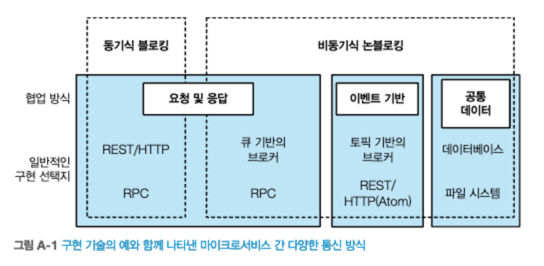
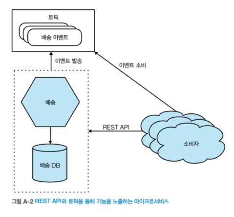
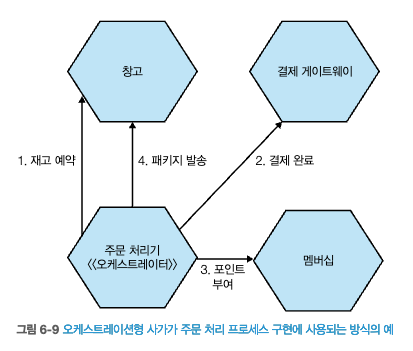
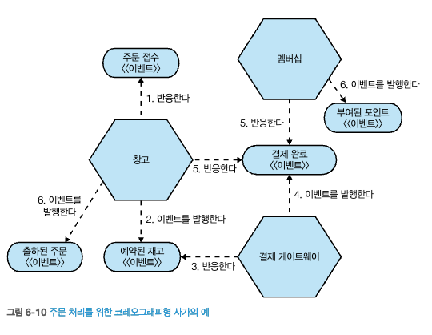
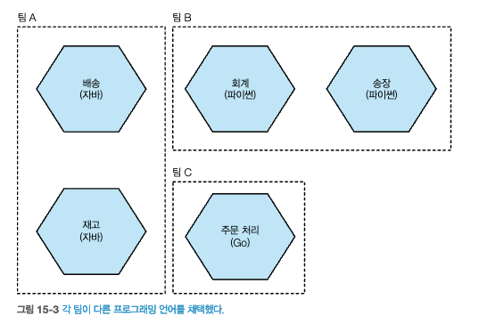

# 종합 정리 : 조언부터 향후 전망까지

## 마이크로서비스란?
- 마이크로서비스는 `독립적인 배포 가능성에 중점`을 둔 **서비스 지향 아키텍처의 한 유형**이다.
- `독립적인 배포 가능성`
  - 마이크로 서비스를 **변경 & 배포 & 기능 릴리스** 할 수 있다는 것을 의미한다.
- `하나의 마이크로서비스를 변경`할 때 **다른 마이크로서비스와의 상호작용이 중단되지 않도록 해야** 한다.
 - **다른 서비스**와의 `인터페이스는 안정적`이며, `하위 호환성이 유지`되는 방식으로 변경돼야 한다. 
   - 정보 은닉(코드, 데이터), **인터페이스에 최소한의 정보만 노출** 해야 한다.
   - 노출이 적을수록 **하위 호환성**을 확인하기가 더 쉽다.
- `독립적인 배포 기능`구현하는 방법 중 하나는 **데이터베이스를 숨기는 것**이다.
 - 내부 데이터베이스가 외부 소비자에게 직접 노출되면 안 된다.
 - 노출시, 둘 사이에 `많은 결합을 유발`하여 **독립적인 배포 가능성을 약화**시킨다.
 - `여러 서비스`가 **동일한 데이터베이스에 액세스 하는 상황은 피해야** 한다.
- `마이크로서비스`는 **도메인 주도 설계(DDD)와 매우 잘 맞는다.**
  - DDD는 **경계를 찾는 데 도움**이 된다.
  - **아키텍처가 비지니스 도메인을 중심으로 정렬**된다.
  - `도메인에 집중하는 팀`은 비지니스의 일치하는 **서비스에 대한 소유권을 가질 수 있다.**
  
## 마이크로서비스로의 전환
- `마이크로서비스`는 사용 이유를 고려해야 할 만큼 **많은 복잡성**을 가져온다.
  - 초기에는 단일 모놀리스가 합리적이며, 현재 아키텍처가 더 이상 적합하지 않을때 변화를 모색하라.
- `마이크로서비스 아키텍처`를 통해 **얻고자 하는 것이 무엇인지 이해하는 것이 중요**하다.
  - `목표하는 결과`는 **모놀리스를 어떻게 분리할지 영향**을 미친다.
- `마이크로서비스의 문제점`은 운영 단계에 돌입한 후에 드러난다.
  - 빅뱅방식으로 재작성하기보다 **기존 모놀리스를 점진적이고 진화적인 방식으로 분해하길 권장**한다.
  - **모놀리스**에서 `적절한 기능을 뽑아낸후`, `마이크로서비스로 배포하는 방식`을 적극 사용하라.

## 통신 방식
- [그림 A-1] 마이크로 서비스 간 다양한 통신 방식
        
  출처 : 한빛미디어 - 마이크로서비스 아키텍처 구축  
  - `요청 및 응답` 통신의 경우, 다운스트림 서비스에 요청을 보내고 응답을 기대한다.
  - `비동기식 요창 및 응답`을 사용하면 응답이 업스트름 서비스의 다른 인스턴스로 돌아 올 수 있다.
  - `이벤트 기반 통신`사용, 해당 **이벤트에 관심이 있는 마이크로서비스가 이벤트에 반응**할 수 있다.
    - 다른 서비스에 무엇을 해야하는지 지시하지 않고, **단지 이벤트를 공유**한다. => **비동기식**
- 하나의 마이크로서비스는 둘 이상의 프로토콜을 통해 통신할 수 있다.
        
  출처 : 한빛미디어 - 마이크로서비스 아키텍처 구축  
  - `이벤트 기반 협업 방식`사용시, 보다 느슨하게 결합된 아키텍처를 쉽게 구축할 수 있다.
    - 하지만, **시스템이 어떻게 동작하는지 이해하기 위해 많은 작업이 필요**하다.
    - 또한, 메시지 브로커와 같은 **전문 기술을 사용해야 하므로 복잡**해진다.

## 워크플로
- 여러 마이크로서비스가 협업해 작업을 수행할경우, `사가`를 사용해 프로세스를 모델링해야 한다.
- `분산 트랜잭션`은 최대한 피해야 한다. => **사가를 사용하라**
- **사가**에는 `오케스트레이션형 사가`와 `코레오그래피형 사가`가 있다.
  - `오케스트레이션형 사가`
    - **중앙 집중식 오케스트레이터를 사용**해 `다른 서비스와 조율 및 작업`
    - 간단하고 직관적이지미나, 중앙 오케스트레이터가 **많은 일을 하게 될** 수 있다.
    - 여러 팀이 동일한 비지니스 프로세스에 작업하는 경우 **분쟁의 소지**가 있다.
      
    출처 : 한빛미디어 - 마이크로서비스 아키텍처 구축  
  - `코레오그래피형 사가`
    - 비지니스 프로세스에 대한 책임이 여러 협업 서비스로 분산 된다.
    - 구현하기가 복잡하며, 모니터링 하기 어렵지만 **강결합을 피하고 여러 팀과 협업하기에 좋다.**
      
    출처 : 한빛미디어 - 마이크로서비스 아키텍처 구축
- 필자는 코레오그래피형 사가를 선호하며, 사용시 구현 과정에서 주의해야 한다.
- 오케스트레이형 사가는 한 팀이 전체 프로세스를 책임질 때는 잘 동작한다. 
  - 여러팀이 관리시에는 문제가 커진다. 

## 빌드
- `각 마이크로서비스`에는 **고유한 빌드, 고유한 CI 파이프라인**이 있어야 한다.
  - 마이크로서비스를 **자체적으로 빌드**할 수 있어야 한다.
  - 모든 서비스를 함께 빌드하는 것은 독립적인 배포를 어렵게 만들기 때문에 피해야 한다.

## 배포
- `마이크로서비스`는 프로세스로 배포된다.
  - 물리머신, 가상머신, 컨테이너, FaaS에 배포
  - 이상적으로 마이크로서비스는 배포된 환경에서 **서로 격리돼 있어야** 한다.
  - `컨테이너`는 인스턴스에 격리된 리소스를 제공하므로 **마이크로서비스 배포에 적합**하다.
- 컨테이너 워크로드로 k8s가 유용하지만, 복잡성으로 인해 소수의 마이크로서비스에는 권장되지 않는다. => 관리형 클러스터 사용 권장
- `배포`와 `릴리스`의 **개념을 명확히 구분**해야 한다.
  - 이러한 개념을 분리하면, 카나리아 릴리스&병렬실행 등 **다양한 방식으로 소프트웨어를 롤아웃할 기회**가 열린다.

## 테스팅
- `자동화된 기능 테스트집합`을 사용하는 것은 **반드시 수행해야 하는 작업**이다.
-  `엔드투엔드 테스트`는 **마이크로서비스 아키텍처에서 문제**가 될 수 있다.
  -  엔드투엔드 테스트 의존도를 줄이고 **소비자 중심 계약**, **스키마 호환성 검사**, **운영 환경에서의 테스트로 대체**하는 것을 고려하라

## 모니터링과 관찰가능성
- `관찰가능성`은 외부 출력을 검사해 시스템이 무엇을 하고 있는지 이해할 수 있는 정도를 말한다.
- `분산 시스템`은 실패할 수 있으며, 마이크로서비스도 동일하다.
  - 시스템 장애의 모든 원인을 예측할 수 없으므로, 외부 출력 정보를 추출하도록 돕는 도구를 사용하는것이 중요하다. => 허니코움
- 시스템 규모가 커질수록 오류가 발생할 가능성이 더 커진다.
  - `병렬 실행`과 `합성 트랜잭션`과 같은 **운영 환경에서 테스팅** 기술을 사용하면 문제를 발견하는데 효과적이다.

## 보안
- `마이크로서비스`는 애플리케이션을 **심층적으로 방어할 수 있는 더 많은 기회를 제공**한다.
- 반면에 `마이크로서비스`는 공격 표면 영역이 더 넓기 때문에 **공격에 더 많이 노출**될 수 있다.
  - 네트워크를 통해 더 많은 정보가 흐른다.
- 수동 프로세스를 사용해 **패치**, **인증서**, **시크릿**을 관리하면 공격에 취약해진다. => **자동화 도구 사용필요**
- `JWT 사용시` 추가 왕복이 필요 없는 방식으로 **인증 로직을 분산**할 수 있다.
  - **혼동된 대리인 문제**(confused deputy problem)같은 문제로부터 **사용자를 보호**, 마이크로서비스가 보다 **독립적인 방식으로 실행되도록 보장**할 수 있다.
- **제로 트러스트**(zero trust)를 사용하면 시스템 보안을 바라보는 관점을 단순화 할 수 있다.

## 회복 탄력성
- 견고성
  - 예상되는 변동을 흡수하는 능력
- 회복성
  - 사건 후 회복 능력
- 원만한 확장성
  - 예상치 못한 상황에 얼마나 잘 대처하는가?
- 지속적인 적응력
  - 변화하는 환경, 이해관계자, 요구 사항에 지속적으로 적응하는 능력

- `마이크로서비스 아키텍처`는 견고성 & 회복성에 도움이 될 수 있지만, 그 자체만으로는 회복탄력성을 갖추지 못한다.
  - `회복 탄력성`은 **팀과 조직의 행동** 및 **문화**에 관한 것이다.
- `마이크로서비스`는 시스템의 회복 탄력성을 개선할 수 있는 여러 선택지를 제공한다.
  - 벌크헤드, 회로 차단기, 타임아웃

## 확장
- 수직 확장
  - 더 큰 머신을 사용하는 것
- 수평 복제
  - 여러 대의 기기를 두는 것을 의미
- 데이터 파티셔닝
  - 고객 그룹과 같이 데이터의 일부 속성에 따라 작업을 나누는 것
- 기능 분해
  - 유형에 따라 업무를 분리하는 것

- **확장할 때는 쉬운 것부터 하라.**
  - `수직 확장`과 `수평 복제`는 비교적 빠르게 적용할 수 있고 쉽다.
- **다양한 확장 방식을 혼합하는 것이 일반적**이다.

## 사용자 인터페이스
- `한 팀`이 **사용자 기능과 관련된 모든 기능을 소유**하는 `스트림 정렬 팀`을 선호한다.
- 사일로화된 프론트엔드 및 백엔드 팀을 없애려면 사용자UI를 분리해야 한다.
  - **마이크로 프론트엔드**, **BFF 패턴**

## 조직
- `스트림 정렬 팀`은 [그림 A-3]에서 보듯이 **활성화 팀에 의해 지원**된다.
- `스트림 정렬 팀`을 자율적으로 만들려면 셀프 서비스 도구가 필요하다. => **플랫폼 사용!**
  - 하지만 `플랫폼`은 포장된 길, **반드시 사용해야 하는 것이 아니라 도와주는 것**으로 보는것이 중요하다.

## 아키텍처
- `시스템 아키텍처`는 **가변적**이다.
- `시스템 아키텍처`를 이끄는 역할은 팀에 분산될 수 있다.
  - 조직이 성장함에 따라 시스템 전반을 살펴볼 **전담 인력을 확보하는 것은 필수적**이다.

## 참고 도서
- `디지털 트랜스포메이션 엔진(에이콘, 2020)`
- `팀 토폴로지:빠른 업무 플로우를 만드는 조직 설계(에이콘, 2020)`
- `마이크로서비스 도입, 이렇게 한다(책만, 2021)`

## 향후 전망
- 

## 마지막 한마디
- 

      
출처 : 한빛미디어 - 마이크로서비스 아키텍처 구축  
